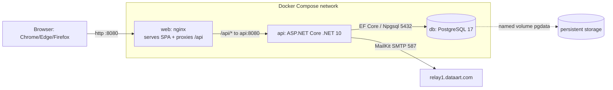
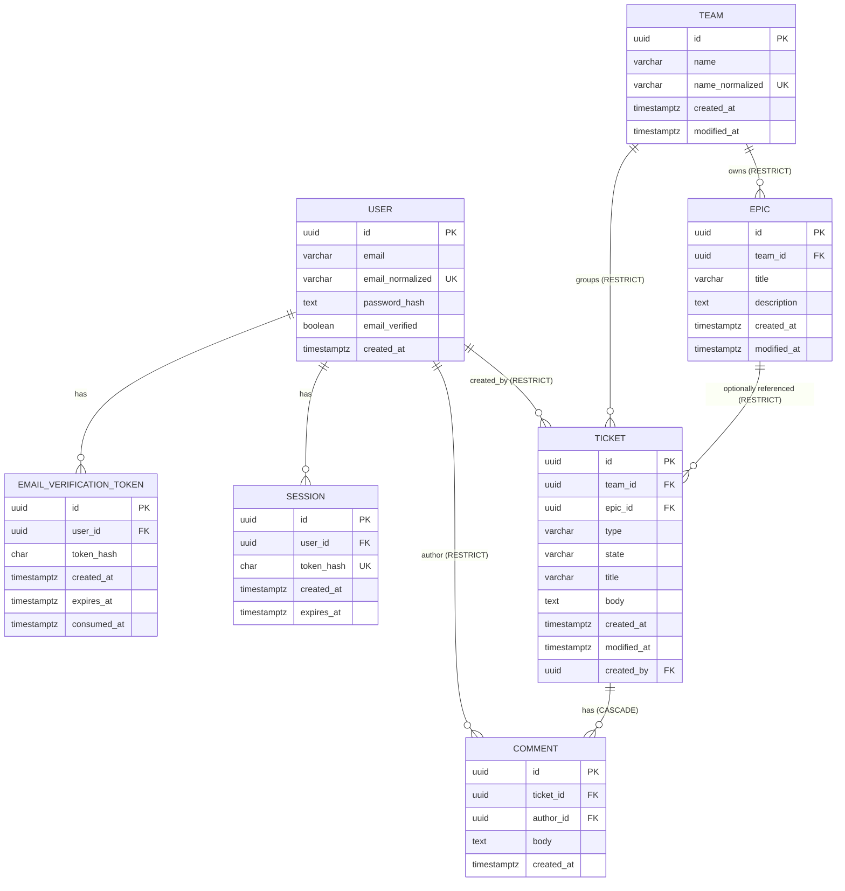

# Ticketing System — Architecture & Technical Design

> **Status:** Authoritative technical contract for implementation.
> **Audience:** Backend, frontend, and QA engineers. Developers implement **strictly** to this document and to [`API_CONTRACT.md`](./API_CONTRACT.md).
> **Inputs:** [`REQUIREMENTS_SOURCE.md`](./REQUIREMENTS_SOURCE.md) (canonical), [`REQUIREMENTS_ANALYSIS.md`](./REQUIREMENTS_ANALYSIS.md) (BA stories/assumptions).
> **Key decisions** are captured as ADRs in [`adr/`](./adr/) and referenced inline as **[ADR-000N]**.
> **Convention:** all timestamps are UTC, serialized ISO-8601 (e.g. `2026-06-30T11:26:00Z`). All enum values are canonical lowercase.

---

## 1. Scope & fixed stack

Mandatory scope (source §1–§10): authentication with email verification, teams, epics, tickets, comments, Kanban board. Out of scope: Scrum/sprints, SSO, roles/membership, attachments, notifications, real-time, reporting (source §12).

Stack is **fixed by the product owner** (do not re-evaluate language/framework):

| Tier | Technology |
|---|---|
| Frontend | React + TypeScript + Vite SPA; @dnd-kit for drag&drop; TanStack Query (React Query) for server state |
| Backend | ASP.NET Core Web API on **.NET 10**; EF Core with **Npgsql**; Argon2id (Konscious.Security.Cryptography.Argon2); MailKit for SMTP |
| Database | PostgreSQL (own container) |
| Delivery | `docker compose up --build` from repo root; nginx serves SPA + proxies `/api` **[ADR-0005]** |

---

## 2. System context & three-tier topology



- **Presentation:** the SPA, delivered as static assets by nginx. nginx also reverse-proxies `/api/*` to the API so the browser is single-origin (no CORS in the common path) **[ADR-0005]**.
- **Application/API:** ASP.NET Core Web API. Layered into API → Application (business logic) → Infrastructure (EF Core, SMTP, hashing). The RDBMS is the system of record; the SPA never treats `localStorage` as authoritative (source §9).
- **Persistence:** PostgreSQL in its own container with a named volume so data survives restart (NFR-REL-1).
- **External:** SMTP relay for verification emails (must support `relay1.dataart.com`, source §3).

---

## 3. Backend application architecture

### 3.1 Solution & project layout (Clean-ish layering)

```
backend/
  TicketTracker.sln
  src/
    TicketTracker.Api/             # ASP.NET Core host: Program.cs, controllers, middleware, DI wiring
    TicketTracker.Application/     # business services, DTOs, validation rules, ports (interfaces)
    TicketTracker.Domain/          # entities, enums, domain invariants (no EF/framework deps)
    TicketTracker.Infrastructure/  # EF Core DbContext, Npgsql config, migrations, Argon2 hasher, MailKit sender
  tests/
    TicketTracker.Tests/           # single xUnit project: unit + WebApplicationFactory integration
```

**Dependency direction:** `Api → Application → Domain`; `Infrastructure → Application + Domain`; `Api` composes `Infrastructure` at startup only (DI). `Domain` has no outward dependencies. This keeps business rules (timestamp semantics, same-team-epic, delete guards) in `Application`/`Domain`, independent of EF — which is what makes them unit-testable and the DbContext swappable **[ADR-0002]**.

### 3.2 Layer responsibilities

- **Domain:** POCO entities (`User`, `EmailVerificationToken`, `Session`, `Team`, `Epic`, `Ticket`, `Comment`), the two enums (`TicketType`, `TicketState`), and pure invariants (e.g., "title non-empty after trim", "epic.team == ticket.team"). No persistence concerns.
- **Application:** one service per aggregate (`AuthService`, `TeamService`, `EpicService`, `TicketService`, `CommentService`). Each depends on the `AppDbContext` (exposed via an `IAppDbContext` interface for testability) and on ports: `IPasswordHasher`, `IEmailSender` **[ADR-0004]**, `ITokenGenerator`, `IClock`. Services own all **[BACKEND-ENFORCED]** rules from ANALYSIS §10 (V1–V28). DTOs (request/response records) and `FluentValidation`-style validators live here.
- **Infrastructure:** `AppDbContext : DbContext` (EF Core model config, indexes, FK behaviors), Npgsql provider wiring, EF migrations, `Argon2PasswordHasher`, `SmtpEmailSender`, `CryptoTokenGenerator`, `SystemClock`.
- **Api:** thin controllers (no business logic — they map DTO ↔ service calls), authentication middleware **[ADR-0001]**, a global exception-to-ProblemDetails mapper that produces the uniform error envelope, `DatabaseInitializer` hosted service that applies migrations on startup **[ADR-0003]**, `NotificationEmailWorker` hosted service (a thin `PeriodicTimer` over `NotificationEmailDispatcher.DrainOnceAsync` — the email outbox, Wave 2 **[ADR-0014]**), health endpoints.

### 3.3 Cross-cutting

- **Auth:** stateful opaque bearer token in `Authorization: Bearer <token>`, validated against the `sessions` table; logout deletes the row **[ADR-0001]**.
- **Validation:** request DTOs validated at the edge (400 with field errors), but every authoritative rule is **re-checked in the service against the DB** — client validation alone is insufficient (source §6). Enum binding is strict: unknown `type`/`state` strings → 400, never silently coerced.
- **Error envelope:** every non-2xx returns `{ "error": { "code": string, "message": string, "errors"?: { field: [msg] } } }` (full taxonomy in API_CONTRACT §2 and **[ADR-0006]**).
- **Time:** `IClock` returns `DateTime.UtcNow`; persisted as `timestamptz` (PG) / UTC text (SQLite tests); serialized with trailing `Z`.
- **IDs:** GUID (`uuid`) primary keys, server-generated. The `TCK-####` label in wireframes is display-only and NOT required (ANALYSIS A18); the SPA may derive a display key but the API key is the GUID.

---

## 4. Data model

### 4.1 Entities, fields, types, keys

All PKs are `uuid` (GUID), server-generated. All timestamps are UTC `timestamptz`. "norm" columns are stored-normalized values used for case-insensitive uniqueness **[ADR-0002]** (portable across PostgreSQL and SQLite, so the same unique constraints are tested as shipped).

#### User
| Column | Type | Constraints | Notes |
|---|---|---|---|
| `id` | uuid | PK | |
| `email` | varchar(320) | not null | original-case display value |
| `email_normalized` | varchar(320) | not null, **UNIQUE** | `trim(lower(email))`; the uniqueness key (V1, A6) |
| `password_hash` | text | not null | Argon2id encoded hash (PHC string); never the password (V2) |
| `email_verified` | boolean | not null, default false | gate for business access (V5, A1) |
| `is_admin` | boolean | not null, default false | global admin privilege; admin ignores team scoping (ADR-0007). Existing users promoted to true by the AddUserManagement migration (ASR-5). |
| `is_blocked` | boolean | not null, default false | hard access denial; blocked ⇒ cannot log in/reset, sessions purged (ADR-0007, ASR-2) |
| `email_notifications_enabled` | boolean | not null, default true | Wave 2 global email toggle (ADR-0013 §6.8); suppresses **email only** (in-app always created) |
| `created_at` | timestamptz | not null | server-set UTC |

#### UserTeam  *(membership join — [ADR-0007])*
| Column | Type | Constraints | Notes |
|---|---|---|---|
| `id` | uuid | PK | |
| `user_id` | uuid | FK → User.id, **ON DELETE CASCADE**, not null, indexed | membership owned by the user |
| `team_id` | uuid | FK → Team.id, **ON DELETE CASCADE**, not null, indexed | membership owned by the team |
| `created_at` | timestamptz | not null | when membership was granted |

Unique index `ux_user_teams_user_team (user_id, team_id)` — a user cannot be in the same team twice (INV-1). Secondary index on `team_id` for "members of team T". CASCADE on both FKs because membership is an association (not authored content); it does **not** relax the Team→Ticket/Epic RESTRICT guards.

#### EmailVerificationToken
| Column | Type | Constraints | Notes |
|---|---|---|---|
| `id` | uuid | PK | |
| `user_id` | uuid | FK → User.id, **ON DELETE CASCADE**, not null, indexed | |
| `token_hash` | char(64) | not null, indexed | SHA-256 hex of raw token; raw token only in email link **[ADR-0006]** |
| `created_at` | timestamptz | not null | issuance time |
| `expires_at` | timestamptz | not null | `created_at + TOKEN_TTL_HOURS` (default 24); expiry boundary `now >= expires_at` ⇒ expired (A31) |
| `consumed_at` | timestamptz | null | set on successful verify; single-use (V3) |

#### Session  *(auth tokens — [ADR-0001])*
| Column | Type | Constraints | Notes |
|---|---|---|---|
| `id` | uuid | PK | |
| `user_id` | uuid | FK → User.id, **ON DELETE CASCADE**, not null, indexed | |
| `token_hash` | char(64) | not null, **UNIQUE**, indexed | SHA-256 hex of opaque bearer token; raw token never stored |
| `created_at` | timestamptz | not null | |
| `expires_at` | timestamptz | not null | `created_at + SESSION_TTL_HOURS` |

#### Team
| Column | Type | Constraints | Notes |
|---|---|---|---|
| `id` | uuid | PK | |
| `name` | varchar(200) | not null | trimmed display name (non-empty, V8) |
| `name_normalized` | varchar(200) | not null, **UNIQUE** | `trim(lower(name))`; case-insensitive uniqueness key (V8, EC2) |
| `created_at` | timestamptz | not null | |
| `modified_at` | timestamptz | not null | advances only on team-entity change (rename); A9, A10 |

#### Epic
| Column | Type | Constraints | Notes |
|---|---|---|---|
| `id` | uuid | PK | |
| `team_id` | uuid | FK → Team.id, **ON DELETE RESTRICT**, not null, indexed | team immutable after create (FR-E3-1, A13) |
| `title` | varchar(512) | not null | non-empty after trim (V11); not unique (A11) |
| `description` | text | null | optional, sane max length enforced in app (A12, A17) |
| `created_at` | timestamptz | not null | |
| `modified_at` | timestamptz | not null | advances only on actual title/description change (A14) |

#### Ticket
| Column | Type | Constraints | Notes |
|---|---|---|---|
| `id` | uuid | PK | stable/unique (R-24) |
| `team_id` | uuid | FK → Team.id, **ON DELETE RESTRICT**, not null, indexed | must reference existing team (V15) |
| `epic_id` | uuid | FK → Epic.id, **ON DELETE RESTRICT**, null, indexed | null OR epic of the SAME team (V16); see §6.3 |
| `type` | varchar(16) | not null, CHECK ∈ {bug,feature,fix} | canonical lowercase text (V13) |
| `state` | varchar(32) | not null, CHECK ∈ {new,ready_for_implementation,in_progress,ready_for_acceptance,done} | canonical text; default `new` (A15, V14) |
| `priority` | varchar(16) | not null, CHECK ∈ {low,medium,high,urgent} | canonical lowercase text; app default `medium`; existing rows backfilled to `medium` (F-03, ADR-0009) |
| `due_date` | date | null | optional calendar day (UTC, no time-of-day); `isOverdue` computed at read time (F-08, ADR-0009) |
| `title` | varchar(512) | not null | non-empty after trim (V17) |
| `body` | text | not null | non-empty after trim (V17); sane max length (A17) |
| `created_at` | timestamptz | not null | server-set at creation (V18) |
| `modified_at` | timestamptz | not null | advances ONLY on real field/state change (V19, V20); NOT on comment add (V21) NOR on assignee change (F-02) |
| `created_by` | uuid | FK → User.id, **ON DELETE RESTRICT**, not null, indexed | server-set, immutable (V18, A16) |

Composite index `(team_id, state, modified_at DESC)` supports the board query (per-team, grouped by state, ordered by modified desc — A22).

#### TicketAssignee  *(assignment join — F-02, ADR-0009)*
| Column | Type | Constraints | Notes |
|---|---|---|---|
| `id` | uuid | PK | |
| `ticket_id` | uuid | FK → Ticket.id, **ON DELETE CASCADE**, not null, indexed | an assignment is not standalone content (mirrors Ticket→Comment) |
| `user_id` | uuid | FK → User.id, **ON DELETE RESTRICT**, not null, indexed | protects user integrity (mirrors created_by/author_id) |
| `created_at` | timestamptz | not null | assignment time |

Unique index `(ticket_id, user_id)` — no user assigned to the same ticket twice (INV-W1). Eligible assignee = member of the ticket's team ∪ any admin.

#### PasswordResetToken  *(auth tokens — F-01, ADR-0010)*
| Column | Type | Constraints | Notes |
|---|---|---|---|
| `id` | uuid | PK | |
| `user_id` | uuid | FK → User.id, **ON DELETE CASCADE**, not null, indexed | auth artifact owned by the user |
| `token_hash` | char(64) | not null, indexed | SHA-256 hex; raw token only in the emailed link |
| `created_at` | timestamptz | not null | |
| `expires_at` | timestamptz | not null | `created_at + PASSWORD_RESET_TTL_HOURS` (default 1); expiry boundary `now >= expires_at` ⇒ expired (A31) |
| `consumed_at` | timestamptz | null | single-use; set atomically on successful reset |

Structural twin of `email_verification_tokens` in its own table (distinct TTL, single-use, no cross-flow acceptance).

#### Comment
| Column | Type | Constraints | Notes |
|---|---|---|---|
| `id` | uuid | PK | |
| `ticket_id` | uuid | FK → Ticket.id, **ON DELETE CASCADE**, not null, indexed | only mandated cascade (V22) |
| `author_id` | uuid | FK → User.id, **ON DELETE RESTRICT**, not null | server-set author (V23, A20) |
| `body` | text | not null | non-empty after trim (V23) |
| `created_at` | timestamptz | not null | server-set UTC, oldest-first ordering (V23, A21) |
| `edited_at` | timestamptz | null | Wave 2 F-12: set on a real body change; `null` = never edited (ADR-0015) |

Index `(ticket_id, created_at ASC)` for chronological listing.

#### TicketWatcher  *(subscription join — Wave 2, ADR-0013)*
| Column | Type | Constraints | Notes |
|---|---|---|---|
| `id` | uuid | PK | |
| `ticket_id` | uuid | FK → Ticket.id, **ON DELETE CASCADE**, not null, indexed | a watch is owned by the ticket |
| `user_id` | uuid | FK → User.id, **ON DELETE CASCADE**, not null, indexed | a watch carries no authorship (mirrors UserTeam) |
| `created_at` | timestamptz | not null | when the watch started |

Unique index `ux_ticket_watchers_ticket_user (ticket_id, user_id)` — no double-watch. Auto-watch on create/assign/comment; manual watch/unwatch (§6.3).

#### Notification  *(in-app + email outbox row — Wave 2, ADR-0013/0014)*
| Column | Type | Constraints | Notes |
|---|---|---|---|
| `id` | uuid | PK | |
| `recipient_id` | uuid | FK → User.id, **ON DELETE CASCADE**, not null | owner of the row |
| `actor_id` | uuid | FK → User.id, **ON DELETE RESTRICT**, not null | who caused the event |
| `ticket_id` | uuid | FK → Ticket.id, **ON DELETE SET NULL**, **nullable**, indexed | subject ticket; **SET NULL** so a `ticket_deleted` notification outlives its ticket (§6.6) |
| `comment_id` | uuid | **nullable, NO FK** | present for comment events; FK-less so a comment delete neither cascade-nukes nor blocks it |
| `event_type` | varchar(40) | not null, CHECK ∈ event set | canonical event code |
| `summary` | varchar(500) | not null | rendered once at fan-out |
| `data_json` | text | null | small structured payload |
| `created_at` | timestamptz | not null | |
| `read_at` | timestamptz | null | `null` = unread |
| `emailed_at` | timestamptz | null | outbox marker + idempotency key (`null` = not emailed) |

Indexes `ix_notifications_recipient_unread (recipient_id, read_at, created_at)` and `ix_notifications_outbox (emailed_at, created_at)`.

#### ActivityEntry  *(per-ticket timeline — Wave 2, ADR-0012)*
| Column | Type | Constraints | Notes |
|---|---|---|---|
| `id` | uuid | PK | |
| `ticket_id` | uuid | FK → Ticket.id, **ON DELETE CASCADE**, not null, indexed | the timeline dies with the ticket |
| `actor_id` | uuid | FK → User.id, **ON DELETE RESTRICT**, not null | preserve audit integrity |
| `event_type` | varchar(40) | not null, CHECK ∈ event set | same event codes as notifications |
| `summary` | varchar(500) | not null | rendered at record time |
| `data_json` | text | null | before/after structured payload |
| `created_at` | timestamptz | not null | |

Index `ix_activity_ticket_created (ticket_id, created_at)`. This is the user-facing per-ticket history — a separate concern from any SEC-3 admin audit (§7bis of WAVE2_DESIGN).

### 4.2 Enums & storage

Both enums are stored as **canonical lowercase text** with a DB `CHECK` constraint (not PG native enums — text + check is portable to SQLite for tests **[ADR-0002]** and avoids migration friction). The API serializes/accepts exactly these strings; the SPA maps them to display labels (A2).

- `TicketType`: `bug` | `feature` | `fix`
- `TicketState`: `new` | `ready_for_implementation` | `in_progress` | `ready_for_acceptance` | `done`
- `TicketPriority`: `low` | `medium` | `high` | `urgent` (default `medium`, F-03/ADR-0009)
- `EventType` (Wave 2, ADR-0012; stored + CHECK on `notifications.event_type` and `activity_entries.event_type`): `ticket_created` | `ticket_field_changed` | `ticket_moved` | `ticket_assignees_changed` | `comment_added` | `comment_edited` | `comment_deleted` | `ticket_deleted`

### 4.3 Referential integrity & cascade policy (V9, V12, V22, V26, A28)

Enforced at **both** the DB (FK behaviors below) **and** the service layer, so direct-API misuse cannot create orphans or cross-team links (A28):

| Relationship | DB on-delete | Why |
|---|---|---|
| Ticket → Comment | **CASCADE** | Deleting a ticket deletes its comments — the ONLY mandated cascade (V22). |
| Team → Ticket | **RESTRICT** | Cannot delete a team that has tickets → 409 (V9). |
| Team → Epic | **RESTRICT** | Cannot delete a team that has epics → 409 (V9). |
| Epic → Ticket | **RESTRICT** | Cannot delete an epic referenced by tickets → 409 (V12). |
| User → Ticket (created_by) / Comment (author) / TicketAssignee (user_id) | **RESTRICT** | No user-delete in scope; protects authorship/assignment integrity. |
| Ticket → TicketAssignee | **CASCADE** | Deleting a ticket drops its assignments (not standalone content — F-02). |
| User → EmailVerificationToken / PasswordResetToken / Session | **CASCADE** | Auth artifacts are owned by the user. |
| User → UserTeam / Team → UserTeam | **CASCADE** | Membership is an association, not authored content; dropping a user or team drops its membership rows (ADR-0007). |
| Ticket → TicketWatcher / User → TicketWatcher | **CASCADE** | A watch is an association (no authorship); drops with either the ticket or the user (Wave 2, ADR-0013). |
| Ticket → Notification | **SET NULL** (ticket_id nullable) | A `ticket_deleted` notification must OUTLIVE its ticket (tombstone, §6.6). **Deliberately NOT CASCADE.** |
| User → Notification (recipient) | **CASCADE** | A notification is owned by its recipient (Wave 2). |
| User → Notification (actor) | **RESTRICT** | Preserve "who did it" integrity (mirrors created_by/author_id). |
| Notification → Comment | **none (FK-less)** | `comment_id` is deliberately FK-less so a comment delete neither cascade-nukes nor blocks the notification (ADR-0013 §4.3). |
| Ticket → ActivityEntry | **CASCADE** | The per-ticket timeline dies with the ticket (Wave 2, ADR-0012). |
| User → ActivityEntry (actor) | **RESTRICT** | Preserve audit integrity. |

The service performs an explicit existence check before delete and returns the proper `409` envelope (with `code`) rather than surfacing a raw FK violation — but the FK RESTRICT is the backstop that guarantees correctness even on a direct API call (EC7).

### 4.4 ER diagram



---

## 5. API surface (summary)

The complete contract — every request/response body, example, and status code — is in [`API_CONTRACT.md`](./API_CONTRACT.md). Summary of routes and auth.

**Auth legend (ADR-0007):** `no` = public; `auth` = any verified, non-blocked session; `A` = admin only; `M(team)` = admin OR member of the resource's team.

| Method | Path | Auth | Purpose |
|---|---|---|---|
| POST | `/api/auth/signup` | no | Create unverified **member** account, send verification email |
| POST | `/api/auth/login` | no | Issue session for a verified, non-blocked account (blocked → 401 account_blocked) |
| POST | `/api/auth/logout` | auth | Invalidate the current session token |
| POST | `/api/auth/verify-email` | no | Consume token, mark verified, grant default-team membership (req 8) |
| POST | `/api/auth/resend-verification` | no | Issue new token (non-committal; blocked accounts get none) |
| POST | `/api/auth/forgot-password` | no | Request a reset link (non-committal; F-01) |
| POST | `/api/auth/reset-password` | no | Consume single-use token, set password, purge all sessions (F-01) |
| GET | `/api/auth/me` | auth | Current user incl. `isAdmin`, `isBlocked`, `teams[]` for SPA bootstrap |
| PUT | `/api/me/profile` | auth (self) | Set/clear own display name (no id in path; F-04) |
| POST | `/api/me/password` | auth (self) | Change own password (current-password re-auth; keep current session, purge others; F-04) |
| GET | `/api/teams` | auth | List teams — admin: all; member: their teams only |
| POST | `/api/teams` | **A** | Create team |
| PUT | `/api/teams/{id}` | **A** | Rename team |
| DELETE | `/api/teams/{id}` | **A** | Delete team (409 if has tickets/epics) |
| PUT | `/api/teams/{id}/wip-limits` | **M(team)** | Set per-state WIP caps |
| GET | `/api/epics?teamId=` | **M(team)** | List epics for a team |
| POST | `/api/epics` | **M(team)** | Create epic |
| PUT | `/api/epics/{id}` | **M(team of epic)** | Edit title/description (team immutable) |
| DELETE | `/api/epics/{id}` | **M(team of epic)** | Delete epic (409 if referenced) |
| GET | `/api/tickets?teamId=&type=&epicId=&search=&priority=&assigneeId=&assignedToMe=&dueFilter=` | **M(team)** | Board for a team (Wave 1 adds priority/assignee/due filters) |
| GET | `/api/tickets/{id}` | **M(team of ticket)** | Ticket detail (IDOR guard) |
| POST | `/api/tickets` | **M(team)** | Create ticket (accepts priority/dueDate/assigneeIds) |
| PUT | `/api/tickets/{id}` | **M(team of ticket)** | Edit (checks current AND target team; priority required in body) |
| PATCH | `/api/tickets/{id}/state` | **M(team of ticket)** | Drag-and-drop state change |
| PUT | `/api/tickets/{id}/assignees` | **M(team of ticket)** | Replace the full assignee set (F-02) |
| DELETE | `/api/tickets/{id}` | **M(team of ticket)** | Delete ticket (cascade comments + assignees) |
| GET | `/api/tickets/{id}/comments` | **M(team of ticket)** | List comments oldest-first |
| POST | `/api/tickets/{id}/comments` | **M(team of ticket)** | Add comment (no modified_at bump) |
| GET | `/api/admin/users` | **A** | List all users (status, role, membership) |
| POST | `/api/admin/users` | **A** | Create active + pre-verified user |
| PUT | `/api/admin/users/{id}/role` | **A** | Set isAdmin (last-admin guard on demote) |
| PUT | `/api/admin/users/{id}/teams` | **A** | Replace membership set |
| POST | `/api/admin/users/{id}/block` | **A** | Block (last-admin guard; purge sessions) |
| POST | `/api/admin/users/{id}/unblock` | **A** | Unblock |
| POST | `/api/admin/users/{id}/reset-password` | **A** | Generate password once (blocked → 403; purge sessions) |
| GET | `/health/live` | no | Liveness |
| GET | `/health/ready` | no | Readiness (DB reachable + migrations applied) |

Auth transport: bearer token in `Authorization` header; never in URLs. The single-use verification token appears only in the emailed link (source §9, **[ADR-0006]**). Authorization is enforced **server-side per resource** in the Application services (`RequireAdmin` / `RequireTeamAccess`), with a complementary admin-zone middleware gate on `/api/admin/*` (ADR-0007).

---

## 6. Core flows & business rules

### 6.1 Sign-up → verify → login

```mermaid
sequenceDiagram
    participant U as User
    participant FE as SPA
    participant API
    participant DB
    participant SMTP

    U->>FE: enter email + password (+confirm, client-only)
    FE->>API: POST /api/auth/signup {email,password}
    API->>API: trim+lowercase email; validate (syntax, len>=8); hash Argon2id
    API->>DB: INSERT user(email_verified=false); INSERT verification token(hash, exp=+24h)
    API->>SMTP: send link FRONTEND_URL/verify-email?token=RAW
    API-->>FE: 201 {message: verification required} (no session)
    Note over U,FE: later, from the email
    U->>FE: open /verify-email?token=RAW
    FE->>API: POST /api/auth/verify-email {token}
    API->>DB: find by sha256(token); check not consumed, now<exp; set consumed_at, email_verified=true (tx)
    API-->>FE: 200 verified  --> FE shows "Continue to login" (no auto-login)
    U->>FE: login email+password
    FE->>API: POST /api/auth/login
    API->>DB: verify Argon2id hash; require email_verified
    API->>DB: INSERT session(token_hash, exp)
    API-->>FE: 200 {token, user} --> FE stores token, enters board
```

- **Unverified login:** correct creds + `email_verified=false` → `403 account_not_verified` + resend affordance (A4); no session issued (A1).
- **Wrong creds / unknown email:** identical `401 invalid_credentials` (A3, anti-enumeration).
- **Resend:** always `202`; invalidates all prior unused/unexpired tokens for that user, then issues+emails a new one (V4). Response is non-committal for unknown/verified emails (A8).
- **Token rules:** 24h expiry (`now >= expires_at` ⇒ expired, A31), single-use (`consumed_at` set atomically), hash-only storage **[ADR-0006]**.
- **Logout:** delete the session row → reuse returns `401` (EC15).

### 6.2 `modified_at` semantics (uniform, testable — V19/V20, A10/A14/A19)

A single normalization+diff rule applies to **Ticket, Epic, and Team** updates:

1. Normalize incoming editable fields: strings are `Trim()`-ed (and `email`/name uniqueness keys also lowercased); references compared by id; enums by canonical value.
2. Compare each normalized incoming value to the stored value.
3. If **every** field is equal → it is a **no-op**: persist nothing, do **not** advance `modified_at`, return the unchanged entity (200). Board ordering is therefore unchanged.
4. If **any** field differs → apply changes and set `modified_at = clock.UtcNow`.

Consequences encoded by this rule: whitespace/case-only ticket edits do not bump `modified_at` (EC6); no-op team rename does not bump (A10); no-op epic edit does not bump (A14). **Adding a comment never goes through this path and never touches ticket.modified_at** (V21, EC8) — so commenting never reorders a board card.

### 6.3 "Epic must belong to the ticket's team" (V16, EC5, EC13, A28)

Enforced server-side on **every** ticket create/update (not just team changes):

- Resolve `team_id` (the request's target team) and `epic_id` (if non-null).
- If `epic_id` is non-null, load the epic and require `epic.team_id == ticket.team_id`; otherwise reject `400 epic_team_mismatch`.
- This holds even when the request bypasses the UI (direct API). On team change with an incompatible epic still set, the backend rejects (the SPA also clears the epic selection client-side on team change, FR-E4-5).

### 6.4 Team / epic delete guards (V9, V12, EC7)

- `DELETE /api/teams/{id}`: if any ticket OR epic references the team → `409 team_has_children`; nothing deleted (no cascade). Backed by FK RESTRICT.
- `DELETE /api/epics/{id}`: if any ticket references the epic → `409 epic_referenced_by_tickets`; nothing deleted. Backed by FK RESTRICT.
- The UI disables these actions when counts > 0 (Wireframes 4/5), but the **backend is authoritative** and returns 409 even for stale-UI/direct calls.

### 6.5 Board read & drag-and-drop (US-BOARD-*, EC9–EC11)

- `GET /api/tickets?teamId=...&type=&epicId=&search=` returns the team's tickets, optionally filtered server-side. Filters combine with **AND** (A24); `search` is case-insensitive substring over **title only** (A24). The response includes per-state grouping data the SPA renders into 5 columns ordered by `modified_at DESC` (A22). Column count badges and the total reflect the **filtered** set (A23). (Filtering may equivalently be done client-side; server-side is offered and is preferred at 100+ tickets, NFR-PERF-1.)
- Drag-drop calls `PATCH /api/tickets/{id}/state { state }`. Backend validates the enum, sets state, advances `modified_at`, persists immediately (V25). The SPA does an **optimistic** move; on non-2xx it **rolls the card back to the previous column and shows an error toast** (FR-E6-5, EC10) — never a silent revert. React Query mutation `onError` restores the previous cache snapshot.
- Empty states (EC9): (a) no teams at all → prompt to create a team; (b) team selected, no tickets → per-column empty state; (c) filtered-to-empty → distinct "no results, clear filters" state.

---

## 7. Frontend architecture

- **Build:** Vite + React + TypeScript SPA. Output static assets served by nginx; runtime API base is the relative `/api` (no per-env rebuild) **[ADR-0005]**.
- **Server state:** TanStack Query for all reads/mutations; query keys per resource (`['teams']`, `['epics', teamId]`, `['tickets', teamId, filters]`, `['ticket', id]`, `['comments', ticketId]`). Drag-drop uses optimistic updates with rollback (§6.5).
- **Auth:** an `apiClient` attaches `Authorization: Bearer <token>`; the token lives in memory + `localStorage` mirror for refresh continuity **[ADR-0001]** (not the system of record — source §9 honored). A 401 response clears the token and routes to login. `GET /api/auth/me` bootstraps session on load.
- **Drag&drop:** @dnd-kit; 5 droppable columns keyed by state; card drop → `PATCH state`.
- **Routing/screens (source §10, wireframes; Wave 1 additions):** `/signup`, `/verify-email` (result + resend), `/login`, `/forgot-password` (request reset), `/reset-password` (consume token — F-01), `/board` (team selector, filters incl. priority/assignee/due, 5 columns), `/tickets/:id` (details/edit + comments; priority/due-date/assignees), `/teams` (management), `/epics` (management), `/account` (self name + password change — F-04). Public routes: signup, login, verify-email, forgot-password, reset-password. All others require a token.
- **State labels:** API canonical lowercase → UI display labels with spaces; column headers and type badges UPPERCASE (A2). Relative modified time derived from UTC `modified_at` (A26); exact UTC shown on the details meta line (Wireframe 3).
- **UX states:** loading / empty / success / error for every async surface (NFR-USE-1), incl. the three distinct empty states (EC9) and clear validation messages for 400/401/403/404/409 (NFR-USE-3).

---

## 8. Configuration (all via environment — A30, NFR-SEC-4)

No secrets in git. `.env.example` (committed, with safe defaults) documents every variable; `.env` (gitignored) holds real values. Compose injects via `env_file`.

| Variable | Consumed by | Default in `.env.example` | Purpose |
|---|---|---|---|
| `POSTGRES_USER` | db, api | `ticketing` | DB user |
| `POSTGRES_PASSWORD` | db, api | `change-me-local` | DB password (local dev only) |
| `POSTGRES_DB` | db, api | `ticketing` | DB name |
| `ConnectionStrings__Default` | api | `Host=db;Port=5432;Database=ticketing;Username=ticketing;Password=change-me-local` | EF/Npgsql connection |
| `AUTH_TOKEN_SECRET` | api | `(generate)` | HMAC pepper actually applied to opaque session/verification token hashing (HMAC-SHA256). Required in Production (fail-fast if unset); a built-in dev key is used outside Production. |
| `SESSION_TTL_HOURS` | api | `72` | Session token lifetime **[ADR-0001]** |
| `TOKEN_TTL_HOURS` | api | `24` | Verification token lifetime (source §3) |
| `PASSWORD_RESET_TTL_HOURS` | api | `1` | Password-reset token lifetime (F-01, ADR-0010) — single-use, deliberately short |
| `SMTP_HOST` | api | `relay1.dataart.com` | SMTP relay (must be supported, §3) |
| `SMTP_PORT` | api | `587` | SMTP port |
| `SMTP_USERNAME` | api | `` (empty) | SMTP auth user (relay may be open) |
| `SMTP_PASSWORD` | api | `` (empty) | SMTP auth password — never committed |
| `SMTP_USE_STARTTLS` | api | `true` | TLS upgrade |
| `EMAIL_FROM` | api | `no-reply@ticketing.local` | From header |
| `FRONTEND_URL` | api | `http://localhost:8080` | Base for verification links (A30, must be env-configurable so QA links resolve) |
| `DEFAULT_SIGNUP_TEAM_NAME` | api | `Demo Team` | Team a self-registered user joins after verifying their email (req 8, ADR-0007/0008/0011). Matched by normalized name; **auto-created if missing** at first self-signup verification, race-safely (F-10, ADR-0011 — supersedes the ADR-0008 warn-and-skip clause). The migration still auto-creates nothing (runtime-only). Blank ⇒ step skipped with a warning. |
| `RUN_MIGRATIONS_ON_STARTUP` | api | `true` | Auto-apply EF migrations **[ADR-0003]** |
| `NOTIFICATION_WORKER_POLL_SECONDS` | api | `15` | Email outbox worker tick interval (Wave 2, ADR-0014) |
| `NOTIFICATION_EMAIL_DEBOUNCE_SECONDS` | api | `60` | Coalescing window: min age before a notification is emailed (Wave 2, ADR-0014) |
| `NOTIFICATIONS_EMAIL_ENABLED` | api | `true` | Master kill-switch for the email worker; `false` ⇒ worker off, in-app unaffected (Wave 2, ADR-0014) |
| `WEB_PORT` | compose | `8080` | Host port for nginx |

ASP.NET reads `ConnectionStrings__Default` and other `__`-delimited keys natively. Argon2id parameters (memory/iterations/parallelism) are constants in `Argon2PasswordHasher` (tuned for ~100–250ms), not env-tuned.

---

## 9. Docker strategy **[ADR-0005]**

Three services in root `docker-compose.yml`:

| Service | Build / image | Ports (host:container) | Healthcheck | depends_on | Volumes |
|---|---|---|---|---|---|
| `db` | `postgres:17-alpine` | none published by default | `pg_isready -U $POSTGRES_USER` (5s/10) | — | `pgdata:/var/lib/postgresql/data` |
| `api` | multi-stage `./backend` (.NET 10 SDK → aspnet runtime, non-root) | none (via nginx) | `GET /health/live` | `db: service_healthy` | — |
| `web` | multi-stage `./frontend` (node build → nginx:alpine) | `${WEB_PORT:-8080}:80` | nginx `GET /` | `api: service_started` | — |

- nginx config: serve `/usr/share/nginx/html` with SPA fallback `try_files $uri /index.html`; `location /api/ { proxy_pass http://api:8080; }`.
- API startup applies migrations (**[ADR-0003]**) with DB-connect retry to cover the residual race after the healthcheck gate. `/health/ready` is unready until migrations finish.
- `pgdata` named volume → data survives `down`/restart (NFR-REL-1). `docker compose down -v` yields a truly fresh DB (schema + migration metadata only, no seed — V28).
- Single command from repo root: `docker compose up --build`. Single browser entry point: `http://localhost:8080`.

---

## 10. Testing strategy **[ADR-0002]**, **[ADR-0004]**

**Hard constraint:** integration tests run locally with only the .NET SDK — **no Docker, no PostgreSQL**.

- **Project:** one `TicketTracker.Tests` xUnit project (unit + integration).
- **DB substitution:** a `CustomWebApplicationFactory<Program>` removes the Npgsql `AppDbContext` registration and re-adds it over an open in-memory **SQLite** connection; schema via `EnsureCreated()` **[ADR-0002]**. Each test class gets a fresh DB. Real relational constraints (unique normalized indexes, FK RESTRICT → 409, comment CASCADE) are exercised, which EF InMemory cannot do.
- **SMTP isolation:** the factory replaces `IEmailSender` with a singleton `FakeEmailSender` recording `(to, link)` **[ADR-0004]**, so the API verify-flow test extracts the token from the captured link and completes verification offline.
- **Parity guard:** CI runs `dotnet ef migrations has-pending-model-changes` so the PG-migration schema and the model-built test schema cannot drift **[ADR-0003]**.

Required coverage (meets NFR-TST-1/2; both run without Docker):

1. **Backend business-flow test (service-level):** `TicketService` modified_at semantics — editing a field advances `modified_at`; saving normalized-identical values is a no-op (no advance); adding a comment leaves `modified_at` untouched; cross-team epic is rejected. (Covers V16, V19, V20, V21.)
2. **API-flow test (WebApplicationFactory, full HTTP):** signup → read captured verification link from `FakeEmailSender` → `POST /verify-email` → `login` → create team → create ticket → `PATCH state` → list board and assert column/order → assert `401` on a business endpoint without a token and after `logout`. (Covers the DoD primary path + auth gate + drag persistence.)

Additional recommended (not required): team duplicate-name → 409; team/epic delete-guard → 409; expired/consumed token → 400. Frontend: a component/RTL test for optimistic drag + rollback-on-error (satisfies the "frontend OR API flow" requirement; the API flow above already satisfies the minimum).

---

## 11. Non-functional requirements (how the design meets §11)

- **Security:** all business endpoints require a valid session token (401 otherwise) **[ADR-0001]**; Argon2id hashing, never plaintext (V2); strict server-side validation of all enums/refs/empties (source §6); no secrets in git (env-only, §8); tokens never in URLs except the single-use verify token; verification tokens stored hashed **[ADR-0006]**; generic anti-enumeration responses (A3/A8) with the one scoped unverified hint (A4); light rate-limiting recommended on login/resend (A32, optional).
- **Reliability:** PostgreSQL + named volume → refresh/restart preserves data (NFR-REL-1); drag-drop rollback keeps UI consistent on failure (NFR-REL-2); FK + service validation prevent orphans/cross-team links under last-write-wins (NFR-REL-3, source §9).
- **Usability:** loading/empty/success/error states everywhere (NFR-USE-1); three distinct empty states (EC9); human labels in UI, canonical in API (A2); clear messages for every error class (NFR-USE-3).
- **Compatibility:** standards-based SPA → current Chrome/Edge/Firefox; whole stack via Docker on any OS (NFR-COMP-1/2).
- **Maintainability:** layered solution; README with prerequisites/config/startup; migrations for schema (NFR-MNT-1/2/3).
- **Performance/Scale:** indexed board query `(team_id, state, modified_at DESC)`; server-side filtering available; board "remains usable" at 100+ tickets; virtualization is stretch-only (NFR-PERF-1).

---

## 12. Repository structure (whole repo)

```
ticket-tracker/
  docker-compose.yml
  .env.example
  .env                      # gitignored (real secrets)
  .gitignore
  README.md
  docs/
    REQUIREMENTS_SOURCE.md
    REQUIREMENTS_ANALYSIS.md
    ARCHITECTURE.md
    API_CONTRACT.md
    adr/
      0001-authentication-strategy.md
      0002-test-database-provider.md
      0003-migration-strategy.md
      0004-email-sender-abstraction.md
      0005-docker-topology.md
      0006-verification-token-and-conflict-codes.md
  backend/
    Dockerfile
    TicketTracker.sln
    src/
      TicketTracker.Api/
        Program.cs
        Controllers/        # Auth, Teams, Epics, Tickets, Comments, Health
        Middleware/         # bearer-auth, exception→ProblemDetails
        HostedServices/     # DatabaseInitializer (migrate on startup); NotificationEmailWorker (email outbox, Wave 2)
      TicketTracker.Application/
        Services/           # AuthService, TeamService, EpicService, TicketService, CommentService
        Abstractions/       # IAppDbContext, IPasswordHasher, IEmailSender, ITokenGenerator, IClock
        Dtos/               # request/response records
        Validation/         # validators, normalization helpers
      TicketTracker.Domain/
        Entities/           # User, EmailVerificationToken, Session, Team, Epic, Ticket, Comment
        Enums/              # TicketType, TicketState
      TicketTracker.Infrastructure/
        Persistence/        # AppDbContext, entity configs, IAppDbContext impl
        Migrations/         # EF Core (Npgsql) migrations
        Security/           # Argon2PasswordHasher, CryptoTokenGenerator
        Email/              # SmtpEmailSender (MailKit)
        Time/               # SystemClock
    tests/
      TicketTracker.Tests/
        Unit/               # service-level business-flow tests
        Api/                # CustomWebApplicationFactory + HTTP flow tests
        Fakes/              # FakeEmailSender
  frontend/
    Dockerfile
    nginx.conf
    package.json
    vite.config.ts
    tsconfig.json
    index.html
    src/
      main.tsx
      api/                  # apiClient (bearer header), generated/typed endpoint fns
      auth/                 # auth context, route guard
      features/
        board/              # Kanban, columns, cards, @dnd-kit, filters, optimistic state mutation
        tickets/            # details/edit view + comments panel
        teams/              # team management screen
        epics/              # epic management screen
        auth/               # signup, login, verify-email (result+resend) screens
      components/           # shared UI (loading/empty/error states, toasts)
      lib/                  # state-label mapping, relative-time, query keys
```

---

## 13. Traceability to requirements

Every backend-enforced rule (ANALYSIS §10, V1–V28) maps to a design element: auth/session (V1–V7, §6.1, ADR-0001/0006), teams (V8–V9, §6.4, §4), epics (V10–V12, §6.3/§6.4), tickets (V13–V20, §4/§6.2/§6.3), comments (V21–V24, §4/§6.2), board/drag (V25, §6.5), integrity/codes/clean-DB (V26–V28, §4.3/§9/ADR-0003/0006). All open risks from ANALYSIS §B are resolved in ADRs: status codes (ADR-0006), enumeration trade-off (ADR-0001), modified_at normalization (§6.2), verification base URL (§8 `FRONTEND_URL`), token hashing (ADR-0006), field limits (§4 lengths), test DB (ADR-0002).
