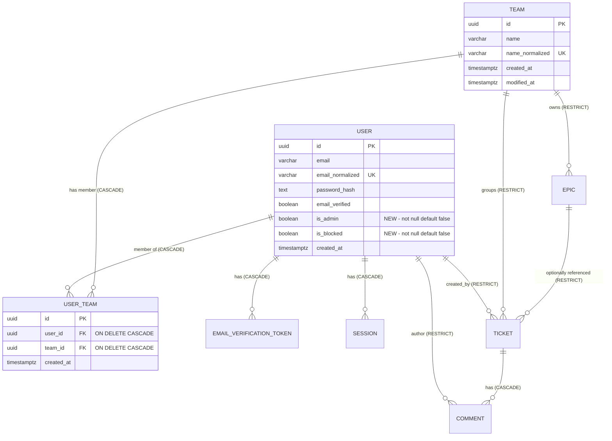
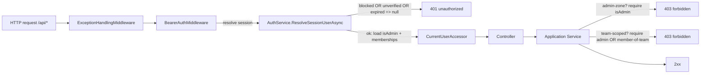

# User Management — Technical Design

> **Status:** Authoritative technical design for the User Management feature. Concept approved by the customer.
> **Audience:** Backend, frontend, QA. Implement strictly to this document; it extends [`ARCHITECTURE.md`](./ARCHITECTURE.md) and [`API_CONTRACT.md`](./API_CONTRACT.md).
> **Author role:** Software Architect (delivery pipeline: BA → Architect → Developer → QA).
> **Conventions inherited:** UTC ISO-8601 with trailing `Z`; canonical lowercase enums; GUID PKs; `ServiceError` codes → `ErrorEnvelope` mapping (ARCHITECTURE §3.3, API_CONTRACT §2); stateful opaque bearer sessions (ADR-0001); normalized companion columns (ADR-0002); EF execution-strategy for user-initiated transactions (fix `14e4424`).
> **New decisions:** captured as [ADR-0007](./adr/0007-authorization-model-admin-and-team-membership.md) and [ADR-0008](./adr/0008-user-management-migration-and-last-admin-guard.md).

---

## 0. Why this design exists (drivers / ASR)

This feature introduces the system's **first authorization model**. Until now there were no roles, no membership, and every verified user could touch every team (REQUIREMENTS_ANALYSIS actor table: "There are no roles, admins, or per-team membership"). The approved requirements change that fundamentally:

- **Two principal kinds:** `admin` (global, ignores team scope) and `member` (sees/acts only within assigned teams).
- **Admin-only "Users" zone** for account lifecycle (create, role, teams, block/unblock, reset password).
- **Account lifecycle states:** `isBlocked` (hard auth denial + session kill) and `isAdmin` (privilege).
- **Membership** as many-to-many `User ↔ Team`.
- **A hard safety invariant:** the system must never lose its last administrator.

The architecturally significant requirements (ASR) — those that shape the design rather than being mere implementation detail — are:

| # | ASR | Design consequence |
|---|---|---|
| ASR-1 | Every team-scoped resource (board, epics, tickets, comments, wip-limits, team settings) must be enforced **server-side** per-resource for members, not just filtered in lists. | Membership must be loaded into `ICurrentUser` and checked in **every** service that touches a team-scoped aggregate (defense against IDOR / OWASP A01 Broken Access Control). |
| ASR-2 | Blocked user must not authenticate even with the correct password, cannot reset/change password, and existing sessions end immediately on block. | Block check belongs in **two** places: at login (AuthService) and at session resolution (BearerAuthMiddleware → AuthService.ResolveSessionUserAsync), plus an explicit session-purge on block/reset. |
| ASR-3 | Last administrator cannot be demoted, blocked, or deleted. | A single reusable **`last-admin` guard** invoked by role-change, block, and (future) delete; counts active (non-blocked) admins. |
| ASR-4 | Admin ignores team scoping entirely; member is constrained to assigned teams. | A uniform `team-scope` authorization helper: `admin ⇒ allow`; `member ⇒ allow iff member of the resource's team`. |
| ASR-5 | Migration must promote ALL existing users to `isAdmin=true` (so the deployment does not lock everyone out of their existing data). | A **data migration** step inside the EF migration (set-based UPDATE), portable enough that the SQLite test path (`EnsureCreated`) does not need it but the PG path does. |
| ASR-6 | Self-registration yields a member who, after verification, joins only the configurable default team ("Demo Team"). | A new env var `DEFAULT_SIGNUP_TEAM_NAME` (default `Demo Team`); membership granted at **verify time**, not signup time; missing team ⇒ no membership + warning log. |

Non-goals (kept out to avoid scope creep): self-service profile editing, password change by the user themselves beyond existing flows, granular per-resource ACLs, audit-log UI, soft-delete of users, admin-configurable role names. These are deliberately excluded; if needed later they are additive.

---

## 1. Assumptions & open questions

Explicit assumptions (marked **[ПРИПУЩЕННЯ]**). None of these block implementation; each is a conscious default chosen to match existing patterns. Open questions for the BA, if any, are listed at the end.

- **[ПРИПУЩЕННЯ UM-1]** "Last administrator" counts **active** admins: a user who is `isAdmin=true AND isBlocked=false AND emailVerified` (a blocked admin cannot act, so it cannot be the safeguarding admin). Therefore demoting/blocking/deleting the only such user is rejected. Rationale: a blocked admin gives no operational coverage; counting it would let the system reach a state with zero usable admins.
- **[ПРИПУЩЕННЯ UM-2]** Admins themselves are **not required to have team memberships**; admin bypasses scoping. Memberships may still be assigned to an admin (harmless) but are ignored while `isAdmin=true`.
- **[ПРИПУЩЕННЯ UM-3]** Admin-created users are `emailVerified=true` and have **no verification token** issued (req 6: pre-verified, no email). They can log in immediately (unless blocked).
- **[ПРИПУЩЕННЯ UM-4]** A reset-generated or admin-set password is subject to the **same** length policy as signup (≥ 8, ≤ 1024). Auto-generated passwords are 16+ chars from a CSPRNG with mixed classes — comfortably strong.
- **[ПРИПУЩЕННЯ UM-5]** The generated password is returned **once** in the HTTP response body of the create/reset call (shown once in UI); it is never persisted in plaintext and never emailed. Only its Argon2id hash is stored.
- **[ПРИПУЩЕННЯ UM-6]** An admin **can** act on their own account for role/teams/block, **except** where the last-admin guard forbids it (you cannot demote/block yourself if you are the last active admin). Self-reset-password is allowed.
- **[ПРИПУЩЕННЯ UM-7]** Blocking a user does **not** delete their authored tickets/comments (User→Ticket/Comment remain RESTRICT). Block is a reversible access state, not a data deletion.
- **[ПРИПУЩЕННЯ UM-8]** `GET /api/admin/users` returns **all** users (no team filter) since it is admin-only and admins are global. Pagination is out of scope for the current scale (hackathon-sized); a `search`/`limit` may be added later without contract break.
- **[ПРИПУЩЕННЯ UM-9]** When a member belongs to multiple teams, choosing which board loads first is **client logic** (last-selected via `localStorage`, else first by name). The server contract only guarantees `/api/auth/me` returns the user's team list; the server does not store a "preferred team".
- **[ПРИПУЩЕННЯ UM-10]** Member visibility of teams: `GET /api/teams` returns only the member's teams; an admin sees all. A member calling team-scoped reads/writes for a non-member team gets **403 `forbidden`** (the resource exists but is not theirs), while a genuinely non-existent id remains **404 `not_found`**. See §3.3 for the 403-vs-404 disclosure decision.

**Open question (non-blocking) for BA:** requirement 8 says self-registered users get membership in the default team *after verification*. If the default team is later renamed, do already-assigned members keep membership (yes — membership is by id, rename is irrelevant) — confirmed, no action. No blocking questions remain.

---

## 2. Data model

### 2.1 Changes to `User`

Two new boolean columns, both `NOT NULL DEFAULT false`, plus a navigation to memberships.

| Column | Type | Constraints | Notes |
|---|---|---|---|
| `is_admin` | boolean | not null, default `false` | Global privilege. Admin ignores team scoping (req 2). Only an admin may change it. |
| `is_blocked` | boolean | not null, default `false` | Hard access denial (req 4). Blocked ⇒ cannot log in, cannot reset/change password, sessions purged. |

Unchanged: `id`, `email`, `email_normalized` (unique), `password_hash`, `email_verified`, `created_at`.

> The "status" column the UI shows per user (req 10) is **derived**, not stored: `blocked` if `is_blocked`; else `unverified` if `!email_verified`; else `active`. Returned in the admin list DTO as both the raw booleans and a convenience `status` string.

### 2.2 New entity / table: `UserTeam` (membership join)

Pure many-to-many join with its own surrogate PK (consistent with the GUID-PK convention; an explicit entity is preferred over an EF implicit join so the membership can carry `created_at` and be queried directly).

| Column | Type | Constraints | Notes |
|---|---|---|---|
| `id` | uuid | PK | server-generated |
| `user_id` | uuid | FK → `users.id`, **ON DELETE CASCADE**, not null, indexed | membership owned by the user |
| `team_id` | uuid | FK → `teams.id`, **ON DELETE CASCADE**, not null, indexed | membership owned by the team |
| `created_at` | timestamptz | not null | when membership was granted |

**Unique constraint:** `UNIQUE (user_id, team_id)` (index `ux_user_teams_user_team`) — a user cannot be in the same team twice. Secondary index on `team_id` for "members of team T" lookups.

**Cascade rationale (deliberate deviation noted):** the existing model uses `RESTRICT` widely to protect against accidental data loss. Membership is different — it is *not* authored content, it is an association. Deleting a team should not be blocked by memberships, and deleting a user (future admin capability) should drop their memberships. Hence **CASCADE** on both FKs. This does **not** weaken the existing `Team → Ticket/Epic` RESTRICT guards: a team with tickets/epics still cannot be deleted (those FKs are unchanged); only its membership rows would cascade.

### 2.3 Invariants

- **INV-1 (uniqueness):** at most one `UserTeam` per `(user_id, team_id)` — DB-enforced + service pre-check (returns clean validation, not a raw 23505).
- **INV-2 (last admin):** `COUNT(users WHERE is_admin AND NOT is_blocked) >= 1` must hold after any role/block/delete operation (service-enforced; see §4.3). There is no DB trigger — the guard is in the Application layer because it is a cross-row business rule and must produce a precise `409 last_admin_required`.
- **INV-3 (blocked ⇒ no live session):** after `is_blocked` becomes true, the user has zero rows in `sessions` (service deletes them in the same transaction). Backed at read time by the block check in `ResolveSessionUserAsync`.
- **INV-4 (member team-scope):** a non-admin may only read/write a team-scoped aggregate whose `team_id` is in their membership set (service-enforced in every team-scoped service).

### 2.4 ER diagram (deltas highlighted)



(Only `USER`, `USER_TEAM` and the `USER↔TEAM` relationship are new; the rest of the diagram is unchanged from ARCHITECTURE §4.4 and reproduced for context.)

### 2.5 Domain & EF mapping notes (for the developer)

- `User` entity (`Domain/Entities/User.cs`): add `public bool IsAdmin { get; set; }`, `public bool IsBlocked { get; set; }`, and `public ICollection<UserTeam> Memberships { get; set; } = new List<UserTeam>();`.
- New `Domain/Entities/UserTeam.cs`: `Id, UserId, User?, TeamId, Team?, CreatedAt`.
- `Team` entity: add `public ICollection<UserTeam> Members { get; set; } = new List<UserTeam>();`.
- `AppDbContext`: add `DbSet<UserTeam> UserTeams`; configure in `OnModelCreating` mirroring existing style — `ToTable("user_teams")`, snake_case columns, `ValueGeneratedNever` on `Id`, unique index `(UserId, TeamId)` named `ux_user_teams_user_team`, index on `TeamId`, both FKs `OnDelete(DeleteBehavior.Cascade)`. Add `is_admin`/`is_blocked` properties to the `User` config with `.HasColumnName(...).IsRequired()` and `.HasDefaultValue(false)`.
- `IAppDbContext`: add `DbSet<UserTeam> UserTeams { get; }`.

---

## 3. Authorization model

### 3.1 Principals & where authorization is enforced



Two enforcement layers, each with a distinct job:

1. **`BearerAuthMiddleware` / `AuthService.ResolveSessionUserAsync` (authentication + identity load):**
   - Reject no/invalid/expired token → `401 unauthorized` (unchanged).
   - **NEW:** reject `is_blocked` user → `401 unauthorized` (ASR-2). Treated as "session no longer valid". A blocked user's sessions are also deleted at block time, so normally there is nothing to resolve; this is the backstop for any token issued just before block.
   - Reject `!email_verified` → null (unchanged).
   - **NEW:** populate `CurrentUserAccessor` with `UserId`, `IsAdmin`, and the set of `TeamIds` the user belongs to (a single `Include`/projection on memberships).

2. **Application services (authorization):**
   - **Admin-zone services** (`UserAdminService` for all `/api/admin/*`): first line is `RequireAdmin()`. Non-admin → `403 forbidden`.
   - **Team-scoped services** (`TeamService` read/CRUD scoping, `EpicService`, `TicketService`, `CommentService`, wip-limits): every operation that resolves a `team_id` calls `RequireTeamAccess(teamId)` → admin passes; member passes iff `teamId ∈ CurrentUser.TeamIds`; otherwise `403 forbidden`. List endpoints additionally **filter** to the member's teams.

> **Why services, not `[Authorize]` attributes:** the codebase deliberately keeps thin controllers and HTTP-agnostic services with all authoritative rules in the Application layer (ARCHITECTURE §3.2). Putting authorization in services keeps it unit-testable without HTTP and guarantees a direct/bypassed call is still checked (ASR-1). A lightweight admin-zone attribute could complement, but the service check is the authoritative backstop and must exist regardless.

### 3.2 `ICurrentUser` extension

`ICurrentUser` (and `CurrentUserAccessor`) gain:

```csharp
public interface ICurrentUser
{
    Guid? UserId { get; }
    bool IsAdmin { get; }
    IReadOnlySet<Guid> TeamIds { get; }   // empty for unauthenticated or team-less users
    Guid RequireUserId();
    void RequireAdmin();                    // throws 403 forbidden if !IsAdmin
    bool CanAccessTeam(Guid teamId);        // IsAdmin || TeamIds.Contains(teamId)
    void RequireTeamAccess(Guid teamId);    // throws 403 forbidden if !CanAccessTeam
}
```

`CurrentUserAccessor.Set(...)` changes signature to accept `(Guid userId, bool isAdmin, IReadOnlySet<Guid> teamIds)`. `FakeCurrentUser` in tests gains the same shape (see §6.5).

`RequireAdmin`/`RequireTeamAccess` throw `ServiceException(ServiceErrorCode.Forbidden, ...)` → `403`.

### 3.3 403-vs-404 disclosure decision

When a member addresses a team-scoped resource by id that exists but belongs to another team, we return **403 `forbidden`**, not 404. Trade-off:

- **403 (chosen):** simpler, honest, and the resource id is a GUID (not enumerable), so leaking "this id exists" carries negligible risk. Members already know teams exist. Aligns with OWASP guidance that obscuring via 404 is weak security-by-obscurity.
- **404-masking (rejected):** would hide existence but complicates the contract (same code for "absent" and "forbidden") and makes debugging/QA harder. The marginal anti-enumeration benefit does not justify it given non-sequential GUID ids.

**Ordering rule (uniform):** resolve the resource first; if absent → `404 not_found`; if present but team not accessible → `403 forbidden`. This keeps the existing 404 semantics for genuinely missing ids intact.

### 3.4 Full endpoint → authorization table

Legend: **A** = admin only; **M(team)** = admin OR member of the resource's team; **Auth** = any authenticated, verified, non-blocked user; **Public** = no auth. "List filter" = what a member sees.

#### Existing endpoints (changes called out)

| Method | Path | Rule | List filter (member) | Codes (new/changed) |
|---|---|---|---|---|
| POST | `/api/auth/signup` | Public | — | `member` account; verification unchanged; membership granted at verify (req 8) |
| POST | `/api/auth/login` | Public | — | **NEW:** blocked → `401 account_blocked` (see §5 trade-off on 401 vs 403); unverified → `403 account_not_verified` (unchanged) |
| POST | `/api/auth/logout` | Auth | — | unchanged |
| POST | `/api/auth/verify-email` | Public | — | **NEW side-effect:** on success, grant membership to default team (req 8) |
| POST | `/api/auth/resend-verification` | Public | — | **NEW:** if the matched account is blocked, behave non-committally (no token issued) — blocked cannot use verification to regain access |
| GET | `/api/auth/me` | Auth | — | **NEW fields:** `isAdmin`, `teams[]` (id+name), `isBlocked` |
| GET | `/api/teams` | Auth | only the member's teams | admin sees all; member sees memberships only |
| POST | `/api/teams` | **A** | — | **CHANGED:** non-admin → `403 forbidden` |
| PUT | `/api/teams/{id}` | **A** | — | **CHANGED:** non-admin → `403 forbidden` |
| PUT | `/api/teams/{id}/wip-limits` | **M(team)** | — | **CHANGED:** member not in team → `403 forbidden` |
| DELETE | `/api/teams/{id}` | **A** | — | **CHANGED:** non-admin → `403 forbidden`; existing `409 team_has_children` unchanged |
| GET | `/api/epics?teamId=` | **M(team)** | rejects non-member teamId | **CHANGED:** member non-member team → `403 forbidden` |
| POST | `/api/epics` | **M(team)** | — | body `teamId` must be accessible → else `403 forbidden` |
| PUT | `/api/epics/{id}` | **M(team of epic)** | — | resolve epic → check team access |
| DELETE | `/api/epics/{id}` | **M(team of epic)** | — | `409 epic_referenced_by_tickets` unchanged |
| GET | `/api/tickets?teamId=` (board) | **M(team)** | rejects non-member teamId | **CHANGED:** member non-member team → `403 forbidden` |
| GET | `/api/tickets/{id}` | **M(team of ticket)** | — | resolve ticket → check team access (IDOR guard) |
| POST | `/api/tickets` | **M(team)** | — | body `teamId` accessible → else `403`; epic-same-team unchanged |
| PUT | `/api/tickets/{id}` | **M(team of ticket)** | — | check access on BOTH current team and target team (a member cannot move a ticket into a team they don't belong to) |
| PATCH | `/api/tickets/{id}/state` | **M(team of ticket)** | — | check team access before state change |
| DELETE | `/api/tickets/{id}` | **M(team of ticket)** | — | check team access; cascade comments unchanged |
| GET | `/api/tickets/{id}/comments` | **M(team of ticket)** | — | resolve ticket's team → check access |
| POST | `/api/tickets/{id}/comments` | **M(team of ticket)** | — | resolve ticket's team → check access |
| GET | `/health/live`, `/health/ready` | Public | — | unchanged |

#### New endpoints (all **A** — admin only)

| Method | Path | Rule | Purpose |
|---|---|---|---|
| GET | `/api/admin/users` | **A** | List all users with status, role, membership, timestamps |
| POST | `/api/admin/users` | **A** | Create active + pre-verified user, optional admin, assign teams, set/generate password |
| PUT | `/api/admin/users/{id}/role` | **A** | Set `isAdmin` (last-admin guard on demote) |
| PUT | `/api/admin/users/{id}/teams` | **A** | Replace the user's team membership set |
| POST | `/api/admin/users/{id}/block` | **A** | Block (last-admin guard; purge sessions) |
| POST | `/api/admin/users/{id}/unblock` | **A** | Unblock (restore access) |
| POST | `/api/admin/users/{id}/reset-password` | **A** | Generate strong password, return once, purge sessions (blocked → 409) |

All `/api/admin/*` paths are guarded by `BearerAuthMiddleware` (require valid, verified, non-blocked session) **and** `UserAdminService.RequireAdmin()` (require `isAdmin`). A non-admin authenticated user hitting any `/api/admin/*` route → `403 forbidden`.

### 3.5 New `ServiceErrorCode` values & envelope mapping

Add to `ServiceErrorCode` enum, `ServiceErrorCodes.ToWire`, and `ErrorStatusMap.ToHttpStatus`:

| Enum value | Wire `code` | HTTP | When |
|---|---|---|---|
| `Forbidden` | `forbidden` | **403** | Authenticated but not allowed: non-admin in admin zone; member acting on a non-member team's resource. |
| `AccountBlocked` | `account_blocked` | **401** | Login (or session resolution) for a blocked account. (See §5 for why 401, with a 403 alternative noted.) |
| `LastAdminRequired` | `last_admin_required` | **409** | Demote/block/delete that would leave zero active admins. |
| `EmailInUse` | `email_in_use` | **409** | Admin create-user with an email that already exists (admin zone is non-public, so enumeration is acceptable here — unlike public signup). |

Notes on choices:
- `Forbidden` = 403 is the canonical "authenticated but not authorized" — distinct from `unauthorized` (401, "not authenticated"). This is the core new code.
- `LastAdminRequired` = 409 (conflict with current persisted state) is consistent with the existing 409 family (`team_has_children`, `epic_referenced_by_tickets`).
- `EmailInUse` = 409 only in the **admin** create path. Public signup keeps its non-enumerating 201 (unchanged). The admin path is allowed to be explicit because the caller is already a trusted admin.

---

## 4. Endpoint contracts

All requests/responses are `application/json`. Bodies use camelCase. Timestamps ISO-8601 UTC `Z`. Errors use the uniform envelope (API_CONTRACT §2).

### 4.1 New admin DTOs (to add in `Application/Dtos/UserAdminDtos.cs`)

```csharp
// status is derived: "blocked" | "unverified" | "active"
public sealed record AdminUserDto(
    Guid Id, string Email, bool IsAdmin, bool IsBlocked, bool EmailVerified,
    string Status, DateTime CreatedAt, IReadOnlyList<TeamRefDto> Teams);

public sealed record TeamRefDto(Guid Id, string Name);

public sealed record CreateUserRequest(
    string? Email, string? Password, bool IsAdmin, IReadOnlyList<Guid>? TeamIds);
// Password null/blank => auto-generate.

public sealed record CreateUserResponse(AdminUserDto User, string? GeneratedPassword);
// GeneratedPassword present (shown once) only when the server generated it.

public sealed record SetRoleRequest(bool IsAdmin);

public sealed record SetTeamsRequest(IReadOnlyList<Guid>? TeamIds);

public sealed record ResetPasswordResponse(string GeneratedPassword);
```

### 4.2 `GET /api/admin/users` — admin

**200 OK**
```json
[
  {
    "id": "8e29c1b4-...",
    "email": "alex@dataart.com",
    "isAdmin": true,
    "isBlocked": false,
    "emailVerified": true,
    "status": "active",
    "createdAt": "2026-06-30T11:26:00Z",
    "teams": [ { "id": "f1...", "name": "Platform" } ]
  }
]
```
Ordered by `created_at` asc (stable). **Errors:** `401 unauthorized` (no/blocked session); `403 forbidden` (authenticated non-admin).

### 4.3 `POST /api/admin/users` — admin

**Request**
```json
{ "email": "newdev@dataart.com", "password": null, "isAdmin": false, "teamIds": ["f1..."] }
```
- `email`: required, valid, normalized-unique. If it already exists → `409 email_in_use`.
- `password`: optional; null/blank ⇒ server generates a strong one (≥ 16 chars, mixed classes). If provided, must satisfy ≥ 8 / ≤ 1024.
- `isAdmin`: optional, default false.
- `teamIds`: optional; each must reference an existing team (else `400 validation_error` keyed `teamIds`). Duplicates de-duplicated. The account is created `emailVerified=true`, `isBlocked=false`, **no** verification token, **no** email sent.

**201 Created**
```json
{
  "user": { "id": "...", "email": "newdev@dataart.com", "isAdmin": false, "isBlocked": false,
            "emailVerified": true, "status": "active", "createdAt": "2026-06-30T12:00:00Z",
            "teams": [ { "id": "f1...", "name": "Platform" } ] },
  "generatedPassword": "Xk9$mPq2vLr7Wn4t"
}
```
`generatedPassword` is `null` when the admin supplied the password. **Errors:** `400 validation_error` (email/password/teamIds); `409 email_in_use`; `401`/`403` as above.

### 4.4 `PUT /api/admin/users/{id}/role` — admin

**Request:** `{ "isAdmin": false }` — **204 No Content** (or return the updated `AdminUserDto`; developer picks one and documents — recommend returning the DTO for SPA cache update; **200** with `AdminUserDto`).

Guard: if `isAdmin=false` (demotion) and the target is the **last active admin** → `409 last_admin_required` (INV-2). Promotion (`isAdmin=true`) is always allowed (subject to admin auth). Idempotent: setting the same value is a no-op success. **Errors:** `404 not_found` (no such user); `409 last_admin_required`; `401`/`403`.

### 4.5 `PUT /api/admin/users/{id}/teams` — admin

**Request:** `{ "teamIds": ["f1...", "a2..."] }` — replaces the full membership set (authoritative set semantics, mirroring the wip-limits "full set" pattern). Each id must exist (else `400 validation_error`). De-duplicated. Empty/null list ⇒ user has no teams. **200** with updated `AdminUserDto`. **Errors:** `400`; `404 not_found` (user); `401`/`403`. Note: changing teams does not affect `isAdmin`; an admin with zero teams is still global.

### 4.6 `POST /api/admin/users/{id}/block` — admin

**Request:** empty body. Sets `is_blocked=true` and **deletes all of the user's sessions** in one transaction (EF execution strategy, fix `14e4424`). Guard: if the target is the last active admin → `409 last_admin_required` (you may not block the last admin). Idempotent (already blocked ⇒ still 200, sessions already gone). **200** with updated `AdminUserDto`. **Errors:** `404`; `409 last_admin_required`; `401`/`403`.

### 4.7 `POST /api/admin/users/{id}/unblock` — admin

**Request:** empty body. Sets `is_blocked=false`. No session restoration (the user logs in again). Idempotent. **200** with updated `AdminUserDto`. **Errors:** `404`; `401`/`403`.

### 4.8 `POST /api/admin/users/{id}/reset-password` — admin

**Request:** empty body. Generates a strong password, stores only its Argon2id hash, **deletes all the user's sessions** (force re-login), returns the plaintext once.

**Guard — reset on a blocked user → `403 forbidden`**, message "Unblock the account before resetting its password." Decision rationale (single source of truth): the refusal is tied to the target's access state, which is an authorization-style "not allowed in this state" condition; `403 forbidden` already exists in the code set, so no new code is introduced. Alternatives considered and rejected: a dedicated 409 code (would expand the taxonomy for one edge case) and reusing `account_blocked` (that code is bound to HTTP 401 — we keep one HTTP status per code). This keeps the taxonomy minimal and status semantics clean (req 5: blocked users cannot reset).

**200 OK**
```json
{ "generatedPassword": "Xk9$mPq2vLr7Wn4t" }
```
**Errors:** `404` (user); `403 forbidden` (target blocked, or caller not admin); `401`.

### 4.9 Changed existing contracts

- **`POST /api/auth/login`** — add blocked branch. Order of checks: resolve user → verify password (equal-cost dummy on null, unchanged) → **if `is_blocked` → `401 account_blocked`** → if `!email_verified` → `403 account_not_verified` → issue session. (Blocked checked before verified so a blocked-and-unverified account reports blocked.)
  ```json
  { "error": { "code": "account_blocked", "message": "This account has been blocked. Contact an administrator." } }
  ```
- **`POST /api/auth/verify-email`** — after marking verified, in the **same transaction**, grant membership to the default team: look up team by normalized name = `NormalizeKey(DEFAULT_SIGNUP_TEAM_NAME)`; if found and not already a member, insert `UserTeam`; if not found, log a warning and proceed (user ends with no teams; req 8). Admin-created users never traverse this path.
- **`POST /api/auth/resend-verification`** — if the matched user is `is_blocked`, return the same non-committal `202` **without** issuing a token (blocked users cannot use verification to act). Unknown/verified behavior unchanged.
- **`GET /api/auth/me`** — extend `UserDto`:
  ```json
  {
    "id": "8e29c1b4-...",
    "email": "alex@dataart.com",
    "emailVerified": true,
    "isAdmin": false,
    "isBlocked": false,
    "teams": [ { "id": "f1...", "name": "Platform" } ]
  }
  ```
  The `teams` array drives the SPA's board team-selector and the "load last/first team" client logic (req 11, [ПРИПУЩЕННЯ UM-9]). `LoginResponse.user` should carry the same shape for a single bootstrap.
- **`/api/teams` (GET)** — member receives only their teams (filter by `TeamIds`); admin receives all. Counts unchanged.
- **`/api/teams` (POST/PUT/DELETE)** — admin-only (`RequireAdmin`), else `403 forbidden`.
- **`/api/epics|tickets|comments|wip-limits`** — every operation calls `RequireTeamAccess(resolvedTeamId)`; board/epic list rejects a non-member `teamId` with `403`.

### 4.10 `docs/API_CONTRACT.md` update plan (developer executes)

The developer updates `API_CONTRACT.md` to add: (a) in §1, the rule that `/api/admin/*` requires `isAdmin` and team-scoped endpoints require membership-or-admin; (b) in §2, the four new codes (`forbidden` 403, `account_blocked` 401, `last_admin_required` 409, `email_in_use` 409) with the 403-vs-404 ordering rule; (c) a new §8 "Admin — User Management" with the seven endpoints above; (d) the changed login/verify/resend/me bodies; (e) the per-endpoint auth column updated for teams/epics/tickets/comments. No contract field is removed — all changes are additive or stricter, so existing SPA reads keep working except where authorization now denies (intended).

---

## 5. Authentication trade-off: blocked login → 401 vs 403

Requirement 4 says a blocked user "cannot log in even with the correct password" and "existing sessions end". The status code is a design choice:

- **401 `account_blocked` (chosen):** A blocked account has, in effect, no valid authentication. Login returns 401, sessions are purged, and `ResolveSessionUserAsync` also returns null (→ 401) for any surviving token. This keeps "blocked == not authenticated" uniform across login and every protected request, so the SPA's existing 401 handler (clear token → route to login) just works, showing the `account_blocked` message.
- **403 (alternative, rejected as default):** "authenticated identity exists but is forbidden". Semantically defensible, but it would make the SPA treat a blocked session differently from an expired one, and a 403 at login implies the credentials were accepted — a subtle information leak. The requirement also pairs blocking with *session termination*, which is fundamentally a 401 condition.

The requirement text mentions "403/401"; we standardize on **401 `account_blocked`** for both login and mid-session, and document it. If the BA insists on 403 at the login step specifically, it is a one-line change in `AuthService.LoginAsync` (throw with a code mapped to 403) — captured as a reversible decision in ADR-0007.

---

## 6. Test strategy (for QA / developer)

Compatible with the existing SQLite `WebApplicationFactory` infra (ARCHITECTURE §10, ADR-0002): `CustomWebApplicationFactory` builds schema via `EnsureCreated()` from the model, so the new `user_teams` table and `users.is_admin/is_blocked` columns appear automatically once the model/config is added — **no data migration runs in tests** (existing-users-promotion is a PG-migration concern only; tests create users with explicit flags). FK CASCADE on `user_teams` fires because the factory sets `PRAGMA foreign_keys=ON`.

### 6.1 New positive cases

1. Admin creates a user (auto-gen password) → 201, `generatedPassword` present, user can log in with it.
2. Admin creates a user with a chosen password + teams → 201, `generatedPassword` null, memberships set, `emailVerified=true`, no email captured by `FakeEmailSender`.
3. Admin promotes a member to admin → that user now sees all teams in `/api/teams`.
4. Admin assigns teams (PUT teams) → member's `/api/teams` and board reflect exactly those teams.
5. Admin blocks then unblocks a user → blocked user cannot log in (401 `account_blocked`); after unblock, login succeeds.
6. Admin reset-password → returns new password once; old sessions 401; user logs in with new password.
7. Self-registration → verify → user is `member`, `isAdmin=false`, member of "Demo Team" (seed a Demo Team first); `/api/auth/me.teams` contains it.
8. Admin sees all users and all teams regardless of membership.
9. `/api/auth/me` returns `isAdmin`, `isBlocked`, `teams[]`.

### 6.2 New negative / security cases (the core of this feature)

1. **Non-admin → admin zone:** authenticated member calls each `/api/admin/*` endpoint → `403 forbidden` (table-driven over all 7).
2. **Member cross-team read (IDOR):** member of Team A calls `GET /api/tickets?teamId=<B>`, `GET /api/tickets/{idInB}`, `GET /api/epics?teamId=<B>`, `GET /api/tickets/{idInB}/comments` → `403 forbidden` for each.
3. **Member cross-team write (IDOR):** member of A tries to create epic/ticket/comment in B, PATCH state of a B ticket, PUT a B ticket, set B wip-limits → `403 forbidden` each.
4. **Member team CRUD:** member POST/PUT/DELETE `/api/teams` → `403 forbidden`.
5. **Blocked cannot log in:** block user → login with correct password → `401 account_blocked`.
6. **Blocked cannot reset:** reset-password on a blocked user → `403 forbidden`.
7. **Blocked sessions die immediately:** user logs in (token T) → admin blocks → request with T → `401`.
8. **Blocked cannot resend verification to regain access:** resend for a blocked (unverified-then-blocked) account → non-committal 202, no token issued; verify still impossible.
9. **Last-admin guard:** with exactly one active admin — demote self → `409 last_admin_required`; block self → `409 last_admin_required`; (future delete → same). With two admins, demoting one succeeds.
10. **Member list filtering:** member of A only sees Team A in `GET /api/teams`; tickets/epics for B never appear.
11. **404 vs 403 ordering:** member requests `GET /api/tickets/{nonexistent}` → `404 not_found`; `GET /api/tickets/{existsInB}` → `403 forbidden`.
12. **Move-into-foreign-team:** member of A PUTs a Team-A ticket setting `teamId=B` → `403 forbidden`.

### 6.3 Existing test groups that change (developer must update)

These groups currently assume the pre-authz world (any verified user does anything) and will break or need adjustment:

| Test file | Why it changes | Action |
|---|---|---|
| `Api/TeamsTests.cs` | Create/rename/delete now admin-only; list now membership-filtered. `RegisterVerifiedUserAsync()` yields a **member**, not an admin. | Add an admin-registration helper; CRUD tests must auth as admin. List tests must seed membership or auth as admin. |
| `Api/EpicsTests.cs` | Epics are team-scoped; the test user must be a member of the team (or admin) for every call. | Make the helper user a member of the team it operates on, or use an admin. |
| `Api/TicketsTests.cs` | Same team-scoping; create/edit/state/delete need membership. | As above. |
| `Api/CommentsTests.cs` | Comment add/list need access to the ticket's team. | As above. |
| `Api/BoardTests.cs` | Board read is team-scoped. | As above. |
| `Api/WipLimitsTests.cs`, `Api/WipLimitsCoverageTests.cs` | wip-limits now M(team). | Member must belong to the team or use admin. |
| `Api/AuthFlowTests.cs` | `/api/auth/me` and `LoginResponse.user` gain fields; signup now yields a member + Demo-Team membership at verify. | Update DTO assertions; seed Demo Team where membership is asserted; new fields tolerated by camelCase deserialization. |
| `Infrastructure/IntegrationTestBase.cs` | `RegisterVerifiedUserAsync` returns a member with no teams by default — many tests implicitly assumed full access. | Add `RegisterAdminAsync()` and `RegisterMemberInTeamAsync(teamId)` helpers; keep the existing helper but document it returns a team-less member. |
| `Infrastructure/ApiResponses.cs` (typed DTOs) | `UserDto`/`LoginDto`/`TeamDto` test mirrors need the new fields. | Extend the test record types. |
| `Unit/*` (e.g. `TicketServiceModifiedAtTests`) | Construct `TicketService` directly with `FakeCurrentUser`. | `FakeCurrentUser` gains `IsAdmin`/`TeamIds`; set `IsAdmin=true` (or membership) so existing modified_at tests keep passing while focusing on their original assertions. |

The recommended minimal-churn approach: make the default test principal an **admin** wherever the test's intent is "exercise the business rule, not authorization", and add dedicated member/blocked principals only in the new authz tests. This isolates the authz change to the new test files plus helper extensions.

### 6.4 Parity guard

CI's `dotnet ef migrations has-pending-model-changes` (ADR-0003) must pass after adding the model config + the new migration — i.e., the new migration must exactly match the model (new columns, defaults, `user_teams` table, indexes, FKs). Run it as the last verification step.

### 6.5 `FakeCurrentUser` shape (tests)

```csharp
public sealed class FakeCurrentUser : ICurrentUser
{
    public Guid? UserId { get; set; }
    public bool IsAdmin { get; set; }
    public IReadOnlySet<Guid> TeamIds { get; set; } = new HashSet<Guid>();
    public Guid RequireUserId() => UserId ?? throw ServiceException.Unauthorized();
    public void RequireAdmin() { if (!IsAdmin) throw new ServiceException(ServiceErrorCode.Forbidden, "Admin access required."); }
    public bool CanAccessTeam(Guid t) => IsAdmin || TeamIds.Contains(t);
    public void RequireTeamAccess(Guid t) { if (!CanAccessTeam(t)) throw new ServiceException(ServiceErrorCode.Forbidden, "You do not have access to this team."); }
}
```

---

## 7. Migration strategy

### 7.1 EF migration (Npgsql) — `AddUserManagement`

Single migration adds:
- `users.is_admin boolean NOT NULL DEFAULT false`, `users.is_blocked boolean NOT NULL DEFAULT false`.
- `user_teams` table: `Id uuid PK`, `user_id uuid NOT NULL`, `team_id uuid NOT NULL`, `created_at timestamptz NOT NULL`; unique index `ux_user_teams_user_team (user_id, team_id)`; index on `team_id`; FK to `users(Id)` ON DELETE CASCADE; FK to `teams(Id)` ON DELETE CASCADE.
- **Data migration (ASR-5):** after creating the columns, a set-based update promotes all existing users:
  ```sql
  UPDATE users SET is_admin = true;
  ```
  Placed in the migration `Up()` via `migrationBuilder.Sql("UPDATE users SET is_admin = true;")`, **after** `AddColumn` (the column already exists with default false; this flips existing rows to true). New rows created after migration default to false — correct, because new signups are members.

### 7.2 SQLite/test parity

- Tests use `EnsureCreated()` (not migrations), so the data-migration `UPDATE` never runs in tests — fine, because tests create users with explicit `is_admin`. The schema (columns, table, indexes, FKs) is produced from the model config and is SQLite-compatible (booleans, uuid-as-text, plain unique indexes — same portable choices as ADR-0002). Default values: configure `.HasDefaultValue(false)` so both providers agree.
- The `migrationBuilder.Sql(...)` data step is plain ANSI `UPDATE` — harmless if it ever ran under SQLite, but it does not (test path uses EnsureCreated).
- The default-team seeding for self-signup is **runtime** logic (verify-email), not a migration: no seed rows are added by the migration (preserves "fresh DB = schema only", V28, ADR-0003). The "Demo Team" must be created by an admin or by the customer's environment; if absent, signup users get no team + a warning log (req 8). Do **not** auto-create Demo Team in the migration.

### 7.3 Config

New env var (ARCHITECTURE §8 table; developer adds to `.env.example` and `Program.cs` options binding):

| Variable | Consumed by | Default | Purpose |
|---|---|---|---|
| `DEFAULT_SIGNUP_TEAM_NAME` | api (AuthService via AuthOptions) | `Demo Team` | Team a self-registered user joins after verification (req 8). If no team with this normalized name exists, the user gets no membership and a warning is logged. |

Add `DefaultSignupTeamName` to `AuthOptions` and bind it in `Program.cs` alongside the existing options.

### 7.4 Rollback

`Down()` drops `user_teams` and the two columns. Because `is_admin` data is not preserved on rollback, document that a forward-fix is preferred over rollback in any environment that has gone live (standard for data migrations).

---

## 8. Risks & security considerations

| # | Risk | Likelihood | Impact | Mitigation | Fallback trigger |
|---|---|---|---|---|---|
| R-1 | **Broken access control (OWASP A01)** — a team-scoped endpoint forgets the membership check, exposing another team's data. | Med | High | Centralize the check in `RequireTeamAccess`; call it in **every** team-scoped service method; table-driven negative tests (§6.2) cover each endpoint; code review checklist item "every team_id resolved → RequireTeamAccess called". | Any §6.2 IDOR test fails. |
| R-2 | **IDOR via direct id** — member fetches `/api/tickets/{idOfOtherTeam}`. | Med | High | Resolve resource, then check the resource's `team_id` (not the request's) before returning; 404-then-403 ordering. | §6.2 case 2/11 fails. |
| R-3 | **Privilege escalation** — non-admin reaches admin zone. | Low | Critical | Two gates: middleware (auth) + `RequireAdmin` in `UserAdminService` (authz). Never rely on the SPA hiding the menu. | §6.2 case 1 fails. |
| R-4 | **Last-admin lockout** — system left with zero usable admins. | Low | Critical | INV-2 guard reused by role/block/(delete); counts active admins; self-action included. | §6.2 case 9 fails. |
| R-5 | **Blocked user retains access** via a live token. | Med | High | Block purges sessions (tx) AND `ResolveSessionUserAsync` rejects blocked → 401. Two-layer. | §6.2 case 7 fails. |
| R-6 | **Generated password leakage** — logged or persisted. | Low | High | Plaintext returned once in response body only; never logged (mirror the token-never-logged rule); only Argon2id hash stored. | Code review / log scan. |
| R-7 | **Migration promotes the wrong set** (e.g., runs twice). | Low | Med | `UPDATE users SET is_admin=true` is idempotent; runs once via EF history; new rows default false. | Post-deploy check: count admins == pre-existing user count. |
| R-8 | **Self-signup default team missing** silently denies a user any workspace. | Med | Low | Warning log on missing team; admin assigns later; documented in req 8 and §7.2. | Ops alert on the warning log. |
| R-9 | **Transaction correctness** for block/reset (set blocked + delete sessions atomically) under Npgsql retry. | Low | Med | Use `Database.CreateExecutionStrategy()` + `BeginTransactionAsync` exactly as AuthService verify/resend (fix `14e4424`); never open a bare transaction. | DbUpdate/retry exceptions in CI. |
| R-10 | **Enumeration via admin create** (`email_in_use`). | Low | Low | Acceptable: caller is a trusted admin; public signup stays non-enumerating (unchanged). | N/A (accepted). |
| R-11 | **Mass-assignment** — client sets `isAdmin` via a non-admin endpoint (e.g., signup body). | Low | High | Signup DTO has no role/teams fields; role/teams only mutable via admin endpoints; admin endpoints gated. | Review signup DTO. |

Security posture summary: enforcement is **server-side per resource** for every team-scoped aggregate (not merely list filtering), satisfying ASR-1 and OWASP A01. Authentication (blocked) is enforced at both login and every request. Admin zone is double-gated. The last-admin invariant is centralized and tested. No secrets (generated passwords) are logged or stored in plaintext.

---

## 9. Handoff for the developer (implementation order)

Implement in this order; each step is independently compilable/testable.

1. **Domain + EF model:** add `User.IsAdmin/IsBlocked/Memberships`; new `UserTeam` entity; `Team.Members`; `AppDbContext` config (table, indexes, FKs, defaults); `IAppDbContext.UserTeams`. Run `dotnet ef migrations add AddUserManagement`; hand-add the `migrationBuilder.Sql("UPDATE users SET is_admin = true;")` after the AddColumn calls. Verify `has-pending-model-changes` clean.
2. **ICurrentUser + accessor:** extend interface; update `CurrentUserAccessor.Set` to take `(userId, isAdmin, teamIds)`; add `RequireAdmin/CanAccessTeam/RequireTeamAccess`. Update `FakeCurrentUser`.
3. **AuthService identity load + block:** `ResolveSessionUserAsync` rejects blocked; load `isAdmin` + membership team ids; `BearerAuthMiddleware.Set(...)` passes them through. Add `is_blocked` branch to `LoginAsync` (401 `account_blocked`).
4. **Error codes:** add `Forbidden`, `AccountBlocked`, `LastAdminRequired`, `EmailInUse` to enum + `ToWire` + `ErrorStatusMap`.
5. **Team-scope enforcement:** add `RequireTeamAccess` calls + list filtering to `TeamService` (list filter; CRUD `RequireAdmin`), `EpicService`, `TicketService` (resolve-then-check, including move-into-team), `CommentService`, wip-limits. Update `/api/auth/me` + `LoginResponse.user` DTO with `isAdmin/isBlocked/teams`.
6. **Self-signup default team:** add `AuthOptions.DefaultSignupTeamName` + binding; grant membership in `VerifyEmailAsync` (same tx, missing-team warning); block-aware `resend-verification`.
7. **UserAdminService + controller:** new `Application/Services/UserAdminService.cs` (RequireAdmin first line; create/list/role/teams/block/unblock/reset; last-admin guard; CSPRNG password gen via existing `ITokenGenerator`/a small password generator; tx for block/reset using execution strategy). New `Api/Controllers/AdminUsersController.cs` (`[Route("api/admin/users")]`, thin).
8. **Tests:** extend `IntegrationTestBase` helpers; update existing groups (§6.3); add new authz test files (§6.1/§6.2); keep parity guard green.
9. **Docs:** update `docs/API_CONTRACT.md` per §4.10; update `docs/ARCHITECTURE.md` §4 (User table + UserTeam) and §5 (route table) and §8 (env var); add `.env.example` entry.

**What is NOT defined by this design (developer's freedom / explicit non-decisions):**
- The exact password-generation alphabet and length beyond "≥ 16, CSPRNG, mixed classes" — pick a concrete implementation.
- Whether role/teams endpoints return 200+DTO or 204 — recommended 200+`AdminUserDto`; developer confirms and documents in the contract.
- SPA implementation of the Users zone, the team selector "last/first" logic (client-only, req 11), and toast/empty/error states — frontend detail.
- Optional admin-zone `[Authorize]`-style attribute as a convenience layer (the service `RequireAdmin` is authoritative regardless).
- Pagination/search on `GET /api/admin/users` (out of scope now; additive later).
