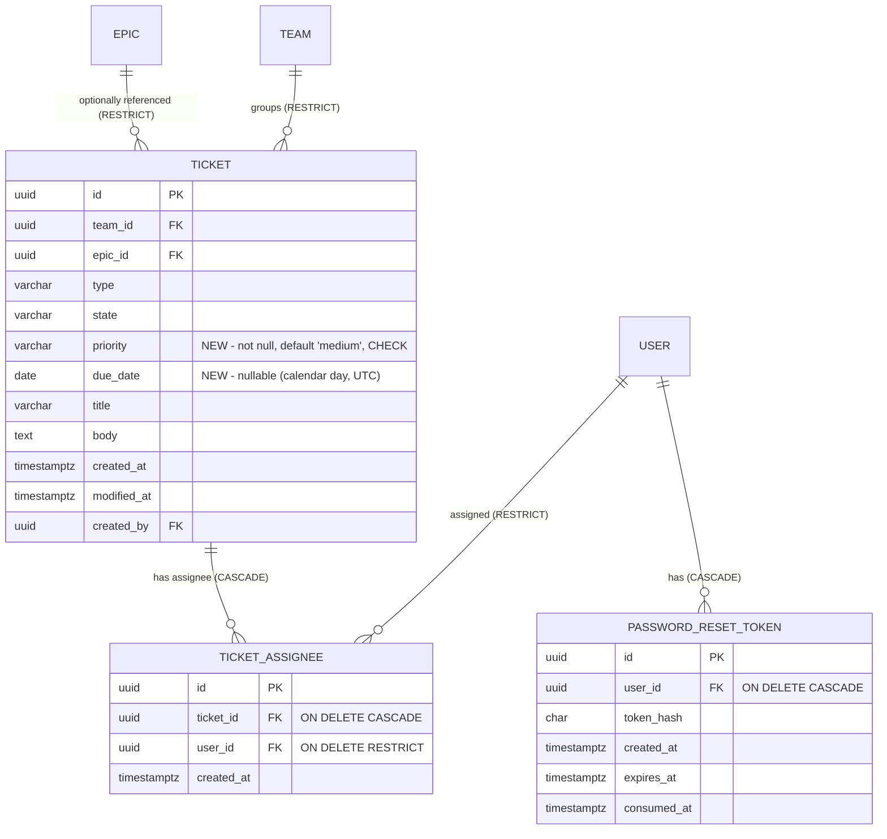

# Wave 1 — Technical Design (6 features)

> **Status:** Authoritative technical design for the PO-approved "Wave 1" batch. Implement strictly to this document; it extends [`ARCHITECTURE.md`](./ARCHITECTURE.md), [`API_CONTRACT.md`](./API_CONTRACT.md), and [`USER_MANAGEMENT_DESIGN.md`](./USER_MANAGEMENT_DESIGN.md).
> **Author role:** Software Architect (delivery pipeline: BA → Architect → Developer → QA).
> **Conventions inherited (do not re-derive):** UTC ISO-8601 with trailing `Z`; canonical lowercase enums; GUID PKs (`ValueGeneratedNever`); normalized companion columns for case-insensitive uniqueness (ADR-0002); stateful opaque bearer sessions + hashed tokens (ADR-0001/0006); Argon2id passwords (V2); `IEmailSender` port (ADR-0004); `ServiceException(ServiceErrorCode)` → `ErrorEnvelope` mapping (`ServiceError.cs`, API_CONTRACT §2); user-initiated transactions wrapped in `_db.Database.CreateExecutionStrategy().ExecuteAsync(...)` per the Npgsql retry constraint (fix `14e4424`); `displayName = name?.trim() || email`; resolve-then-check 404-then-403 anti-IDOR ordering (ADR-0007).
> **New decisions:** captured as [ADR-0009](./adr/0009-ticket-field-extensions.md), [ADR-0010](./adr/0010-self-service-account-flows.md), [ADR-0011](./adr/0011-default-team-auto-provisioning.md).

---

## 1. Summary & scope

Six features in two groups. Group A extends the `Ticket` aggregate (three new fields, all surfacing on the board card / ticket form / board filters). Group B adds self-service account/onboarding flows that reuse the existing token, session, and Argon2id patterns.

| # | Feature | Group | Aggregate(s) touched | New migration objects |
|---|---|---|---|---|
| F-03 | Priority (fixed dictionary + default) | A — ticket fields | `Ticket` | `tickets.priority` column + CHECK |
| F-02 | Assignees — **multiple** per ticket (M:N) | A — ticket fields | `Ticket`↔`User` via new `TicketAssignee` join | `ticket_assignees` table |
| F-08 | Due date (optional, date-only UTC) | A — ticket fields | `Ticket` | `tickets.due_date` column |
| F-01 | Self-service password reset | B — account | `User`, new `PasswordResetToken` | `password_reset_tokens` table |
| F-04 | Self-service profile (name + password) | B — account | `User`, `Session` | none (reuses existing tables) |
| F-10 | Robust default-team auto-provisioning | B — onboarding | `Team`, `UserTeam` | none (runtime logic only) |

All Group A fields ship in **one** EF migration; F-01's token table ships in the **same** migration (see §3 — one logical migration, one ModelSnapshot update). F-04 and F-10 add **no schema**.

### 1.1 Traceability (feature → design section)

| Feature | Data model | API | Authz | Security | Frontend | Tests |
|---|---|---|---|---|---|---|
| F-03 Priority | §3.1 | §4.1 | §5 (M(team)) | §6.4 | §7.1 | §8 A |
| F-02 Assignees | §3.2 | §4.2 | §5 (M(team)) | §6.5 | §7.1 | §8 B |
| F-08 Due date | §3.3 | §4.3 | §5 (M(team)) | §6.4 | §7.1 | §8 C |
| F-01 Password reset | §3.4 | §4.4 | §5 (Public) | §6.1 | §7.2 | §8 D |
| F-04 Profile | §3.5 (no schema) | §4.5 | §5 (self-only) | §6.2 | §7.3 | §8 E |
| F-10 Default team | §3.6 (no schema) | §4.6 (verify-email change) | §5 (Public) | §6.3 | §7.4 | §8 F |

---

## 2. Assumptions (the PO can veto any of these)

Each is a conscious default that matches an existing pattern; none blocks implementation. Vetoing any is a small, localized change.

- **[ASSUMPTION W1-PRIORITY-DICT]** Priority dictionary = **`low` | `medium` | `high` | `urgent`** (canonical lowercase, stored as text + DB CHECK, mirroring `TicketType`/`TicketState`). **Default = `medium`** for new tickets and for the backfill of existing rows. Rationale: a 4-level scale is the industry-standard minimum that still distinguishes "normal" from "drop everything"; `medium` as the neutral default avoids inflating everything to high. Veto surface: change the enum members in `TicketPriority` + the CHECK constraint + the backfill literal (one migration line).
- **[ASSUMPTION W1-PRIORITY-SORT]** Priority does **not** change board ordering. Columns stay ordered by `modified_at DESC` (A22). Priority is a filter + a visual badge only. Sorting-by-priority is explicitly out of scope for Wave 1 (additive later; would only change the board `ORDER BY`). Rationale: changing sort order silently would break the established "recently touched floats up" mental model and the drag-drop-to-top behaviour (§6.5 of ARCHITECTURE).
- **[ASSUMPTION W1-DUEDATE-GRAIN]** Due date is **date-only, interpreted as UTC** (no time-of-day). Stored as a `date` column; serialized as `"YYYY-MM-DD"` (not a `Z`-suffixed timestamp — it is a calendar day, not an instant). Rationale in §3.3 and ADR-0009. Veto surface: switch the column to `timestamptz` and the DTO to ISO-8601 (larger change; documented alternative).
- **[ASSUMPTION W1-OVERDUE-COMPUTE]** `isOverdue` is **backend-computed and returned** on ticket detail and board cards. `isOverdue = dueDate != null && dueDate < today(UTC) && state != done`. Rationale: single source of truth for "today", avoids client-clock skew and per-client drift, and keeps the rule testable server-side. `dueDate` is also returned raw so the SPA can style "due soon". Veto surface: drop the computed flag and let the SPA compute it from `dueDate` (documented alternative in §3.3).
- **[ASSUMPTION W1-ASSIGN-SEMANTICS]** Assignee mutation uses **full-set replace** (`PUT /api/tickets/{id}/assignees { userIds: [...] }`), mirroring the established "authoritative full set" pattern used by wip-limits and admin `PUT .../teams`. Add/remove-delta endpoints are **not** added (they can be layered later without a contract break). Rationale: one idempotent write is simpler to reason about, matches the form UX (a multi-select whose current value is the full set), and makes the Wave 2 notification diff trivial (compare old set vs new set). See §3.2/§4.2.
- **[ASSUMPTION W1-ASSIGN-ELIGIBILITY]** Assignable users = **members of the ticket's team, plus any admin**. Assigning a user who is neither → **`400 validation_error`** keyed `userIds` with code detail (see §4.2 for the not-a-member vs not-found distinction). Rationale: mirrors the team-scoping model (you can only assign people who can actually see the ticket) and the existing "referenced entity in body → 400" rule (ADR-0006 §B).
- **[ASSUMPTION W1-RESET-EXPIRY]** Password-reset token TTL = **1 hour** (env `PASSWORD_RESET_TTL_HOURS`, default `1`), distinct from the 24h verification TTL. Rationale: a reset link is higher-value than a verify link and should live briefly; 1h is the common default. Boundary rule identical to verification: `now >= expires_at` ⇒ expired (A31).
- **[ASSUMPTION W1-RESET-TABLE]** Password reset uses a **dedicated `password_reset_tokens` table**, not the existing `email_verification_tokens` table. Rationale in §3.4 / ADR-0010: different purpose, different TTL, different single-use semantics, and mixing them would force a "token type" discriminator and risk a verify token being accepted as a reset token (privilege confusion). A dedicated table keeps each flow's invariants clean and independently testable — consistent with how `sessions` and `email_verification_tokens` are already separate.
- **[ASSUMPTION W1-RESET-BLOCKED]** A **blocked** user's reset request is a **silent no-op** (same non-committal 202 as an unknown email; no token issued, no email sent). Rationale: aligns with `resend-verification`, which already no-ops for blocked users (`AuthService.ResendVerificationAsync`), and with `account_blocked` semantics — a blocked user must not regain access via any self-service path. Non-enumerating: the response is identical whether the email is unknown, unverified, verified, or blocked.
- **[ASSUMPTION W1-RESET-UNVERIFIED]** An **unverified** account that requests a reset is **also a silent no-op** (no token issued). Rationale: the correct recovery path for an unverified account is `resend-verification`, not password reset; issuing a reset would let someone set a password on an address they have not proven they own. Non-committal 202 as above.
- **[ASSUMPTION W1-RESET-SESSIONS]** On a successful reset, **all** of the user's sessions are purged (force re-login everywhere), mirroring the admin `reset-password` behaviour (`UserAdminService.ResetPasswordAsync`). The reset token is consumed (single-use) in the same transaction.
- **[ASSUMPTION W1-PROFILE-PWD-SESSIONS]** On a self-service password **change** (F-04), purge **all OTHER** sessions but **keep the current one** (the caller stays logged in; every other device is logged out). Rationale: least-surprise for the actor who just changed their own password, while still evicting a potentially-compromised parallel session. This differs deliberately from reset/admin-reset (which purge ALL because the actor may not be the legitimate owner). See §3.5/§4.5.
- **[ASSUMPTION W1-PROFILE-NAME]** Self-service name edit reuses the **exact** normalization and bound already implemented for admin `PUT /api/admin/users/{id}/name` (`UserAdminService.SetNameAsync`): trim; blank/whitespace ⇒ stored `null`; `> FieldLimits.NameMax` (100) ⇒ `400` keyed `name`; idempotent no-op when unchanged.
- **[ASSUMPTION W1-DEFAULTTEAM-AUTOCREATE]** F-10 **auto-creates** the default team (`DEFAULT_SIGNUP_TEAM_NAME`) at verify time **if missing**, idempotently and race-safely, then grants membership. This changes the current behaviour documented in ADR-0008 ("migration never auto-creates it; if absent, no membership + warning log"). The **migration still creates nothing** (V28 preserved: fresh DB = schema only); creation happens lazily at the first self-signup verification. See §3.6/§4.6/ADR-0011. Admin-created-user behaviour is unchanged (pre-verified, never traverses verify).

**No blocking open questions.** Two items for PO confirmation (non-blocking) are listed in §11.

---

## 3. Data model changes

One consolidated logical migration: **`AddWave1`** (see §3.7 for the precise shape and why it is one migration). Below, each change lists the entity delta, the EF config delta (mirroring `AppDbContext.OnModelCreating`), and the backfill for existing rows.

### 3.1 F-03 Priority — `tickets.priority`

New domain enum `TicketPriority` (Domain/Enums), stored as canonical lowercase text via a value converter exactly like `TicketType`/`TicketState`.

```csharp
// Domain/Enums/TicketPriority.cs — ordinal order = ascending severity (used only for a stable badge, not board sort)
public enum TicketPriority { Low, Medium, High, Urgent }
```

Extend `EnumCanonical` with `ToCanonical(TicketPriority)`, `TryParseType`-style strict `TryParsePriority(string?, out TicketPriority)`, and a `PriorityValues` array (`low, medium, high, urgent`) for the UI/validation. Strict parse: unknown string ⇒ `false` ⇒ `400 validation_error` keyed `priority`.

| Column | Type | Constraints | Notes |
|---|---|---|---|
| `priority` | varchar(16) | not null, CHECK ∈ {low,medium,high,urgent} | canonical lowercase text; default `medium` for new rows (app-set), CHECK backstop |

EF config (add inside the `Ticket` entity block, alongside `type`/`state`):
```csharp
var ticketPriorityConverter = new ValueConverter<TicketPriority, string>(
    v => EnumCanonical.ToCanonical(v), v => ParsePriority(v));
e.Property(x => x.Priority).HasConversion(ticketPriorityConverter)
    .HasColumnName("priority").HasMaxLength(16).IsRequired();
// and extend the tickets table CHECK block:
t.HasCheckConstraint("ck_tickets_priority", "priority IN ('low','medium','high','urgent')");
```
Add `Priority` to `Ticket.cs`: `public TicketPriority Priority { get; set; } = TicketPriority.Medium;`. The domain default guarantees a value even if a code path forgets to set it; the service sets it explicitly on create.

**Backfill (existing rows):** the column is `NOT NULL`; there is no DB default value, so add the column then backfill in the same migration:
```
migrationBuilder.AddColumn<string>("priority", "tickets", ... , nullable: false, defaultValue: "medium");
```
Using EF's `defaultValue: "medium"` on `AddColumn` backfills every existing row to `medium` in one statement and satisfies `NOT NULL` at add-time. **Do not** keep a store-level default afterwards for parity reasons — instead drop it immediately so the model (no `HasDefaultValue`) and the migration agree; EF handles this by emitting the default only for the ALTER. (Developer note: if `has-pending-model-changes` complains about a lingering default, add `.HasDefaultValue("medium")` on the column OR — preferred — keep the default off the model and let the `AddColumn defaultValue` apply only during backfill. Pick the approach that leaves the parity guard green; see §8.G.)

### 3.2 F-02 Assignees — new `TicketAssignee` join (M:N `Ticket`↔`User`)

Explicit join entity (consistent with `UserTeam`), so it can carry `created_at` and be queried/diffed directly (Wave-2-ready, §6.5).

```csharp
// Domain/Entities/TicketAssignee.cs
public class TicketAssignee
{
    public Guid Id { get; set; }
    public Guid TicketId { get; set; }
    public Ticket? Ticket { get; set; }
    public Guid UserId { get; set; }
    public User? User { get; set; }
    public DateTime CreatedAt { get; set; } // when the assignment was made (UTC)
}
```
Add navigations: `Ticket.Assignees` (`ICollection<TicketAssignee>`) and (optional) `User.AssignedTickets`.

| Column | Type | Constraints | Notes |
|---|---|---|---|
| `id` | uuid | PK, `ValueGeneratedNever` | server-generated |
| `ticket_id` | uuid | FK → `tickets.id`, **ON DELETE CASCADE**, not null, indexed | assignment is owned by the ticket; deleting a ticket drops its assignments |
| `user_id` | uuid | FK → `users.id`, **ON DELETE RESTRICT**, not null, indexed | protect user integrity; no user-delete in scope (mirrors `created_by`) |
| `created_at` | timestamptz | not null | assignment time |

**Cascade rationale (deliberate, per-FK):** `ticket_id` CASCADE (like `Ticket→Comment`) — an assignment is not standalone content; deleting a ticket must not be blocked by assignments and they carry no value without the ticket. `user_id` RESTRICT — matches the existing `Ticket.created_by` / `Comment.author_id` RESTRICT policy (no user deletion in scope; authorship/assignment integrity protected). When a user is removed from a team via admin `PUT .../teams`, that does **not** cascade to assignments; a stale assignee (no longer a team member) is tolerated on existing tickets and simply cannot be *added* again — see §4.2 and R-4.

EF config (new block, mirroring `UserTeam`):
```csharp
b.Entity<TicketAssignee>(e =>
{
    e.ToTable("ticket_assignees");
    e.HasKey(x => x.Id);
    e.Property(x => x.Id).ValueGeneratedNever();
    e.Property(x => x.TicketId).HasColumnName("ticket_id").IsRequired();
    e.Property(x => x.UserId).HasColumnName("user_id").IsRequired();
    e.Property(x => x.CreatedAt).HasColumnName("created_at").IsRequired();
    e.HasIndex(x => new { x.TicketId, x.UserId }).IsUnique().HasDatabaseName("ux_ticket_assignees_ticket_user"); // INV: no double-assign
    e.HasIndex(x => x.UserId); // "tickets assigned to user U" / "assigned to me" filter
    e.HasOne(x => x.Ticket).WithMany(t => t.Assignees).HasForeignKey(x => x.TicketId).OnDelete(DeleteBehavior.Cascade);
    e.HasOne(x => x.User).WithMany().HasForeignKey(x => x.UserId).OnDelete(DeleteBehavior.Restrict);
});
```
Also add `DbSet<TicketAssignee> TicketAssignees` to `AppDbContext` and `IAppDbContext`.

**Invariant INV-W1:** at most one `(ticket_id, user_id)` row (DB unique index + service de-dup before insert, returning clean validation rather than a raw 23505 — same pattern as `UserTeam`).

**Backfill (existing rows):** none needed — existing tickets simply have zero assignee rows (the empty set is the correct default). The `ticket_assignees` table starts empty.

### 3.3 F-08 Due date — `tickets.due_date`

| Column | Type | Constraints | Notes |
|---|---|---|---|
| `due_date` | date | **null** | optional calendar day (UTC), no time-of-day |

Add to `Ticket.cs`: `public DateOnly? DueDate { get; set; }`. EF config:
```csharp
e.Property(x => x.DueDate).HasColumnName("due_date"); // DateOnly? -> PG 'date', SQLite TEXT 'YYYY-MM-DD'
```
**Why date-only UTC (not `timestamptz`):** a due date is a calendar deadline ("due on the 5th"), not a precise instant; storing a timestamp invites timezone-of-day ambiguity (is `2026-07-05T00:00Z` overdue at 23:00 in UTC-5?). `DateOnly` + a UTC "today" comparison gives one unambiguous, testable overdue rule for all clients. `DateOnly` maps cleanly to PG `date` and to SQLite `TEXT` (ISO `YYYY-MM-DD`) — provider-agnostic per ADR-0002. **Documented alternative (rejected):** `timestamptz dueAt` for time-precise SLAs — larger surface, per-client timezone rendering, not needed for Wave 1.

**Overdue computation (backend-computed, [ASSUMPTION W1-OVERDUE-COMPUTE]):** the service computes
`isOverdue = DueDate is { } d && d < DateOnly.FromDateTime(_clock.UtcNow) && ticket.State != TicketState.Done`
and returns it on the ticket detail DTO and each board card. `today` is derived from the injected `IClock` (testable; `TestClock` already exists). `dueDate` is also returned raw so the SPA can render the date and derive its own "due soon" styling. **Documented alternative (rejected):** frontend-computed overdue — rejected because per-client clocks drift and QA cannot assert the flag over HTTP without controlling the client clock.

**Backfill (existing rows):** none — the column is nullable; existing tickets get `NULL` (no due date), which is the correct default.

### 3.4 F-01 Password reset — new `PasswordResetToken` table

Structurally a twin of `EmailVerificationToken`, in its own table ([ASSUMPTION W1-RESET-TABLE], ADR-0010).

```csharp
// Domain/Entities/PasswordResetToken.cs
public class PasswordResetToken
{
    public Guid Id { get; set; }
    public Guid UserId { get; set; }
    public User? User { get; set; }
    public string TokenHash { get; set; } = string.Empty; // SHA-256 hex (64) of raw token; raw only in the email
    public DateTime CreatedAt { get; set; }
    public DateTime ExpiresAt { get; set; }  // CreatedAt + PASSWORD_RESET_TTL_HOURS (default 1)
    public DateTime? ConsumedAt { get; set; } // single-use; set atomically on successful reset
}
```

| Column | Type | Constraints | Notes |
|---|---|---|---|
| `id` | uuid | PK, `ValueGeneratedNever` | |
| `user_id` | uuid | FK → `users.id`, **ON DELETE CASCADE**, not null, indexed | auth artifact owned by the user (mirrors verification token) |
| `token_hash` | char(64) fixed | not null, indexed | SHA-256 hex; lookup key; raw token never stored |
| `created_at` | timestamptz | not null | |
| `expires_at` | timestamptz | not null | `now >= expires_at` ⇒ expired (A31) |
| `consumed_at` | timestamptz | null | single-use |

EF config mirrors `EmailVerificationToken` exactly (fixed-length 64 `token_hash`, index on `token_hash` and `user_id`, FK CASCADE). Add `DbSet<PasswordResetToken> PasswordResetTokens` to `AppDbContext` and `IAppDbContext`. Reuse `ITokenGenerator` (`GenerateRawToken` + `Hash`) — same CSPRNG + SHA-256 + HMAC-pepper machinery as verification/session tokens (ADR-0006). **Backfill:** none (new empty table).

New env var + `AuthOptions` field:

| Variable | Consumed by | Default | Purpose |
|---|---|---|---|
| `PASSWORD_RESET_TTL_HOURS` | api (AuthService via AuthOptions) | `1` | Password-reset token lifetime (F-01). |

Add `public int PasswordResetTtlHours { get; set; } = 1;` to `AuthOptions` and bind it in `Program.cs` next to `TokenTtlHours`/`SessionTtlHours`.

**Reset email:** extend `IEmailSender` with a second method (do not overload the verification method — the link path/content differs):
```csharp
Task SendPasswordResetEmailAsync(string toEmail, string resetLink, CancellationToken ct);
```
Link = `{FrontendUrl}/reset-password?token=<raw>` (the raw token is the only token allowed in a URL, ADR-0006). Implement in `SmtpEmailSender` and `LoggingEmailSender`; the test `FakeEmailSender` records it identically to verification links so QA can extract the token offline (ADR-0004).

### 3.5 F-04 Self-service profile — **no schema change**

Reuses `users.name`, `users.password_hash`, and the `sessions` table. All logic lives in `AuthService` (new methods `UpdateOwnProfileAsync`, `ChangeOwnPasswordAsync`) operating on `_currentUser.RequireUserId()`.

### 3.6 F-10 Default-team auto-provisioning — **no schema change**

Reuses `teams` + `user_teams`. Logic changes in `AuthService.GrantDefaultTeamMembershipAsync` (now creates the team if missing, race-safely). See §4.6 and ADR-0011.

### 3.7 Consolidated migration plan (one logical migration, one ModelSnapshot)

The repo has a **single `AppDbContextModelSnapshot`**; the latest migration is `20260630215529_AddUserName`. To avoid snapshot conflicts, generate **exactly one** new migration for all schema-bearing Wave 1 work:

**Migration `AddWave1`** (`dotnet ef migrations add AddWave1`) produces, in `Up()`:
1. `AddColumn` `tickets.priority` (`varchar(16)`, `NOT NULL`, `defaultValue: "medium"` for backfill) + CHECK `ck_tickets_priority`.
2. `AddColumn` `tickets.due_date` (`date`, nullable).
3. `CreateTable` `ticket_assignees` (+ unique index `ux_ticket_assignees_ticket_user`, index on `user_id`, FK ticket CASCADE, FK user RESTRICT).
4. `CreateTable` `password_reset_tokens` (+ index on `token_hash`, index on `user_id`, FK user CASCADE).

`Down()` reverses in the opposite order (drop tables, drop columns).

**Ordering rule for the developer (critical, §8.G):** do all model + `AppDbContext` config edits for F-03/F-02/F-08/F-01 **first**, then run `dotnet ef migrations add AddWave1` **once**. This yields one migration file + one snapshot update covering all four schema changes, so there is no interleaving and no second snapshot diff. F-04 and F-10 touch no schema, so they must **not** produce a migration. After adding, run `dotnet ef migrations has-pending-model-changes` (ADR-0003 parity guard) and confirm it is clean.

**SQLite/test parity:** all four objects are provider-agnostic (text enum + CHECK, `DateOnly?`→TEXT, GUIDs-as-text, plain unique indexes, FK behaviours honoured by `PRAGMA foreign_keys=ON`). Tests build schema via `EnsureCreated()` from the model, so the new table/columns appear automatically; the `priority` backfill `defaultValue` is a migration-only concern and does not run under `EnsureCreated` (tests create tickets with an explicit priority). No Postgres-only feature is used.

### 3.8 ER diagram (Wave 1 deltas highlighted)



---

## 4. API contract additions & changes

All bodies camelCase JSON; timestamps ISO-8601 UTC `Z`; **`dueDate` is `"YYYY-MM-DD"`** (a calendar day, no `Z`). Errors use the uniform envelope (API_CONTRACT §2). Auth legend (ADR-0007): `Public` = no auth; `Auth` = any verified non-blocked session; `M(team)` = admin or member of the resource's team; `Self` = the authenticated user acting on their own account only.

### 4.1 F-03 Priority — extend existing ticket endpoints (no new routes)

**Changed request DTOs** (`Application/Dtos/TicketDtos.cs`): add `string? Priority` to `CreateTicketRequest` and `UpdateTicketRequest` (raw string for strict parse, like `Type`/`State`).

**Changed response DTOs:** add `string Priority` to `TicketDetailDto` and `string Priority` to `TicketCardDto`.

- `POST /api/tickets` — `priority` optional; defaults to `medium` when omitted/null (A15-style default, mirroring `state`); if provided must ∈ enum else `400 validation_error` keyed `priority`. — **M(team)**, unchanged authz.
- `PUT /api/tickets/{id}` — `priority` **required in the edit body** (like `type`/`state`), participates in the modified_at no-op diff (§6.2 of ARCHITECTURE): a priority-only change advances `modified_at`; an identical priority is part of a no-op. — **M(team of ticket)**.
- `GET /api/tickets?...&priority=` — **new optional filter**; one of `{low,medium,high,urgent}`; bad value ⇒ `400 validation_error`. Combines with existing filters via AND (A24). — **M(team)**.
- Board card & detail responses now carry `priority`.

Example board card (additions in **bold** conceptually — `priority`, `dueDate`, `isOverdue`, `assignees`):
```json
{ "id": "...", "type": "bug", "state": "new", "priority": "high",
  "title": "Login fails", "epicId": "ep01...", "epicTitle": "Billing Revamp",
  "dueDate": "2026-07-05", "isOverdue": false,
  "assignees": [ { "id": "8e29...", "displayName": "Alex Doe" } ],
  "modifiedAt": "2026-06-23T12:40:00Z" }
```

### 4.2 F-02 Assignees — new sub-resource + DTO fields

**New DTO** (`TicketDtos.cs`): `public sealed record AssigneeRefDto(Guid Id, string DisplayName);` where `DisplayName = name?.trim() || email` (computed server-side; the SPA never recomputes). Add `IReadOnlyList<AssigneeRefDto> Assignees` to `TicketDetailDto` and `TicketCardDto`.

**Create/edit surface:** `CreateTicketRequest`/`UpdateTicketRequest` gain **`IReadOnlyList<Guid>? AssigneeIds`** (optional; null/omitted ⇒ no change semantics differ per method, see below). Plus a dedicated set endpoint for the ticket-detail "assign" control:

| Method | Path | Auth | Purpose |
|---|---|---|---|
| PUT | `/api/tickets/{id}/assignees` | **M(team of ticket)** | Replace the full assignee set (authoritative) |

**Request**
```json
{ "userIds": ["8e29c1b4-...", "a71f..."] }
```
**200 OK** → the updated **ticket detail** (so the SPA refreshes the card + detail from one response). Body carries the new `assignees[]`.

**Semantics (full-set replace, [ASSUMPTION W1-ASSIGN-SEMANTICS]):** the request is the authoritative complete set. The service diffs against the current set (remove absent, add new, leave unchanged), de-duplicates ids, and — importantly — a no-op (same set) does **not** advance the ticket's `modified_at` (assignment is metadata; consistent with "comment add never bumps modified_at", V21). **Decision:** assignment changes do **not** bump `modified_at` so re-assigning does not reorder the board card. (This is a deliberate call; noted for QA.)

**On `POST`/`PUT /api/tickets`:** `assigneeIds` is optional. On **create**, if provided, the set is applied after the ticket is inserted (same validation). On **PUT**, `assigneeIds` semantics: **if the field is present (non-null) it replaces the set; if omitted/null the assignee set is left untouched** (so a normal field edit does not wipe assignees). This nullable-means-"leave alone" is documented explicitly because PUT is otherwise full-replace for scalar fields. (Recommended primary path for the SPA: use the dedicated `PUT .../assignees` for assignment and keep `assigneeIds` out of the main edit body to avoid ambiguity. Developer may choose to support only the sub-resource for Wave 1 and ignore `assigneeIds` on the main PUT — call it out in the contract; see §10.)

**Eligibility validation ([ASSUMPTION W1-ASSIGN-ELIGIBILITY]):** for each requested `userId`:
- must reference an **existing** user → else `400 validation_error` keyed `userIds` ("One or more users do not exist.").
- must be a **member of the ticket's team OR an admin** → else `400 validation_error` keyed `userIds` with message "One or more users are not members of this ticket's team." (**Decision: 400, not 403** — the caller is authorized on the ticket; the *payload* references an ineligible user, which is the "bad reference in body → 400" rule, ADR-0006 §B. 403 is reserved for the caller's own lack of access.)

Eligibility query (one round-trip): the eligible set = `{ users in user_teams for ticket.team_id } ∪ { users where is_admin }`. Reject if any requested id ∉ eligible.

**Board filters (new, on `GET /api/tickets`):**
- `assigneeId={guid}` — tickets assigned to that user (AND with other filters).
- `assignedToMe=true` — sugar for `assigneeId = current user id` (the SPA's "Assigned to me" toggle). If both are sent, `assignedToMe` wins; document precedence.

Filter is implemented as `query.Where(t => t.Assignees.Any(a => a.UserId == targetId))`. — **M(team)**, unchanged authz.

**Errors (PUT assignees):** `404 not_found` (unknown ticket); `403 forbidden` (caller not admin/member of ticket team); `400 validation_error` keyed `userIds` (unknown or ineligible user).

**Wave-2 notification readiness (§6.5):** because assignment goes through a single service method (`SetAssigneesAsync`) that computes `added`/`removed` diffs against the prior set, Wave 2 can hook a fan-out at exactly that point without touching the contract.

### 4.3 F-08 Due date — extend existing ticket endpoints (no new routes)

- `CreateTicketRequest`/`UpdateTicketRequest` gain `DateOnly? DueDate` (System.Text.Json parses `"YYYY-MM-DD"` to `DateOnly`; an ill-formed string ⇒ model-binding `400`). Validation: none beyond format (any valid calendar date is allowed, including past dates — a past due date is simply overdue, not invalid).
- `TicketDetailDto`/`TicketCardDto` gain `DateOnly? DueDate` and `bool IsOverdue` (computed, §3.3).
- `POST` — optional; null ⇒ no due date. — **M(team)**.
- `PUT` — participates in the modified_at no-op diff (a due-date change bumps `modified_at`; clearing it to null is a change). — **M(team of ticket)**.
- `GET /api/tickets?...&dueFilter=` — **new optional filter** with values `overdue` | `has_due_date` | `no_due_date` (single string param, extensible). `overdue` ⇒ `due_date < today AND state != done`; `has_due_date` ⇒ `due_date IS NOT NULL`; `no_due_date` ⇒ `due_date IS NULL`. Bad value ⇒ `400 validation_error`. AND with other filters. — **M(team)**. (Chosen a single `dueFilter` enum param over two booleans to keep mutually-exclusive states unambiguous.)

### 4.4 F-01 Self-service password reset — 2 new public endpoints

| Method | Path | Auth | Purpose |
|---|---|---|---|
| POST | `/api/auth/forgot-password` | **Public** | Request a reset link (non-enumerating) |
| POST | `/api/auth/reset-password` | **Public** | Consume token, set new password, purge sessions |

Add both paths to `BearerAuthMiddleware.PublicApiPaths`.

**`POST /api/auth/forgot-password`**
```json
{ "email": "alex@dataart.com" }
```
**202 Accepted** (always, non-committal — mirrors `resend-verification`):
```json
{ "message": "If an account exists for that address, a password reset link has been sent." }
```
Behaviour: normalize email; look up user. Issue+email a reset token **only if** the user exists AND `emailVerified` AND `!isBlocked` ([ASSUMPTION W1-RESET-BLOCKED / -UNVERIFIED]). In all other cases (unknown / unverified / blocked / blank), return the identical 202 with no token issued and no email sent. Token issuance invalidates the user's prior unused reset tokens then inserts a new one, **atomically inside the execution strategy + transaction** (same pattern as `ResendVerificationAsync`). Email send failure is swallowed with a warning (never logs the token), account stands (ADR-0004). Light rate-limiting recommended (A32; optional, same as login/resend).

**`POST /api/auth/reset-password`**
```json
{ "token": "raw-base64url-token-from-email", "password": "new correct horse" }
```
**200 OK**
```json
{ "message": "Your password has been reset. Please log in with your new password." }
```
Behaviour (all inside one execution-strategy transaction, single-use + atomic like `VerifyEmailAsync`):
1. Validate `password` (≥ 8, ≤ 1024 — reuse `FieldLimits`); blank/too-short ⇒ `400 validation_error` keyed `password` (this check can run before the token lookup, but return the token error first if the token is bad — see ordering below).
2. Hash the incoming token; find the `password_reset_tokens` row.
3. Reject (`400 invalid_or_expired_token`, reuse the existing `InvalidOrExpiredToken` code) if: not found, `consumed_at != null` (single-use), `now >= expires_at` (expired), OR the owning user is now blocked (defence-in-depth: a token issued just before a block must not work).
4. Set `user.password_hash = Argon2id(password)`; set `token.consumed_at = now`; purge **all** the user's sessions ([ASSUMPTION W1-RESET-SESSIONS]); commit.

**Ordering decision:** validate the token **before** revealing password-field errors is unnecessary here (both are 400 and neither leaks account existence — the token itself is the secret). Recommend: validate `password` format first (cheap, no DB), then token. Either order is acceptable; document the chosen one.

**Errors:** `400 validation_error` (bad password); `400 invalid_or_expired_token` (unknown/consumed/expired token, or owner blocked). No 401/403/404 — the endpoint is public and non-enumerating.

**Add to `ServiceErrorCode`?** No new code needed. `InvalidOrExpiredToken` (400) and `ValidationError` (400) already exist and map correctly.

### 4.5 F-04 Self-service profile — 2 new authenticated self-only endpoints

| Method | Path | Auth | Purpose |
|---|---|---|---|
| PUT | `/api/me/profile` | **Self** | Set/clear own display name |
| POST | `/api/me/password` | **Self** | Change own password (current-password re-auth) |

New controller `Api/Controllers/MeController.cs` (`[Route("api/me")]`, thin). New DTOs in `AuthDtos.cs`. These live under `/api/me/*`, which is neither public nor `/api/admin/*`, so `BearerAuthMiddleware` already requires a valid, verified, non-blocked session — no middleware change. There is **no id in the path**: the target is always `_currentUser.RequireUserId()`, so cross-user editing is structurally impossible (a user can never address another user here).

**`PUT /api/me/profile`**
```json
{ "name": "Alex Doe" }
```
(or `{ "name": null }` / blank to clear). **200 OK** → the updated `UserDto` (same shape as `/api/auth/me`, so the SPA updates its cached identity). Normalization = `UserAdminService.SetNameAsync` rules ([ASSUMPTION W1-PROFILE-NAME]). Idempotent no-op when unchanged. **Errors:** `400 validation_error` keyed `name` (> 100 chars); `401` (no/blocked session).

**`POST /api/me/password`**
```json
{ "currentPassword": "correct horse battery", "newPassword": "new correct horse" }
```
**204 No Content** (the caller's current session stays valid; no body needed). Behaviour (one execution-strategy transaction):
1. Load the current user; verify `currentPassword` against `password_hash` via `IPasswordHasher.Verify`. Mismatch ⇒ **`401 invalid_credentials`** (reuse the existing code; re-auth failure is a credentials failure — do not leak more). Run the equal-cost path only if needed; here the user is known, so a plain verify is fine.
2. Validate `newPassword` (≥ 8, ≤ 1024) ⇒ `400 validation_error` keyed `newPassword` on failure.
3. Set `password_hash = Argon2id(newPassword)`; **purge all OTHER sessions, keep the current one** ([ASSUMPTION W1-PROFILE-PWD-SESSIONS]) — delete `sessions WHERE user_id = me AND token_hash != currentTokenHash`; commit.

To identify "the current session," the controller passes the current raw bearer token (as `AuthController.Logout` already extracts it) into the service; the service hashes it (`ITokenGenerator.Hash`) and excludes that row from the purge. **Decision:** keep-current is the least-surprising behaviour for a self-initiated change; reset/admin-reset differ (purge ALL) because the actor's legitimacy is uncertain there.

**Errors:** `401 invalid_credentials` (wrong current password); `401 unauthorized` (no/blocked session); `400 validation_error` keyed `newPassword`.

**Blocked users:** already rejected at `BearerAuthMiddleware`/`ResolveSessionUserAsync` (blocked ⇒ 401), so no in-service block check is required — but the reset-token path (F-01) still checks block defensively because it is public.

### 4.6 F-10 Default-team auto-provisioning — change to `verify-email` (no new route)

`POST /api/auth/verify-email` is unchanged in contract (request/response identical). The **side effect** changes: on success, in the same transaction, the service now **ensures the default team exists** (creating it if absent, race-safely) and grants membership — instead of only granting when it already exists.

New behaviour of `AuthService.GrantDefaultTeamMembershipAsync` (see §6.3 for the race-safety design):
1. Compute `normalizedName = NormalizeKey(DefaultSignupTeamName)`. If blank (operator cleared the config) ⇒ skip with a warning (unchanged degrade path).
2. Look up team by `name_normalized`. If found ⇒ use it.
3. If **not** found ⇒ create it (`Team { Name = trimmed config value, NameNormalized = normalizedName, CreatedAt = ModifiedAt = now }`), handling the race where a concurrent verification created it first (unique index on `name_normalized` is the backstop; on unique-violation, re-query and use the existing row).
4. Insert `UserTeam` if not already a member (unchanged de-dup).

**Interaction with the ADR-0008 data migration:** unchanged. That migration promotes existing users to admin and creates **no** teams (V28). F-10 does not add a seed either — the team is created lazily at the first self-signup verification, so a fresh DB still contains only schema until a real user acts. Admin-created users are pre-verified and never call verify-email, so they never trigger auto-creation (unchanged; F-10 explicitly does not alter admin-created-user behaviour). This **supersedes** the ADR-0008 statement "the migration never auto-creates it; if absent, no membership + warning" only in that the *runtime* now auto-creates (the migration still does not) — captured in ADR-0011 as superseding that one clause of ADR-0008.

### 4.7 `docs/API_CONTRACT.md` update plan (developer executes)

Additive, no field removals. The developer updates `API_CONTRACT.md` to:
- §3 (Auth): add `POST /api/auth/forgot-password` and `POST /api/auth/reset-password` (public) with the bodies above; note `verify-email` side-effect now auto-creates the default team.
- New §"Me" (self-service): `PUT /api/me/profile`, `POST /api/me/password`.
- §6 (Tickets): add `priority`, `dueDate`, `isOverdue`, `assignees[]` to the ticket detail + card objects; add `priority` / `dueDate` / `assigneeIds` to create/update requests; add the `PUT /api/tickets/{id}/assignees` sub-resource; add the `priority`, `assigneeId`, `assignedToMe`, `dueFilter` query params to `GET /api/tickets`.
- §1 route/auth table: add the four new routes with their auth column.
- §8/config: add `PASSWORD_RESET_TTL_HOURS`.
- Also update `ARCHITECTURE.md` §4 (Ticket table: `priority`, `due_date`; new `ticket_assignees`, `password_reset_tokens`), §5 route table, §8 env table (`PASSWORD_RESET_TTL_HOURS`), and `.env.example`.

---

## 5. Authorization rules per endpoint

| Method | Path | Rule | Resolve-then-check (anti-IDOR) | New/changed codes |
|---|---|---|---|---|
| POST | `/api/tickets` | **M(team)** | body `teamId` accessible → else 403; assignees validated as body refs → 400 | `400 validation_error` (priority/dueDate/assignee) |
| PUT | `/api/tickets/{id}` | **M(team of ticket)** | resolve ticket → check current team; if `teamId` changes, check target team too (existing rule) | as above |
| GET | `/api/tickets?...` (board) | **M(team)** | reject non-member `teamId` → 403; new filters are server-side within the scoped set | `400` on bad filter enum |
| PUT | `/api/tickets/{id}/assignees` | **M(team of ticket)** | resolve ticket → its team → `RequireTeamAccess`; eligibility of each user is a **body** check → 400 | `404`/`403`/`400 validation_error` |
| POST | `/api/auth/forgot-password` | **Public** | n/a — non-enumerating, no resource addressed | none |
| POST | `/api/auth/reset-password` | **Public** | token is the capability; owner-blocked ⇒ token treated invalid | `400 invalid_or_expired_token` |
| PUT | `/api/me/profile` | **Self** | target is always `RequireUserId()`; no id in path ⇒ no IDOR surface | `400`/`401` |
| POST | `/api/me/password` | **Self** | target is always `RequireUserId()`; current-password re-auth | `401 invalid_credentials`/`400` |
| POST | `/api/auth/verify-email` | **Public** | unchanged; side-effect creates/join default team | none |

Key points:
- **Assignee eligibility is a payload rule (400), not an access rule (403).** The caller must already pass `RequireTeamAccess(ticket.TeamId)` (403 otherwise); only then are the requested user ids validated as body references (400 if ineligible). This keeps the two concerns separate and consistent with ADR-0006 §B.
- **`/api/me/*` is self-only by construction** — the endpoint takes no user id; it always acts on the authenticated principal. A user literally cannot form a request targeting another account. This is the strongest anti-IDOR posture (no id to tamper with). Admin editing of other users stays exclusively in `/api/admin/*` (unchanged).
- **Board filters run inside the already-scoped query** (`WHERE team_id = @teamId`), so a member cannot use `assigneeId`/`priority`/`dueFilter` to reach another team's data.

---

## 6. Security notes

### 6.1 Password reset (F-01)
- **Non-enumeration:** `forgot-password` always returns the same 202 regardless of whether the email is unknown, unverified, verified, or blocked ([ASSUMPTION W1-RESET-BLOCKED/-UNVERIFIED]). No timing branch that leaks existence (the DB lookup happens in all cases; token issuance is the only difference and is not observable in the response).
- **Token handling:** raw token only in the emailed link (`{FrontendUrl}/reset-password?token=...`); DB stores SHA-256(HMAC) hash only, via `ITokenGenerator` (ADR-0006). Single-use (`consumed_at` set atomically) and time-bounded (1h). Prior unused reset tokens invalidated on each new request (at most one live reset token per account) — same invariant as verification tokens (V4).
- **Blocked/unverified defence-in-depth:** even if a token was issued moments before a block, `reset-password` re-checks the owner's `is_blocked` inside the transaction and treats the token as invalid.
- **Session purge:** successful reset purges ALL sessions (a reset implies possible compromise / the owner forgot the password on all devices).
- **TOCTOU / race:** issuance and consumption both run inside `_db.Database.CreateExecutionStrategy().ExecuteAsync(...)` + `BeginTransactionAsync` (the Npgsql-retry-safe pattern, fix `14e4424`), exactly like `VerifyEmailAsync`/`ResendVerificationAsync`. Two concurrent resets with the same token cannot both consume it (single-use is enforced inside the transaction).

### 6.2 Profile / password change (F-04)
- **Current-password re-auth:** `POST /api/me/password` requires the correct current password (`IPasswordHasher.Verify`) before any change; mismatch ⇒ `401 invalid_credentials`. This blocks a hijacked-but-idle session from silently changing the password (defence against session-riding).
- **Self-only by construction:** no user id in the path (§5) — the most robust anti-IDOR shape; there is nothing to tamper with.
- **Session hygiene:** keep-current / purge-others ([ASSUMPTION W1-PROFILE-PWD-SESSIONS]); the current session is identified by hashing the presented bearer token and excluding that row.
- **No enumeration surface:** authenticated endpoints; a blocked user is already 401 at the middleware.

### 6.3 Default-team auto-provisioning race (F-10) — TOCTOU
- **The race:** two users verify near-simultaneously; both find no default team; both try to create it. Without care, the second insert violates the `name_normalized` unique index (`teams` already has `HasIndex(x => x.NameNormalized).IsUnique()`).
- **Mitigation (ADR-0011):** the create-team-if-missing + grant-membership runs inside the **existing** verify transaction (already `CreateExecutionStrategy().ExecuteAsync`). On `DbUpdateException` from the unique index, the strategy/handler re-queries by normalized name and uses the now-existing row (loser of the race joins the winner's team). Idempotent membership insert (existing `AnyAsync` guard) prevents a double-membership. **Never** open a bare transaction — always through the execution strategy (Npgsql retry constraint). This is the single most important implementation note for F-10 and must be flagged in the developer handoff (§9).
- **No seed / V28 preserved:** the team is created by runtime code on first real verification, not by the migration; a fresh DB is still schema-only until a user acts.

### 6.4 Priority / due-date (F-03/F-08)
- Strict enum parse for `priority` (unknown ⇒ 400, never coerced) mirrors `type`/`state` — no injection surface (value is a bounded enum, and the DB CHECK is a backstop).
- `dueDate` is a bounded `DateOnly`; no free-form input; `isOverdue` is server-computed from `IClock` (no client-trusted time). No new authz surface — these are attributes of an already-scoped ticket.

### 6.5 Assignees (F-02) — access + Wave-2 readiness
- **Assignee-must-be-team-member:** enforced server-side on every set/create/update (eligibility query = team members ∪ admins). A direct API call cannot assign an outsider (mass-assignment/priv-confusion guard). Admin is intentionally eligible (admins ignore scoping).
- **Anti-IDOR:** caller must pass `RequireTeamAccess(ticket.TeamId)` first (403 otherwise), then payload user ids are validated (400). Resolve-then-check ordering preserved.
- **Wave-2 notification surface:** `SetAssigneesAsync` computes `added`/`removed` diffs in one place; Wave 2 fans out on those diffs. No contract change needed later — the change surface is already isolated. Assignment does **not** bump `modified_at` (metadata change, like comments), so notifications and board ordering stay decoupled.
- **Stale assignees:** if a user later loses team membership (admin `PUT .../teams`), existing assignments remain (RESTRICT on `user_id`, no cascade from membership removal). They are tolerated read-side and cannot be re-added; a Wave-2 cleanup job could prune them (out of scope). Documented as R-4.

### 6.6 STRIDE quick-scan on the two new public flows

| Threat | Vector | Control |
|---|---|---|
| **S**poofing | Reset link forwarded/guessed | High-entropy CSPRNG token (≥256-bit), hash-only storage, 1h single-use, owner-blocked re-check |
| **T**ampering | `assigneeId`/`priority`/`dueFilter` used to read another team | Filters run inside the team-scoped query; `RequireTeamAccess` precedes |
| **R**epudiation | Who reset/changed a password | Warning/info logs on issue/consume (never the token); admin actions already audited (`UserAdminService`) — self actions can log user id + action (recommended, non-secret) |
| **I**nformation disclosure | Account enumeration via forgot-password / reset timing | Uniform 202; identical response for all cases; DB lookup in all branches |
| **D**enial of service | Argon2id CPU via huge password on reset | `FieldLimits.PasswordMax` (1024) bound before hashing |
| **E**levation of privilege | Self endpoint mutating another user; assigning a non-member | `/api/me/*` has no id (self-by-construction); eligibility check on assignees |

---

## 7. Frontend impact notes (for the developer — not full UI)

### 7.1 Group A — board & ticket form (F-03/F-02/F-08)
- **Ticket create/edit form** (`features/tickets/`): add a **Priority** select (`low/medium/high/urgent`, default `medium`, human labels via the existing `lib/` state-label mapping — extend it with priority labels); a **Due date** picker (date-only; sends `"YYYY-MM-DD"`, empty ⇒ omit/null); an **Assignees** multi-select whose options are the ticket's team members (fetch from the team; admins may appear) and whose value is the full current set. On submit, prefer the dedicated `PUT /api/tickets/{id}/assignees` for assignment changes (or send `assigneeIds` on create). On **team change** in the form, clear the assignee selection (assignees are team-scoped, analogous to the existing "clear epic on team change" rule FR-E4-5).
- **TicketCard** (`features/board/`): render a **priority badge** (colour by priority; UPPERCASE like type badge, A2); an **overdue indicator** driven by `isOverdue` (e.g. red due-date pill) plus the raw `dueDate` for "due soon" styling; **assignee avatars/initials** from `assignees[].displayName`.
- **Board FilterBar** (`features/board/`): add **Priority** filter (all/low/medium/high/urgent → `&priority=`); **Assignee** filter including an **"Assigned to me"** toggle (`&assignedToMe=true`) and a by-user option (`&assigneeId=`); a **Due** filter (all / overdue / has due date / no due date → `&dueFilter=`). All combine via AND with existing filters; the "clear filters" and filtered-empty states (EC9) already exist — extend them.
- React Query: the ticket detail/board query keys already include filters (`['tickets', teamId, filters]`) — add the new filter params to the key so caching stays correct. The `PUT .../assignees` mutation invalidates `['ticket', id]` and `['tickets', teamId, ...]`.

### 7.2 F-01 — new public pages
- **`/forgot-password`** page (public route): email field → `POST /api/auth/forgot-password` → show the non-committal success message (never reveal existence). Link it from the login screen ("Forgot password?").
- **`/reset-password`** page (public route): reads `?token=` from the URL (like the existing `/verify-email` page), collects new password (+ confirm, client-only), → `POST /api/auth/reset-password`. On success → "Continue to login". On `400 invalid_or_expired_token` → error state with a "request a new link" affordance (back to forgot-password). Add both to the public route allowlist in the SPA router (alongside signup/login/verify-email).

### 7.3 F-04 — Profile/Account page
- **`/account`** (or `/profile`, authenticated route): a **Name** field → `PUT /api/me/profile` (updates the cached identity from the returned `UserDto`); a **Change password** form (current + new + confirm) → `POST /api/me/password`. On success of password change, show "password changed; other devices signed out" (the current session persists). Wire `401 invalid_credentials` on the change form to a "current password is incorrect" field error. Add an entry point in the header/user menu.

### 7.4 F-10 — self-signup flow
- No new screen. After verify, the SPA's existing `/api/auth/me` bootstrap now reliably returns a team in `teams[]` (the default team is auto-created + joined), so the board team-selector is populated for a brand-new self-registered user without an admin having to pre-create the team. No client change strictly required; QA should confirm the new user lands on a usable board.

---

## 8. Test guidance handoff (key behaviours QA must cover)

Compatible with the existing SQLite `WebApplicationFactory` infra (ADR-0002); `EnsureCreated()` builds the new columns/tables from the model. `TestClock` (`Fakes/TestClock.cs`) lets tests set "today" to assert `isOverdue` and token expiry deterministically. `FakeEmailSender` captures the reset link for offline token extraction. Existing helpers `RegisterAdminAsync` / `RegisterMemberInTeamAsync` / `BlockUserAsync` (in `IntegrationTestBase`) cover principal setup.

**A. F-03 Priority:** create with each valid value + omitted (defaults `medium`); invalid value ⇒ 400 keyed `priority`; edit priority bumps `modified_at`, no-op edit does not; `&priority=` filter returns the right subset and combines with type/search; existing tickets after migration read `medium` (data-migration path is PG-only, so assert the *model default* under SQLite).

**B. F-02 Assignees:** set assignees to team members ⇒ 200, `assignees[]` correct with `displayName`; assign a **non-member** ⇒ 400 keyed `userIds`; assign an **admin** (non-member) ⇒ allowed; assign an **unknown user id** ⇒ 400; set is de-duplicated; full-replace removes the dropped ones; no-op set does not bump `modified_at`; `assignedToMe=true` and `assigneeId=` filters; IDOR — member of A cannot `PUT` assignees on a B ticket ⇒ 403; deleting a ticket cascades its `ticket_assignees` (FK CASCADE fires under SQLite).

**C. F-08 Due date:** create/edit with a date, clear to null, past date allowed; `isOverdue` true when `dueDate < today AND state != done` and false when `state == done` even if past — drive "today" via `TestClock`; `dueFilter=overdue|has_due_date|no_due_date` subsets; bad `dueFilter` ⇒ 400; ill-formed date string ⇒ 400.

**D. F-01 Password reset:** forgot-password for a real verified user ⇒ 202 + link captured; reset with the captured token + new password ⇒ 200, old password fails login, new password works, **all sessions purged** (pre-existing token ⇒ 401); token is **single-use** (second reset ⇒ 400 `invalid_or_expired_token`); **expired** token (advance `TestClock` past 1h) ⇒ 400; **unknown/unverified/blocked** email ⇒ identical 202 with **no** link captured (non-enumeration + blocked no-op); reset for a user blocked after issuance ⇒ token treated invalid.

**E. F-04 Profile:** `PUT /api/me/profile` sets/clears name, > 100 chars ⇒ 400 keyed `name`, returned `UserDto` reflects it; **cannot** edit another user (no id path — assert there is no route that accepts another id, and that admin-only name edit stays under `/api/admin`); `POST /api/me/password` with correct current password ⇒ 204, **current session still works**, **other sessions purged**; wrong current password ⇒ 401 `invalid_credentials`; too-short new password ⇒ 400 keyed `newPassword`; blocked user (blocked mid-session) ⇒ 401 at the middleware.

**F. F-10 default-team race:** with the default team **absent**, a single verify creates it and joins the user (`/api/auth/me.teams` contains it); a **second** verify joins the same team (no duplicate team, no duplicate membership); **concurrency** — two verifications racing to create the team must not both fail (assert one team exists and both users are members; use two parallel verify calls or simulate via the service test with the serializable/execution-strategy path); with the config **blank**, verify succeeds with no team + a warning (unchanged degrade).

**G. Migration & parity (developer, blocking):** after the model+config edits, run `dotnet ef migrations add AddWave1` **once**; confirm the migration contains all four objects (priority column+CHECK+backfill, due_date, ticket_assignees, password_reset_tokens) and nothing else; run `dotnet ef migrations has-pending-model-changes` and ensure it is **clean** (resolve any lingering `priority` default mismatch per §3.1). Confirm `Down()` reverses cleanly. Existing test groups that assert the ticket DTO shape (`ApiResponses.cs`, `TicketsTests`, `BoardTests`) must be extended for the new fields (camelCase deserialization tolerates additions, but explicit assertions need updating).

---

## 9. Developer build order (avoids EF snapshot conflicts)

Implement in this order; each step is independently compilable/testable. **Do the schema work for all of Group A + F-01's table before generating the single migration.**

1. **Domain + enums (no migration yet):**
   - `Domain/Enums/TicketPriority.cs`; extend `EnumCanonical` (`ToCanonical`, `TryParsePriority`, `PriorityValues`).
   - `Ticket.cs`: add `Priority` (default `Medium`), `DueDate` (`DateOnly?`), `Assignees` nav.
   - New `Domain/Entities/TicketAssignee.cs`; new `Domain/Entities/PasswordResetToken.cs`.
2. **EF config + ports:**
   - `AppDbContext.OnModelCreating`: priority converter + CHECK; `due_date`; `ticket_assignees` block; `password_reset_tokens` block. Add the two `DbSet`s to `AppDbContext` **and** `IAppDbContext`.
3. **Single migration:** `dotnet ef migrations add AddWave1`. Verify it covers exactly the four objects (add the `priority` backfill `defaultValue: "medium"` if EF did not). Run `has-pending-model-changes` → clean. (ADR-0003 parity guard.)
4. **DTOs:** extend `TicketDtos.cs` (requests + `TicketDetailDto`/`TicketCardDto` with `priority`, `dueDate`, `isOverdue`, `assignees`; new `AssigneeRefDto`; new `SetAssigneesRequest`). Extend `AuthDtos.cs` (forgot/reset/profile/change-password requests). Add `PasswordResetTtlHours` to `AuthOptions`; bind in `Program.cs`; add env to `.env.example`.
5. **Ports:** extend `IEmailSender` with `SendPasswordResetEmailAsync`; implement in `SmtpEmailSender`, `LoggingEmailSender`, and the test `FakeEmailSender`.
6. **TicketService:** set `priority`/`dueDate` on create/update; include them in the no-op diff; compute `isOverdue`; project `assignees` into detail + cards; add `SetAssigneesAsync` (eligibility = team members ∪ admins, de-dup, diff old/new, no `modified_at` bump); add `priority`/`assigneeId`/`assignedToMe`/`dueFilter` to `GetBoardAsync`.
7. **AuthService:** `RequestPasswordResetAsync` (non-committal, block/unverified no-op, issue+invalidate-prior inside execution-strategy tx); `ResetPasswordAsync` (single-use, purge ALL sessions, block re-check); `UpdateOwnProfileAsync` (name); `ChangeOwnPasswordAsync` (current-password re-auth, purge OTHER sessions keep current — pass the current raw token in); update `GrantDefaultTeamMembershipAsync` to create-if-missing race-safely.
8. **Controllers:** extend `TicketsController` (add `PUT /{id}/assignees`, new query params); add `MeController` (`PUT /profile`, `POST /password`); add `forgot-password`/`reset-password` to `AuthController` and to `BearerAuthMiddleware.PublicApiPaths`.
9. **Tests:** extend `ApiResponses.cs` typed mirrors; extend existing ticket/board tests for the new fields; add new test files for F-01/F-04/F-10 and assignee/priority/due-date behaviours (§8).
10. **Docs:** update `API_CONTRACT.md`, `ARCHITECTURE.md`, `.env.example` per §4.7.

**What is NOT defined here (developer's freedom / explicit non-decisions):**
- Priority badge colours and label casing beyond "human labels, UPPERCASE like type" — UI detail.
- Whether the main `PUT /api/tickets` also accepts `assigneeIds` or assignment is done only via the sub-resource (recommend sub-resource-only for Wave 1; developer confirms and documents in the contract).
- Exact `dueFilter` param name/shape if the developer prefers two booleans (`overdue=true&hasDueDate=true`) — recommend the single enum param; developer confirms.
- The reset/forgot email copy and template.
- Whether `POST /api/me/password` returns 204 or the refreshed `UserDto` (recommend 204; developer confirms).
- Rate-limiting specifics on forgot-password (recommended, optional — A32).
- SPA component/styling detail for all new screens.

---

## 10. Risks & mitigations

| # | Risk | Likelihood | Impact | Mitigation | Fallback trigger |
|---|---|---|---|---|---|
| R-1 | **Two migrations created** (one per Group-A field) → duplicate/interleaved ModelSnapshot diffs | Med | High | §3.7/§9: do ALL model edits first, then one `AddWave1`; parity guard `has-pending-model-changes` clean before commit | Guard reports pending changes or a second migration file appears |
| R-2 | **`priority` NOT NULL add fails on existing rows** | Low | High | `AddColumn(defaultValue:"medium")` backfills at add-time; CHECK added after backfill | Migration errors on apply |
| R-3 | **Default-team race** → unique-index violation, one verify fails | Med | Med | ADR-0011: create-if-missing inside the existing execution-strategy tx; on unique violation re-query and join existing; idempotent membership | Concurrency test (§8.F) fails |
| R-4 | **Stale assignee** (user later removed from team) lingers on a ticket | Med | Low | Tolerated read-side; cannot be re-added (eligibility check); Wave-2 cleanup optional | N/A (accepted, documented) |
| R-5 | **Reset-token enumeration / brute force** | Low | High | ≥256-bit CSPRNG token, hash-only, 1h single-use, uniform 202, optional rate-limit | Security review |
| R-6 | **Session-riding password change** (idle hijacked session) | Low | High | Current-password re-auth on `POST /api/me/password`; purge-others on success | §8.E test fails |
| R-7 | **`DateOnly` provider drift** (PG date vs SQLite TEXT) | Low | Med | `DateOnly?` maps to both; overdue compared as `DateOnly`; covered by SQLite tests | Board/due-date test fails on either provider |
| R-8 | **`isOverdue` client-clock skew** if computed client-side | Low | Med | Backend-computed from `IClock` ([ASSUMPTION W1-OVERDUE-COMPUTE]) | N/A (design choice) |
| R-9 | **Transaction correctness** for reset/profile-password under Npgsql retry | Low | Med | Always `CreateExecutionStrategy().ExecuteAsync` + `BeginTransactionAsync` (fix `14e4424`); never a bare tx | DbUpdate/retry exceptions in CI |
| R-10 | **PUT ticket wipes assignees** if `assigneeIds` treated as full-replace when omitted | Med | Med | `assigneeIds` null/omitted ⇒ leave untouched; assignment via sub-resource preferred (§4.2) | Regression: editing a field drops assignees |

---

## 11. Open questions for the PO (non-blocking)

1. **Priority default & dictionary** — confirm `low/medium/high/urgent` with default `medium` ([ASSUMPTION W1-PRIORITY-DICT]). If the PO wants a 3-level or 5-level scale, or a different default, it is a one-migration-line change. Proceeding with the assumption meanwhile.
2. **Default-team auto-create** — confirm the shift from "warn if missing" (ADR-0008) to "auto-create if missing" (F-10, ADR-0011). This means a fresh deployment where an admin never created the team will still auto-create `Demo Team` on the first self-signup. If the PO prefers an admin to own team creation explicitly, we keep the ADR-0008 warn-and-skip behaviour instead (revert F-10 to a no-op on missing team). Proceeding with auto-create meanwhile.

Both are reversible with small, localized changes; neither blocks the rest of Wave 1.
