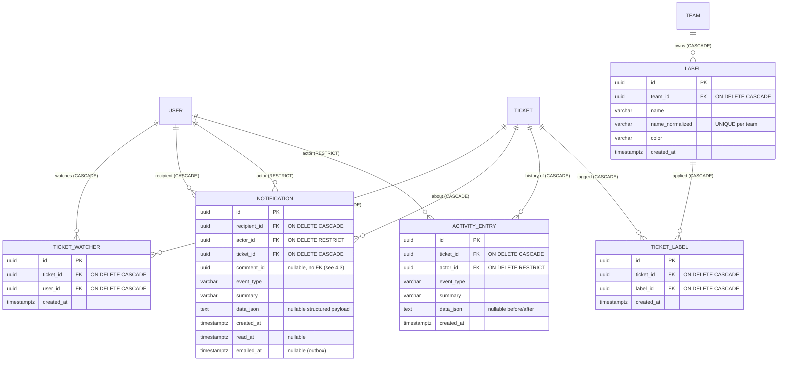

# Wave 2 — Technical Design (Notifications, Comments edit/delete, Activity history, Labels, Team-members endpoint)

> **Status:** Authoritative technical design for the PO-approved "Wave 2" batch. Implement strictly to this document; it extends [`ARCHITECTURE.md`](./ARCHITECTURE.md), [`API_CONTRACT.md`](./API_CONTRACT.md), [`WAVE1_DESIGN.md`](./WAVE1_DESIGN.md), and [`USER_MANAGEMENT_DESIGN.md`](./USER_MANAGEMENT_DESIGN.md).
> **Author role:** Software Architect (delivery pipeline: BA → Architect → Developer → QA).
> **Conventions inherited (do not re-derive):** UTC ISO-8601 with trailing `Z`; canonical lowercase enums stored as text + DB CHECK (ADR-0002); GUID PKs with `ValueGeneratedNever`; normalized companion columns for case-insensitive uniqueness (ADR-0002); stateful opaque bearer sessions + hashed tokens (ADR-0001/0006); Argon2id passwords (V2); `IEmailSender` port (ADR-0004); `IClock` for time; `ServiceException(ServiceErrorCode)` → `ErrorEnvelope` mapping (`Common/ServiceError.cs`, API_CONTRACT §2); **user-initiated transactions wrapped in `_db.Database.CreateExecutionStrategy().ExecuteAsync(async () => { await using var tx = await _db.Database.BeginTransactionAsync(ct); … await tx.CommitAsync(ct); })`** per the Npgsql retry constraint (fix `14e4424`, AuthService `VerifyEmailAsync`/`ResendVerificationAsync`); `displayName = name?.Trim() || email`; resolve-then-check 404-then-403 anti-IDOR ordering (ADR-0007); hosted-service pattern = `BackgroundService` + `IServiceProvider.CreateScope()` (see `HostedServices/DatabaseInitializer.cs`); integration tests boot the real API over in-memory SQLite (`EnsureCreated`, `PRAGMA foreign_keys=ON`) with `FakeEmailSender`/`TestClock` (ADR-0002/0004).
> **New decisions:** captured as [ADR-0012](./adr/0012-application-event-backbone.md) … [ADR-0017](./adr/0017-team-members-endpoint.md).

---

## 1. Summary, scope & assumptions

### 1.1 Scope (full Wave 2)

Five areas, delivered around **one shared spine — an application-level domain-event backbone** that both the Activity log and the Notifications subsystem consume. Everything else hangs off that spine or is independent.

| # | Area | New aggregates / tables | Depends on |
|---|---|---|---|
| 1 | **Notifications subsystem** (watchers + in-app + email outbox worker) | `TicketWatcher`, `Notification` | event backbone |
| 2 | **Comments edit/delete own** (F-12) | none (adds `comments.edited_at`) | event backbone (activity only) |
| 3 | **Activity history** (per-ticket audit trail) | `ActivityEntry` | event backbone |
| 4 | **Labels / tags** | `Label`, `TicketLabel` | independent (no events in Wave 2) |
| 5 | **Team-members endpoint** (Wave-1 debt) | none | independent |

**Design keystone (ADR-0012):** service methods that mutate a ticket raise **explicit application events** through a single injected `IDomainEventPublisher` **after the mutation commits**. Two synchronous handlers consume each event in-process: `ActivityRecorder` (writes one `ActivityEntry`) and `NotificationFanout` (writes N `Notification` rows to watchers, excluding the actor). This is **not** an EF `SaveChanges` interceptor — it is explicit, testable, and lets the developer see exactly where events fire (ADR-0012). The email outbox worker is a **separate, later stage**: it drains un-emailed notifications on a timer, coalescing bursts per recipient (ADR-0014).

### 1.2 What is deliberately NOT in Wave 2

- No message broker / queue infra — the outbox is a DB table drained by a hosted `BackgroundService`, matching the codebase's simple hosted-service style (ADR-0014).
- No WebSockets / SSE — the in-app bell refreshes by **polling + refetch-on-window-focus** (ADR-0016).
- No per-event or per-ticket notification preferences — global only. A single optional profile toggle `emailNotificationsEnabled` is included (cheap; ADR-0013 / §6.8).
- No epic-level notifications/watchers — see [ASSUMPTION W2-EVENTS-SCOPE].
- Labels raise **no** events in Wave 2 (label add/remove is not notified or activity-logged) — see [ASSUMPTION W2-LABEL-NOEVENTS].

### 1.3 ASSUMPTIONS (the PO can veto any — each is a localized change)

- **[ASSUMPTION W2-EVENTS-LIST]** The canonical event set (§6.1) is: `ticket_created`, `ticket_field_changed` (one event **per changed field** — `title`, `description/body`, `type`, `priority`, `due_date`), `ticket_moved` (state change, its own event), `ticket_assignees_changed` (carries added/removed), `comment_added`, `comment_edited`, `comment_deleted`, `ticket_deleted`. Rationale: this is exactly "all changes a watcher cares about" without drowning them; per-field granularity makes both the activity timeline and the coalesced email human-readable. Veto surface: add/remove a member of the `EventType` enum + its summary template.
- **[ASSUMPTION W2-EVENTS-SCOPE]** **Epic-level changes are OUT** (no epic watchers, no epic notifications) for Wave 2. Rationale: watchers/notifications are modelled on the ticket aggregate; epics have no watcher concept and adding one doubles the fan-out surface for marginal value. Epic edits are already covered by the epic's own `modified_at`. Additive later. Veto surface: a parallel `EpicWatcher` + epic events — a separate mini-feature.
- **[ASSUMPTION W2-NOTIFY-RECIPIENTS]** Recipients = **watchers of the ticket, minus the actor** who caused the event (never notify yourself, per PO). Auto-watch triggers: creating the ticket, being added as an assignee, adding a comment. Others watch/unwatch manually. (§6.3)
- **[ASSUMPTION W2-STALE-WATCHER]** A watcher who has **lost team access** to the ticket's team (removed from the team, blocked) is **skipped at fan-out and at read** — no in-app row is created for them and no email is sent; the `TicketWatcher` row is **tolerated** (not eagerly deleted). Rationale + justification in §6.3. Veto surface: change the fan-out `WHERE` clause.
- **[ASSUMPTION W2-COALESCE-WINDOW]** Email debounce/coalesce window = **60 seconds**; worker poll interval = **15 seconds** (`NOTIFICATION_EMAIL_DEBOUNCE_SECONDS=60`, `NOTIFICATION_WORKER_POLL_SECONDS=15`, both env). Rationale in §7.4 / ADR-0014. Veto surface: two env values.
- **[ASSUMPTION W2-NOTIF-RENDER]** A notification stores a **structured payload** (`event_type`, `ticket_id`, optional `comment_id`, `actor_id`, plus a small JSON `data` blob) **and** a pre-rendered `summary` string produced once at fan-out time. Rationale: pre-rendering keeps the list read cheap and the email builder trivial, while the structured columns keep filtering/aggregation possible. (§6.4 / ADR-0013)
- **[ASSUMPTION W2-COMMENT-ADMIN-OVERRIDE]** Comment **edit** is author-only; comment **delete** is author **or admin**. Rationale + justification in §5.2 / ADR-0015.
- **[ASSUMPTION W2-COMMENT-EVENTS]** `comment_added` → activity **and** notification (email included). `comment_edited` / `comment_deleted` → **activity-log only, no notification, no email**. Rationale: keep notification noise low; an edit/delete of an existing comment is rarely worth an email, but it IS worth an audit line. (§5.2 / ADR-0015)
- **[ASSUMPTION W2-LABEL-OWNERSHIP]** Labels are **team-scoped**; **any member of the team (or an admin) may create/rename/delete** the team's labels, and assign/remove them on that team's tickets. Rationale + justification in §8.1 / ADR-0016. Veto surface: change `LabelService` from `RequireTeamAccess` to `RequireAdmin`.
- **[ASSUMPTION W2-LABEL-ASSIGN]** Labels are assigned on a ticket via a **full-set replace sub-resource** `PUT /api/tickets/{id}/labels { labelIds: [...] }`, mirroring assignees/wip-limits. (§8.3)
- **[ASSUMPTION W2-LABEL-NOEVENTS]** Label create/rename/delete and label assign/remove raise **no** activity/notification events in Wave 2. Rationale: labels are lightweight organizational metadata (like assignment was pre-Wave-2), and wiring them into the event spine is additive later if the PO wants "labels changed" in the timeline. Veto surface: add `label_changed` to the event enum and emit from `SetLabelsAsync`.
- **[ASSUMPTION W2-ACTIVITY-VS-AUDIT]** The per-ticket **ActivityEntry** timeline (user-facing "what happened to this ticket") is a **separate concern** from any SEC-3 admin/security audit log (who logged in, admin actions). They do not share a table. Overlap discussion in §7bis / ADR-0012. (Note: there is currently no persisted SEC-3 audit-log table in the codebase; ActivityEntry does not attempt to be one.)
- **[ASSUMPTION W2-EMAIL-TOGGLE]** A single global per-user boolean `users.email_notifications_enabled` (default `true`) suppresses **email** only (in-app notifications are always created). Cheap; included. (§6.8 / ADR-0013)

**No blocking open questions.** PO-confirmation items (non-blocking) are in §12.

### 1.4 Traceability (area → design section)

| Area | Data model | API | Authz | Events/worker | Frontend | Tests |
|---|---|---|---|---|---|---|
| 1 Notifications | §4.2/§4.3/§4.7 | §5.3/§5.4 | §6 (Self + watch M(team)) | §6/§7 | §9.1/§9.2 | §10 A–E |
| 2 Comments F-12 | §4.6 | §5.2 | §5.2 (author + admin) | §6.1 | §9.3 | §10 F |
| 3 Activity | §4.5 | §5.5 | §5.5 (M(team)) | §6/§7bis | §9.3 | §10 G |
| 4 Labels | §4.4/§4.8 | §5.6/§5.7 | §8 (M(team)) | — | §9.4 | §10 H |
| 5 Members | none | §5.8 | §8bis (M(team)) | — | §9.5 | §10 I |

---

## 2. Architecture drivers (ASR) & the event backbone in one picture

The architecturally-significant requirements that shape Wave 2:

| # | ASR | Consequence |
|---|---|---|
| ASR-W2-1 | "All changes" must reach BOTH the activity log and notifications from a single mutation, deterministically. | One explicit emission point per mutation → an in-process event published after commit, consumed by two synchronous handlers (ADR-0012). No EF interceptor. |
| ASR-W2-2 | Email must be instant-per-event yet anti-noise (coalesced bursts), with no broker. | DB-backed outbox (`notifications.emailed_at`) drained by a hosted `BackgroundService`; the drain logic is a **directly-callable synchronous service method** so tests invoke it deterministically (ADR-0014). |
| ASR-W2-3 | Everything must stay testable on in-memory SQLite with faked clock/email (ADR-0002/0004). | No provider-specific SQL; the worker's timer is a thin wrapper over `NotificationEmailDispatcher.DrainOnceAsync(now, ct)` which tests call directly with `TestClock` + `FakeEmailSender`. |
| ASR-W2-4 | Never notify the actor about their own action; fan-out must exclude the actor and stale watchers. | Fan-out `WHERE watcher.user_id != actorId AND (recipient still has team access)`; deduped one row per (recipient, event) (ADR-0013). |
| ASR-W2-5 | Team-scoped access must continue to hold for every new read/write (OWASP A01). | Every new team-scoped endpoint resolves the resource then calls `RequireTeamAccess`; notifications are self-scoped (no id in path) (ADR-0017, ADR-0007). |

```mermaid
flowchart LR
    subgraph Request path (synchronous, one HTTP call)
      Ctrl[Controller] --> Svc[TicketService / CommentService]
      Svc -->|1. mutate + SaveChanges| DB[(DB)]
      Svc -->|2. publish events AFTER commit| Pub[IDomainEventPublisher]
      Pub --> AR[ActivityRecorder]
      Pub --> NF[NotificationFanout]
      AR -->|insert ActivityEntry| DB
      NF -->|insert Notification rows for watchers != actor| DB
    end
    subgraph Background (timer, decoupled)
      Timer[NotificationEmailWorker : BackgroundService] -->|every 15s, scoped| Drain[NotificationEmailDispatcher.DrainOnceAsync]
      Drain -->|un-emailed & older than 60s, grouped by recipient| DB
      Drain -->|one combined email per recipient| Mail[IEmailSender.SendNotificationDigestEmailAsync]
      Drain -->|mark emailed_at| DB
    end
```

---

## 3. Data model — overview & ER delta

Six new tables/columns groups. All PKs `uuid` (`ValueGeneratedNever`); all timestamps `timestamptz` (UTC); enums as canonical lowercase text + CHECK (ADR-0002). New `DbSet`s go on **both** `AppDbContext` and `IAppDbContext` (mirroring the Wave-1 additions).



Plus two column additions: `comments.edited_at` (nullable, F-12) and `users.email_notifications_enabled` (not null default true).

---

## 4. Data model — entities, columns, constraints, indexes, cascades

### 4.1 Cascade philosophy (deliberate, per-FK — consistent with ARCHITECTURE §4.3)

The existing model uses **RESTRICT** to protect authored content and user integrity, and **CASCADE** for associations/owned artifacts. Wave 2 follows the same split:

| Relationship | on-delete | Why |
|---|---|---|
| Ticket → TicketWatcher | **CASCADE** | a watch is an association owned by the ticket (mirrors TicketAssignee); deleting a ticket drops watches |
| User → TicketWatcher | **CASCADE** | a watch is owned by the user (mirrors UserTeam membership) |
| Ticket → Notification | **SET NULL** (ticket_id nullable) | a notification must OUTLIVE its ticket so a `ticket_deleted` notification survives and can be emailed (§6.6). The `summary` is self-contained; the SPA renders a null `ticketId` as a non-navigable tombstone. **This is the deliberate, final choice — NOT CASCADE.** |
| User → Notification (recipient) | **CASCADE** | a notification is owned by its recipient |
| User → Notification (actor) | **RESTRICT** | preserve "who did it" integrity; no user-delete in scope (mirrors created_by/author_id) |
| Ticket → ActivityEntry | **CASCADE** | the timeline belongs to the ticket; gone with it (see §7bis on retention trade-off) |
| User → ActivityEntry (actor) | **RESTRICT** | preserve audit integrity |
| Team → Label | **CASCADE** | a label is owned by its team; deleting a team (only possible when it has no tickets/epics, V9) drops its labels |
| Ticket → TicketLabel | **CASCADE** | a tag is an association owned by the ticket (mirrors TicketAssignee/Comment) |
| Label → TicketLabel | **CASCADE** | removing a label removes it from all tickets |

> **Note on the Team→Label CASCADE vs Team→Ticket RESTRICT:** deleting a team is still blocked by the existing `team_has_children` guard whenever it has tickets or epics (V9, unchanged). Labels alone never block team deletion — they are pure metadata, so they cascade. This does not weaken any existing RESTRICT guard.

### 4.2 `TicketWatcher` (subscription join — like TicketAssignee)

```csharp
// Domain/Entities/TicketWatcher.cs
public class TicketWatcher
{
    public Guid Id { get; set; }
    public Guid TicketId { get; set; }
    public Ticket? Ticket { get; set; }
    public Guid UserId { get; set; }
    public User? User { get; set; }
    public DateTime CreatedAt { get; set; }
}
```

| Column | Type | Constraints | Notes |
|---|---|---|---|
| `id` | uuid | PK, `ValueGeneratedNever` | |
| `ticket_id` | uuid | FK → `tickets.id`, **CASCADE**, not null, indexed | |
| `user_id` | uuid | FK → `users.id`, **CASCADE**, not null, indexed | |
| `created_at` | timestamptz | not null | when the watch started |

Indexes: unique `ux_ticket_watchers_ticket_user (ticket_id, user_id)` (INV: no double-watch); index on `user_id` ("my watched tickets", possible later). EF config mirrors `TicketAssignee` exactly but **both** FKs CASCADE (a watch, unlike an assignment, carries no authorship — losing it on user delete is fine and simpler; consistent with UserTeam).

### 4.3 `Notification`

```csharp
// Domain/Entities/Notification.cs
public class Notification
{
    public Guid Id { get; set; }
    public Guid RecipientId { get; set; }
    public User? Recipient { get; set; }
    public Guid ActorId { get; set; }
    public User? Actor { get; set; }
    public Guid TicketId { get; set; }
    public Ticket? Ticket { get; set; }
    public Guid? CommentId { get; set; }         // no FK — see below
    public string EventType { get; set; } = "";  // canonical event-type code
    public string Summary { get; set; } = "";    // rendered at fan-out (W2-NOTIF-RENDER)
    public string? DataJson { get; set; }        // small structured payload (nullable)
    public DateTime CreatedAt { get; set; }
    public DateTime? ReadAt { get; set; }         // null = unread
    public DateTime? EmailedAt { get; set; }      // null = not yet emailed (outbox marker)
}
```

| Column | Type | Constraints | Notes |
|---|---|---|---|
| `id` | uuid | PK | |
| `recipient_id` | uuid | FK → `users.id`, **CASCADE**, not null | owner of the row |
| `actor_id` | uuid | FK → `users.id`, **RESTRICT**, not null | who caused the event |
| `ticket_id` | uuid | FK → `tickets.id`, **CASCADE**, not null | subject ticket |
| `comment_id` | uuid | **nullable, NO FK** | present for comment events; intentionally FK-less so a comment delete (F-12) does not cascade-nuke or block the notification (the summary is already rendered). See rationale below. |
| `event_type` | varchar(40) | not null, CHECK ∈ event set | canonical code (§6.1); CHECK keeps bad values out (parity with type/state) |
| `summary` | varchar(500) | not null | pre-rendered human line |
| `data_json` | text | null | small JSON (e.g. `{"from":"new","to":"in_progress"}`); render-on-read is possible later |
| `created_at` | timestamptz | not null, indexed (desc) | list order |
| `read_at` | timestamptz | null | unread indicator + count |
| `emailed_at` | timestamptz | null | outbox worker marks this; idempotency key |

**Indexes (chosen for the two hot queries):**
- `ix_notifications_recipient_unread (recipient_id, read_at, created_at DESC)` — "my notifications newest-first" and "my unread count" (partial-index semantics emulated by ordering; SQLite-portable, no filtered index needed).
- `ix_notifications_outbox (emailed_at, created_at)` — the worker scans `WHERE emailed_at IS NULL AND created_at <= now - window` cheaply.

**Why `comment_id` has no FK:** comment delete is now a real operation (F-12). If `comment_id` had an FK CASCADE, deleting a comment would silently delete the "comment added" notifications that reference it; with RESTRICT it would block the delete. Neither is desirable — the notification's `summary` is already rendered and self-contained, and the SPA deep-links to the ticket (not the comment anchor), so a dangling `comment_id` is harmless (documented as R-6). Keeping it FK-less is the cleanest choice; no defensive nulling on the comment-delete path is required.

### 4.4 `Label` (team-scoped)

```csharp
// Domain/Entities/Label.cs
public class Label
{
    public Guid Id { get; set; }
    public Guid TeamId { get; set; }
    public Team? Team { get; set; }
    public string Name { get; set; } = "";
    public string NameNormalized { get; set; } = ""; // trim(lower(name)) — uniqueness key per team
    public string Color { get; set; } = "";          // "#RRGGBB" validated in the service
    public DateTime CreatedAt { get; set; }
}
```

| Column | Type | Constraints | Notes |
|---|---|---|---|
| `id` | uuid | PK | |
| `team_id` | uuid | FK → `teams.id`, **CASCADE**, not null, indexed | label owned by the team |
| `name` | varchar(50) | not null | trimmed display value; `FieldLimits.LabelNameMax = 50` |
| `name_normalized` | varchar(50) | not null | `trim(lower(name))`; uniqueness key |
| `color` | varchar(7) | not null | `#RRGGBB` (7 chars incl. `#`); validated by regex in the service, CHECK backstop optional |
| `created_at` | timestamptz | not null | |

**Uniqueness:** composite unique index `ux_labels_team_name (team_id, name_normalized)` — a label name is unique **within a team**, case-insensitively (two teams may both have "bug"). Collision → `409 duplicate_label_name` (new code, §5.9). No global CHECK on color required; the service enforces `^#[0-9a-fA-F]{6}$` and lowercases it; a CHECK is optional and left to developer discretion (SQLite cannot easily regex-CHECK, so keep the authoritative check in the service — consistent with WIP-limit bounds).

### 4.5 `ActivityEntry`

```csharp
// Domain/Entities/ActivityEntry.cs
public class ActivityEntry
{
    public Guid Id { get; set; }
    public Guid TicketId { get; set; }
    public Ticket? Ticket { get; set; }
    public Guid ActorId { get; set; }
    public User? Actor { get; set; }
    public string EventType { get; set; } = "";
    public string Summary { get; set; } = "";   // rendered at record time
    public string? DataJson { get; set; }        // before/after structured (nullable)
    public DateTime CreatedAt { get; set; }
}
```

| Column | Type | Constraints | Notes |
|---|---|---|---|
| `id` | uuid | PK | |
| `ticket_id` | uuid | FK → `tickets.id`, **CASCADE**, not null, indexed | timeline belongs to the ticket |
| `actor_id` | uuid | FK → `users.id`, **RESTRICT**, not null | preserve audit integrity |
| `event_type` | varchar(40) | not null, CHECK ∈ event set | same event codes as notifications |
| `summary` | varchar(500) | not null | rendered human line |
| `data_json` | text | null | e.g. `{"field":"priority","from":"low","to":"high"}` |
| `created_at` | timestamptz | not null | |

Index: `ix_activity_ticket_created (ticket_id, created_at)` — the ticket-detail timeline lists a ticket's entries chronologically (newest-first at read; `ORDER BY created_at DESC`).

### 4.6 `Comment` change (F-12)

Add **`edited_at timestamptz null`** (null = never edited). EF: `e.Property(x => x.EditedAt).HasColumnName("edited_at");`. No other change. `comments.author_id` stays RESTRICT; comment delete is a hard delete (cascade of TicketLabel/notification refs handled per §4.3 — none block it). The `ix_comments_ticket_created` index is unchanged.

### 4.7 `User` change (email toggle)

Add **`email_notifications_enabled boolean not null default true`**. EF: `.HasColumnName("email_notifications_enabled").IsRequired().HasDefaultValue(true)`. Existing rows backfill to `true` via the migration `AddColumn(defaultValue: true)` (parity note: keep `.HasDefaultValue(true)` on the model so `has-pending-model-changes` stays clean — this default is semantically permanent, unlike Wave-1's priming-only priority default).

### 4.8 `TicketLabel` (tag join — like TicketAssignee)

| Column | Type | Constraints | Notes |
|---|---|---|---|
| `id` | uuid | PK | |
| `ticket_id` | uuid | FK → `tickets.id`, **CASCADE**, not null, indexed | |
| `label_id` | uuid | FK → `labels.id`, **CASCADE**, not null, indexed | |
| `created_at` | timestamptz | not null | |

Unique `ux_ticket_labels_ticket_label (ticket_id, label_id)`; index on `label_id` (board filter "tickets with label L"). Both FKs CASCADE (a tag is not standalone content). **Invariant:** a label may only tag a ticket **of the label's own team** — enforced in `SetLabelsAsync` (eligibility check, 400 keyed `labelIds`, mirroring assignee eligibility). Cross-team labels are rejected before insert.

### 4.9 `IAppDbContext` / `AppDbContext` additions

Add `DbSet<TicketWatcher> TicketWatchers`, `DbSet<Notification> Notifications`, `DbSet<ActivityEntry> ActivityEntries`, `DbSet<Label> Labels`, `DbSet<TicketLabel> TicketLabels` to both. Add navigations: `Ticket.Watchers`, `Ticket.Labels`, `Team.Labels` (collections). No back-navigation from `User` to notifications is required (query by `recipient_id`).

---

## 5. API contract additions & changes

All bodies camelCase JSON; timestamps ISO-8601 UTC `Z`. Errors use the uniform envelope (API_CONTRACT §2). Auth legend (ADR-0007): `Public`; `Auth` = any verified non-blocked session; `M(team)` = admin or member of the resource's team; `Self` = the authenticated user acting on their own data only (no id in path). **The developer updates `docs/API_CONTRACT.md` and `docs/ARCHITECTURE.md` per §11.**

### 5.1 New endpoint summary (add to API_CONTRACT §1 route table)

| Method | Path | Auth | Purpose | Phase |
|---|---|---|---|---|
| GET | `/api/teams/{id}/members` | **M(team)** | List a team's members for pickers (Wave-1 debt) | 1 |
| PUT | `/api/comments/{id}` | **author** | Edit own comment (F-12) | 1 |
| DELETE | `/api/comments/{id}` | **author or admin** | Delete own comment (admin override) | 1 |
| GET | `/api/tickets/{id}/activity` | **M(team of ticket)** | Per-ticket activity timeline | 2 |
| GET | `/api/tickets/{id}/watchers` | **M(team of ticket)** | Is-watching + watcher list | 2 |
| POST | `/api/tickets/{id}/watch` | **M(team of ticket)** | Watch the ticket (idempotent) | 2 |
| DELETE | `/api/tickets/{id}/watch` | **M(team of ticket)** | Unwatch the ticket (idempotent) | 2 |
| GET | `/api/notifications` | **Self** | List my notifications (paged, newest-first) | 2 |
| GET | `/api/notifications/unread-count` | **Self** | My unread count (cheap poll) | 2 |
| POST | `/api/notifications/{id}/read` | **Self** | Mark one read | 2 |
| POST | `/api/notifications/read-all` | **Self** | Mark all mine read | 2 |
| GET | `/api/me/notification-settings` | **Self** | Read my email toggle | 2 |
| PUT | `/api/me/notification-settings` | **Self** | Set my email toggle | 2 |
| GET | `/api/labels?teamId={id}` | **M(team)** | List a team's labels | 3 |
| POST | `/api/labels` | **M(team)** | Create a label | 3 |
| PUT | `/api/labels/{id}` | **M(team of label)** | Rename / recolor | 3 |
| DELETE | `/api/labels/{id}` | **M(team of label)** | Delete a label (removes from all tickets) | 3 |
| PUT | `/api/tickets/{id}/labels` | **M(team of ticket)** | Replace the full label set | 3 |

Changed existing: `GET /api/tickets?...&labelId={guid}` gains a label filter (§8.4); ticket detail + board card DTOs gain `labels[]` (§8.5); ticket detail gains `isWatching` (§6.7).

### 5.2 Comments edit/delete (F-12)

**Changed comment object** (`CommentDto`): add `bool Edited` and `DateTime? EditedAt`.

```json
{ "id": "cm01...", "ticketId": "tk1042...", "authorId": "8e29...", "authorEmail": "alex@dataart.com",
  "authorName": "Alex Doe", "body": "Looks fixed.", "createdAt": "2026-07-01T13:00:00Z",
  "edited": true, "editedAt": "2026-07-01T13:05:00Z" }
```

**`PUT /api/comments/{id}` — author-only.** Note the path is `/api/comments/{id}` (a top-level resource), NOT under `/api/tickets/...`, because a comment id is globally unique and the author check is the primary gate.

Request: `{ "body": "Actually still broken on Safari." }`
- `body`: required, non-empty after trim, ≤ `FieldLimits.CommentBodyMax` (reuse). 
**200 OK** → the updated `CommentDto` (with `edited=true`, `editedAt=now`).
- **Authorization ordering (anti-IDOR, §5.2a):** resolve the comment → 404 if absent. Then resolve the comment's ticket → its team; call `RequireTeamAccess(team)` (403 if the caller can't even see the ticket). Then require `comment.AuthorId == currentUserId` else **`403 forbidden`** ("You can only edit your own comments."). **No admin override on edit** (editing someone else's words is worse than removing them — ADR-0015).
- No-op rule: if the normalized new body equals the stored body → nothing persisted, `edited_at` NOT set/advanced, 200 with the unchanged object (consistent with the modified_at no-op philosophy §6.2 of ARCHITECTURE).
- **Events:** on a real change, emit `comment_edited` → **activity only** (no notification/email), per [ASSUMPTION W2-COMMENT-EVENTS].
- **Errors:** `404 not_found`; `403 forbidden` (not the author, or no team access); `400 validation_error` (blank/oversize body).

**`DELETE /api/comments/{id}` — author or admin (override).**
- Same resolve-then-check ordering. Then require `comment.AuthorId == currentUserId` **OR** `currentUser.IsAdmin` else `403 forbidden`. (Admin override justified in ADR-0015: moderation.)
- **204 No Content.** Hard delete of the comment row. `comment_id`-referencing notifications are tolerated (FK-less, §4.3).
- **Events:** emit `comment_deleted` → **activity only**.
- **Errors:** `404 not_found`; `403 forbidden`.

New `CommentService` methods: `EditAsync(Guid commentId, EditCommentRequest, ct)`, `DeleteAsync(Guid commentId, ct)`. New DTO `EditCommentRequest(string? Body)`.

### 5.3 In-app notifications (Self)

**DTOs**
```csharp
public sealed record NotificationDto(
    Guid Id, string EventType, string Summary,
    Guid TicketId, Guid? CommentId, Guid ActorId, string ActorDisplayName,
    DateTime CreatedAt, DateTime? ReadAt);            // ReadAt null ⇒ unread
public sealed record NotificationListDto(
    IReadOnlyList<NotificationDto> Items, int UnreadCount, bool HasMore, string? NextCursor);
public sealed record UnreadCountDto(int UnreadCount);
```

**`GET /api/notifications?limit=20&cursor=<opaque>` — Self.** Newest-first (`created_at DESC, id DESC`). `limit` clamped to `[1, 50]` (default 20). Cursor = opaque base64 of `(created_at,id)` of the last item (keyset pagination — cheaper than OFFSET and stable under new inserts). Returns `NotificationListDto` (the `unreadCount` is included so the bell can update from the same call). **Errors:** `401`.

**`GET /api/notifications/unread-count` — Self.** The cheap poll target. **200** `{ "unreadCount": 3 }`. **Errors:** `401`.

**`POST /api/notifications/{id}/read` — Self.** Marks the addressed notification read (`read_at = now` if null; idempotent). **Anti-IDOR:** resolve by id **and** `recipient_id = currentUserId` in one query; a row that exists but belongs to another user is treated as **404 not_found** (do not confirm existence of another user's notification — this is a self-owned resource, so 404-masking is the right call here, unlike team resources). **200** `{ "unreadCount": <new count> }` (so the bell decrements without a second round-trip). **Errors:** `404`; `401`.

**`POST /api/notifications/read-all` — Self.** Sets `read_at = now` for all the caller's unread rows in one `UPDATE`. **200** `{ "unreadCount": 0 }`. **Errors:** `401`.

All four live under a new `NotificationsController` (`[Route("api/notifications")]`); no id-of-another-user is ever addressable (Self by construction, strongest anti-IDOR — same posture as `/api/me/*`).

### 5.4 Watch / unwatch (M(team of ticket))

**`POST /api/tickets/{id}/watch`** — idempotent. Resolve ticket → 404; `RequireTeamAccess(ticket.TeamId)` → 403. Insert a `TicketWatcher` if not present (AnyAsync guard, like membership). **200** `{ "watching": true }`.
**`DELETE /api/tickets/{id}/watch`** — idempotent. Same guards; remove the row if present. **200** `{ "watching": false }`.
**`GET /api/tickets/{id}/watchers`** — same guards. **200** `{ "watching": true, "watchers": [ { "id": "...", "displayName": "Alex Doe" } ] }` (the caller's own flag + the full list for the ticket-detail "watchers" affordance). **Errors (all):** `404`, `403`, `401`.

> These use `WatchService` (or fold into `TicketService` — developer's choice; recommend a small `WatchService` to keep `TicketService` focused). Watching is a manual override on top of the auto-watch rules (§6.3).

### 5.5 Activity timeline (M(team of ticket))

**`GET /api/tickets/{id}/activity?limit=50&cursor=<opaque>` — M(team of ticket).** Resolve ticket → 404; `RequireTeamAccess` → 403. Returns the ticket's `ActivityEntry` rows newest-first with keyset pagination (same cursor scheme as notifications).
```json
{ "items": [
    { "id":"ac1...", "eventType":"ticket_moved", "summary":"Alex Doe moved this from In Progress to Done",
      "actorId":"8e29...", "actorDisplayName":"Alex Doe", "createdAt":"2026-07-01T14:00:00Z" },
    { "id":"ac0...", "eventType":"comment_added", "summary":"Alex Doe commented", "actorId":"8e29...",
      "actorDisplayName":"Alex Doe", "createdAt":"2026-07-01T13:00:00Z" }
  ], "hasMore": false, "nextCursor": null }
```
DTO `ActivityEntryDto(Guid Id, string EventType, string Summary, Guid ActorId, string ActorDisplayName, DateTime CreatedAt)`; list wrapper `ActivityListDto(IReadOnlyList<ActivityEntryDto> Items, bool HasMore, string? NextCursor)`. **Errors:** `404`, `403`, `401`.

### 5.6 Labels — management (M(team))

**Label object** `LabelDto(Guid Id, Guid TeamId, string Name, string Color)`.

**`GET /api/labels?teamId={id}` — M(team).** `teamId` required; resolve team → 404, `RequireTeamAccess` → 403. Returns `LabelDto[]` for the team, ordered by `name_normalized`. **Errors:** `400` (missing teamId), `404`, `403`.

**`POST /api/labels` — M(team).** Body `{ "teamId":"f1...", "name":"  Backend  ", "color":"#3b82f6" }`.
- `teamId` required + accessible (403 else); `name` required, ≤ 50, trimmed; `color` required, `^#[0-9a-fA-F]{6}$` (lowercased), else `400 validation_error` keyed `color`.
- **201** → `LabelDto`. **Errors:** `400 validation_error`; `403 forbidden`; `409 duplicate_label_name` (same normalized name already in the team).

**`PUT /api/labels/{id}` — M(team of label).** Body `{ "name":"Backend", "color":"#2563eb" }`. Resolve label → 404, `RequireTeamAccess(label.TeamId)` → 403. Team is immutable (labels never move teams). No-op rule for name+color. **200** → `LabelDto`. **Errors:** `404`; `403`; `400`; `409 duplicate_label_name` (collides with a *different* label in the same team).

**`DELETE /api/labels/{id}` — M(team of label).** Resolve → 404, `RequireTeamAccess` → 403. Removes the label and its `ticket_labels` rows (CASCADE). **204.** No delete-guard/409 — a label in use is simply removed from its tickets (unlike epics; a label is disposable metadata, so blocking delete would be user-hostile). **Errors:** `404`; `403`.

### 5.7 Labels — assign on a ticket (full-set replace, M(team of ticket))

**`PUT /api/tickets/{id}/labels` — M(team of ticket).** Body `{ "labelIds": ["l1...","l2..."] }`.
- Resolve ticket → 404; `RequireTeamAccess(ticket.TeamId)` → 403. Then validate each `labelId` as a **body reference**: must exist AND belong to the **ticket's team** → else `400 validation_error` keyed `labelIds` ("One or more labels do not exist or belong to another team."). De-duplicated; full-set replace (add new, remove absent). `labelIds` null/omitted ⇒ empty set (clears all).
- Does **not** bump `modified_at` (labels are metadata, same rule as assignees §4.2 of WAVE1). Raises **no** event (W2-LABEL-NOEVENTS).
- **200** → the updated **ticket detail** (carries the new `labels[]`), so the SPA refreshes card + detail from one response. **Errors:** `404`; `403`; `400 validation_error` keyed `labelIds`.

### 5.8 Team members (Wave-1 debt, M(team))

**`GET /api/teams/{id}/members` — M(team).** Resolve team → 404, `RequireTeamAccess` → 403 (a member of the team, or an admin). Returns the team's members **plus** the picker needs admins to be eligible assignees too — but admins are global, so the response is **the team's members only** (admins already appear via the admin path and, more importantly, the assignee-eligibility rule is "team members ∪ admins" enforced server-side; the picker for a *member* should show the people they can actually collaborate with = team members). To keep the picker correct for adding an admin, the response optionally includes admins — **decision: return team members only** (the common, minimal case); an admin assigning themselves is an admin action and admins use the admin surface. This resolves the `useTeamMembers` gap for the member's normal flow.

```json
[ { "id": "8e29...", "displayName": "Alex Doe", "isAdmin": false },
  { "id": "a71f...", "displayName": "Sam Lee", "isAdmin": true } ]
```
DTO `TeamMemberDto(Guid Id, string DisplayName, bool IsAdmin)`. Ordered by `displayName`. **Errors:** `404`; `403`; `401`. (Lives on `TeamsController` → `TeamService.ListMembersAsync`.)

### 5.9 New `ServiceErrorCode` values

Add to `ServiceErrorCode`, `ServiceErrorCodes.ToWire`, and the API `ErrorStatusMap`:

| Enum value | Wire `code` | HTTP | When |
|---|---|---|---|
| `DuplicateLabelName` | `duplicate_label_name` | **409** | Label create/rename collides case-insensitively within the team |

All other Wave-2 error conditions reuse existing codes: `Forbidden` (403 — comment not-author, team-scope), `NotFound` (404), `ValidationError` (400 — bad color/name/labelIds/body). No new 401 codes.

---

## 6. Event backbone + notifications design (the core)

### 6.1 Canonical event set (ADR-0012, [ASSUMPTION W2-EVENTS-LIST])

`Domain/Enums/EventType.cs` — canonical lowercase codes, stored as text + CHECK on `notifications.event_type` and `activity_entries.event_type`.

| Code | Raised when | Notify? | Activity? | Summary template (rendered with actor displayName + data) |
|---|---|---|---|---|
| `ticket_created` | ticket POST commits | yes | yes | "{actor} created this ticket" |
| `ticket_field_changed` | a scalar field really changed on PUT (one event per field) | yes | yes | "{actor} changed {field} from {from} to {to}" |
| `ticket_moved` | state changed (PUT or PATCH state) | yes | yes | "{actor} moved this from {fromState} to {toState}" |
| `ticket_assignees_changed` | assignee set changed (PUT assignees / create / edit) | yes | yes | "{actor} updated assignees (+{added} / −{removed})" |
| `comment_added` | comment POST commits | yes | yes | "{actor} commented" |
| `comment_edited` | comment PUT really changed body | **no** | yes | "{actor} edited a comment" |
| `comment_deleted` | comment DELETE | **no** | yes | "{actor} deleted a comment" |
| `ticket_deleted` | ticket DELETE (before row removal) | yes | **no** (ticket & its activity are cascaded away) | "{actor} deleted ticket '{title}'" |

Notes:
- `ticket_field_changed` is emitted **once per changed field** so both the timeline and the coalesced email read naturally. Fields tracked: `title`, `body` (shown as "description"), `type`, `priority`, `due_date`. (`teamId`/`epicId` moves are lower-value; **decision: include `epic` as a tracked field, exclude `team` move** — a team move is rare and re-scopes the ticket; log it as a single `ticket_field_changed` with field `team` too. Developer may fold team+epic into the field loop; keep it simple.)
- `ticket_deleted` notifies watchers but writes **no** activity entry (the ticket and its activity cascade away in the same operation; the notification is what survives). Its notification is created **and the outbox is allowed to email it** even though the ticket row is gone — because the notification's FK to ticket is CASCADE, the delete ordering matters (§6.6).
- Field human labels and enum display values reuse the SPA's label mapping on the **client**, but the **server** renders the summary once (W2-NOTIF-RENDER) using canonical values interpolated into templates; the server may keep canonical enum values in `summary` (e.g. "from in_progress to done") or map to display — **decision: server renders display-cased for readability** using a small server-side label map (mirror of `lib/labels`), so the email and timeline are human without client help.

### 6.2 Emission mechanism (ADR-0012 — explicit publisher, NOT an interceptor)

`Application/Abstractions/IDomainEventPublisher.cs`:
```csharp
public interface IDomainEventPublisher
{
    /// Publish events to all in-process handlers, synchronously, within the caller's scope.
    /// Called by services AFTER the mutation has committed (so handlers see committed state and
    /// a handler failure cannot roll back the user's action). Handlers persist their own rows.
    Task PublishAsync(IReadOnlyList<TicketEvent> events, CancellationToken ct);
}

public sealed record TicketEvent(
    EventType Type,
    Guid TicketId,
    Guid ActorId,
    Guid? CommentId,
    string? DataJson,                 // structured payload (field/from/to, added/removed, title…)
    string SummaryForActivity,        // rendered once by the raising service
    string SummaryForNotification);   // usually identical; separated for flexibility
```

`Application/Events/DomainEventPublisher.cs` (registered scoped) fans to the two handlers:
```csharp
public interface ITicketEventHandler { Task HandleAsync(IReadOnlyList<TicketEvent> events, CancellationToken ct); }
// ActivityRecorder : ITicketEventHandler   -> inserts ActivityEntry rows
// NotificationFanout : ITicketEventHandler -> inserts Notification rows for watchers != actor
```

**Where services raise events (the two emission points):**

- **`TicketService`** — after each successful `SaveChangesAsync`, build the event list and `await _publisher.PublishAsync(events, ct)`:
  - `CreateAsync`: auto-watch the creator + any initial assignees (§6.3), then publish `ticket_created` (+ `ticket_assignees_changed` if the create set is non-empty).
  - `UpdateAsync`: compute the per-field diff you already compute for `modified_at`, and emit one `ticket_field_changed` per changed field, `ticket_moved` if state changed, `ticket_assignees_changed` if the set changed (auto-watching newly-added assignees first).
  - `PatchStateAsync`: emit `ticket_moved` when state actually changes.
  - `SetAssigneesAsync`: auto-watch added assignees, emit `ticket_assignees_changed` if changed.
  - `DeleteAsync`: publish `ticket_deleted` **before** removing the ticket (§6.6).
- **`CommentService`** — `AddAsync`: auto-watch the commenter (§6.3), publish `comment_added`. `EditAsync`/`DeleteAsync`: publish `comment_edited`/`comment_deleted` (activity-only handlers no-op for notifications).

**Why after-commit, in-process, explicit:** (1) an activity/notification write failure must not roll back the user's actual edit — after-commit isolates that (the handler wraps its own inserts and logs on failure; the user's mutation already succeeded). (2) Explicit `PublishAsync` calls are greppable and unit-testable; an EF interceptor hides the emission and cannot distinguish "field changed" semantics cleanly. (3) In-process keeps the no-broker constraint. Trade-off (accepted, R-2): a crash between commit and publish loses that event's activity+notification (at-most-once). Mitigation: the window is microseconds and single-process; a stronger transactional-outbox for events is deferred (§13 open item) — for a hackathon-scale tool this is the right cost.

### 6.3 Watchers — auto-subscribe, manual, and the stale-watcher rule

**Auto-subscribe (idempotent `AnyAsync` guard, like membership):**
- `CreateAsync` → watch `createdBy`.
- assignee **added** (create/update/set) → watch that user.
- `comment_added` → watch the comment author.

Auto-watch happens **inside the same transaction as the mutation** (a watch is cheap and belongs with the action), *before* fan-out, so a just-added assignee is a watcher and will receive subsequent events (but NOT the current one if they are the actor — the actor is always excluded).

**Manual:** `POST/DELETE /api/tickets/{id}/watch` (§5.4). A user who unwatches stops receiving new notifications; existing rows stay.

**Stale-watcher rule ([ASSUMPTION W2-STALE-WATCHER], decision + justification):** at fan-out, a watcher who **no longer has team access** to the ticket's team (removed from the team, or blocked) is **skipped** — no notification row, no email. The `TicketWatcher` row is **not** eagerly deleted. **Justification:** (a) Security — never deliver a notification (which reveals ticket title/activity) to someone who has lost the right to see that ticket; this is the read-side of the same team-scope rule that governs every other endpoint (ADR-0007). (b) Simplicity — we do not have to hook every membership/block change to prune watchers; we filter at fan-out. (c) Reversibility — if the user is re-added to the team, their watch resumes automatically (the row was preserved). This mirrors the Wave-1 "stale assignee is tolerated" decision (R-4). Fan-out query:
```
recipients = watchers(ticketId)
  WHERE user_id != actorId
    AND NOT user.is_blocked
    AND (user.is_admin OR EXISTS membership(user, ticket.team_id))
```

### 6.4 Notification fan-out (`NotificationFanout` handler)

For each event that is notifiable (§6.1 "Notify? = yes"):
1. Compute recipients = eligible watchers (§6.3 query), excluding `actorId`.
2. For each recipient, insert a `Notification { recipient_id, actor_id=actorId, ticket_id, comment_id, event_type, summary=event.SummaryForNotification, data_json, created_at=now, read_at=null, emailed_at=null }`.
3. One `SaveChangesAsync` for the whole batch.

The handler does **not** send email — it only writes rows (instant in-app). Email is the worker's job (§7). This cleanly separates "instant in-app for every event" from "coalesced email".

Fan-out for `ticket_deleted` runs **before** the ticket row is deleted (§6.6) so recipients resolve and the notification's `ticket_id` FK is still satisfiable; but see the CASCADE caveat in §6.6.

### 6.5 Activity recording (`ActivityRecorder` handler)

For each event whose "Activity? = yes", insert an `ActivityEntry { ticket_id, actor_id, event_type, summary=event.SummaryForActivity, data_json, created_at }`. `ticket_deleted` is Activity=no (the entries would cascade away instantly). One `SaveChangesAsync` per batch. This handler runs regardless of whether anyone is watching (activity is the objective history; notifications are the subjective feed).

### 6.6 Ordering hazard: `ticket_deleted` vs the ticket FK (the key schema subtlety)

**The hazard:** the `ticket_deleted` event fans out `Notification` rows that point at the ticket, and then the ticket row is removed. If `notifications.ticket_id` were CASCADE, that delete would immediately cascade-delete the very notifications we just created — watchers would never learn their ticket was deleted.

**Decision:** `notifications.ticket_id` is **nullable with `ON DELETE SET NULL`** (§4.1/§4.3). A notification therefore **outlives** its ticket: the row's `summary` is self-contained (e.g. "Alex Doe deleted ticket 'Login fails'"), and after the ticket is gone its `ticket_id` becomes `null`. The SPA renders a null-`ticketId` notification as a **non-navigable tombstone**. `ticket_deleted` notifications are then created, persisted, and emailed by the outbox worker like any other — no special-casing in the delete path.

**Delete-path order (`TicketService.DeleteAsync`):** (1) resolve + `RequireTeamAccess`; (2) publish `ticket_deleted` so `NotificationFanout` writes the rows (still pointing at the live ticket id); (3) remove the ticket's comments/assignees/labels/watchers (as today for cascades) and the ticket row; the SET-NULL FK nulls the fresh notifications' `ticket_id` rather than deleting them. `ActivityEntry` keeps **CASCADE** — a ticket's timeline has no meaning without the ticket and dies with it (which is why `ticket_deleted` writes **no** activity entry, §6.1).

**Rejected alternative:** a separate `deleted_ticket_title` column with no FK — more columns; SET NULL keeps referential integrity while allowing the tombstone.

> **This is the single most important schema subtlety in Wave 2. The developer MUST set `notifications.ticket_id` nullable + `ON DELETE SET NULL` (NOT CASCADE), and the SPA MUST render `ticketId == null` as a non-navigable tombstone.** Flagged again in §11, §15 handoff and R-1.

### 6.7 Ticket detail gains `isWatching`

`TicketDetailDto` gains `bool IsWatching` (computed for the current user in `GetByIdAsync` via an `AnyAsync` on `TicketWatchers`). Board cards do **not** carry it (keeps the board query lean). This drives the ticket-detail watch toggle without an extra round-trip.

### 6.8 Email toggle (Self)

**`GET /api/me/notification-settings`** → `{ "emailNotificationsEnabled": true }`. **`PUT /api/me/notification-settings`** body `{ "emailNotificationsEnabled": false }` → 200 with the same shape. Lives on `MeController` (Self, no id). The **worker** honors it: a recipient with `email_notifications_enabled=false` still gets in-app notifications but is skipped when building digests (their rows are marked `emailed_at=now` with no send, OR left null and filtered — **decision: mark `emailed_at=now` without sending**, so they don't accumulate as a permanent backlog). In-app is unaffected.

---

## 7. Email outbox worker (ADR-0014)

### 7.1 Shape: thin timer over a directly-callable drain

```csharp
// Application/Services/NotificationEmailDispatcher.cs  (registered scoped)
public sealed class NotificationEmailDispatcher
{
    // The entire drain/coalesce/send/mark cycle. Directly callable by tests with a controlled
    // clock + fake sender. Returns the number of recipients emailed (for assertions/metrics).
    public Task<int> DrainOnceAsync(DateTime now, CancellationToken ct);
}

// Api/HostedServices/NotificationEmailWorker.cs  (BackgroundService — thin)
protected override async Task ExecuteAsync(CancellationToken stoppingToken)
{
    var poll = TimeSpan.FromSeconds(_config.GetValue("NOTIFICATION_WORKER_POLL_SECONDS", 15));
    using var timer = new PeriodicTimer(poll);
    while (await timer.WaitForNextTickAsync(stoppingToken))
    {
        try
        {
            using var scope = _services.CreateScope();          // same pattern as DatabaseInitializer
            var dispatcher = scope.ServiceProvider.GetRequiredService<NotificationEmailDispatcher>();
            var clock = scope.ServiceProvider.GetRequiredService<IClock>();
            await dispatcher.DrainOnceAsync(clock.UtcNow, stoppingToken);
        }
        catch (Exception ex) { _logger.LogError(ex, "Notification email drain failed; will retry next tick."); }
    }
}
```

The worker owns **only** timing + scope + error-logging. All correctness is in `DrainOnceAsync`, which never touches real time except through the `now` argument (so tests are deterministic — ASR-W2-3). Registered via `builder.Services.AddHostedService<NotificationEmailWorker>();` next to `DatabaseInitializer`. **The `CustomWebApplicationFactory` must remove this hosted service too** (like it removes `DatabaseInitializer`) so tests drive `DrainOnceAsync` explicitly and no background timer fires during a test — see §10.E.

### 7.2 `DrainOnceAsync` algorithm

Inside the execution-strategy transaction (Npgsql-retry-safe pattern):
```
strategy = _db.Database.CreateExecutionStrategy();
await strategy.ExecuteAsync(async () =>
{
    await using var tx = await _db.Database.BeginTransactionAsync(ct);

    // 1. Select un-emailed notifications past the debounce window, grouped by recipient.
    cutoff = now - TimeSpan.FromSeconds(DEBOUNCE_SECONDS);        // 60s
    var pending = await _db.Notifications
        .Where(n => n.EmailedAt == null && n.CreatedAt <= cutoff)
        .OrderBy(n => n.RecipientId).ThenBy(n => n.CreatedAt)
        .ToListAsync(ct);                                         // bounded; small scale

    foreach (var group in pending.GroupBy(n => n.RecipientId))
    {
        var recipient = await _db.Users.FindAsync([group.Key], ct);
        // Skip blocked / email-off recipients: mark emailed (no send) so they don't backlog.
        var emailOff = recipient is null || recipient.IsBlocked || !recipient.EmailNotificationsEnabled;
        if (!emailOff)
        {
            var lines = group.Select(n => n.Summary).ToList();     // already rendered
            await _email.SendNotificationDigestEmailAsync(recipient!.Email, lines, deepLinkBase, ct);
        }
        foreach (var n in group) n.EmailedAt = now;                // idempotency: never re-send
    }

    await _db.SaveChangesAsync(ct);
    await tx.CommitAsync(ct);
});
```

- **Coalescing (anti-noise):** all of a recipient's pending notifications older than the window collapse into **one** email with N summary lines. A rapid burst (multiple events within 60s) is emailed together on the first tick after the window elapses.
- **Debounce:** only notifications **older than** `now - 60s` are eligible, so an event that just happened waits ~60s for its potential burst-mates before its email goes out. The 15s poll bounds latency to ≤ ~75s.
- **Idempotency:** `emailed_at` is set to `now` for every processed row in the same transaction as the send decision. A row is emailed **at most once** (`emailed_at IS NULL` is the only selector). A crash after send but before commit re-selects the rows next tick and re-sends the digest (**at-least-once** email; acceptable — a duplicate digest is benign; documented R-3). To reduce that window, the send happens inside the tx and commit follows immediately.
- **Failure/retry:** if `SendNotificationDigestEmailAsync` throws for one recipient, the whole tx rolls back and the tick retries next interval (the recipient's rows stay `emailed_at=null`). To stop one bad address from starving others, the developer MAY wrap each recipient send in try/catch and mark only successful ones — **decision: per-recipient try/catch**, log + skip a failing recipient (leave their rows null for next tick), commit the rest. This isolates a single bad recipient (R-3 mitigation).

### 7.3 New `IEmailSender` method

```csharp
Task SendNotificationDigestEmailAsync(string toEmail, IReadOnlyList<string> lines, string deepLinkBase, CancellationToken ct);
```
Implement in `SmtpEmailSender` (MailKit, subject e.g. "You have {n} new updates on Ticket Tracker", body = bulleted `lines` + a link to `{FRONTEND_URL}/notifications`), `LoggingEmailSender` (log the lines), and the test `FakeEmailSender` (record `(to, lines)` as a new captured kind `EmailKind.NotificationDigest` so tests assert coalescing).

### 7.4 Config

| Variable | Default | Purpose |
|---|---|---|
| `NOTIFICATION_WORKER_POLL_SECONDS` | `15` | worker tick interval |
| `NOTIFICATION_EMAIL_DEBOUNCE_SECONDS` | `60` | coalescing window (min age before a notification is emailed) |
| `NOTIFICATIONS_EMAIL_ENABLED` | `true` | master kill-switch for the worker (if false, the hosted service returns immediately; in-app still works) |

Bind in `Program.cs` (a small `NotificationOptions`) next to `AuthOptions`. Add to `.env.example`. **Why 60s/15s:** 60s is long enough to coalesce a human's rapid edit burst (typical "fix title, fix body, set priority" happens in seconds) into one email, short enough that a single event still emails within ~75s (feels "instant-ish"). Both are env-tunable so the PO can dial noise vs latency without a code change (ADR-0014).

### 7.5 Deterministic test drive (ASR-W2-3)

Tests never wait on the timer. They: (1) perform HTTP actions that create notifications (via the request path + in-process fan-out); (2) resolve `NotificationEmailDispatcher` from the factory's scope and call `DrainOnceAsync(Factory.Clock.UtcNow, ct)` — asserting **zero** emails when within the debounce window; (3) `Factory.Clock.Advance(TimeSpan.FromSeconds(61))`; (4) call `DrainOnceAsync` again — asserting **one** digest per recipient with the expected coalesced lines, and that a second drain sends **nothing** (idempotency via `emailed_at`). This is the exact `TestClock` + `FakeEmailSender` pattern already used for token TTLs.

---

## 7bis. Activity history vs security audit log (ADR-0012 clarification)

- **ActivityEntry** = user-facing, per-ticket, team-scoped "what happened to this ticket" (created/edited/moved/assigned/commented). Readable by any member of the ticket's team. Lives with the ticket (CASCADE) — when the ticket is deleted, its timeline goes with it (accepted: the timeline has no meaning without the ticket, and the `ticket_deleted` **notification** is what informs watchers).
- **SEC-3 security/admin audit** = who logged in, admin lifecycle actions (block, role change, reset). There is **no persisted audit-log table in the codebase today** (SEC-3 is currently satisfied by application logs in `UserAdminService`). ActivityEntry does **not** attempt to be that log. They are distinct concerns: different audience (team members vs security/ops), different scope (one ticket vs system-wide), different retention (dies with the ticket vs must survive). If a persisted security audit table is wanted later, it is a separate feature — do not overload ActivityEntry. This separation is the decision (W2-ACTIVITY-VS-AUDIT); overlap is intentionally **none**.

---

## 8. Labels — details

### 8.1 Ownership decision (ADR-0016, [ASSUMPTION W2-LABEL-OWNERSHIP])

**Any team member (or admin) manages the team's labels.** Justification: labels are collaborative organizational metadata used daily by the people working the board; gating creation behind admin would make members ask an admin to add "needs-design" — friction that defeats the feature. This mirrors how WIP-limits are `M(team)` (a team concern, not an admin-only concern), and how epics are `M(team)`. Risk (label sprawl) is low and reversible (any member can delete a bad label). Veto: switch `LabelService` guards from `RequireTeamAccess` to `RequireAdmin` — one-line-per-method change.

### 8.2 `LabelService`

New `Application/Services/LabelService.cs` (scoped): `ListAsync(teamId)`, `CreateAsync(req)`, `UpdateAsync(id, req)`, `DeleteAsync(id)` — all `RequireTeamAccess` on the resolved team; uniqueness via normalized companion column + `AnyAsync` pre-check returning `409 duplicate_label_name` (plus the unique index as backstop, same pattern as team name). Color normalized to lowercase `#rrggbb`.

### 8.3 Assign — `SetLabelsAsync` on `TicketService`

Mirrors `SetAssigneesAsync`: resolve ticket → `RequireTeamAccess`; validate each label id exists AND `label.TeamId == ticket.TeamId` (400 keyed `labelIds`); de-dup; diff; no `modified_at` bump; no event. Add a private `ApplyLabelSetAsync(ticketId, desired, ct)` (structural twin of `ApplyAssigneeSetAsync`).

### 8.4 Board filter by label

`GET /api/tickets?...&labelId={guid}` — new optional filter, ANDed inside the already team-scoped query: `query.Where(t => t.Labels.Any(l => l.LabelId == labelId))`. Bad/unknown label id simply matches nothing (no 400 needed for an unknown filter value — consistent with `epicId` filter behavior). Add `labelId` to the SPA board query key.

### 8.5 DTO changes

- `TicketDetailDto` and `TicketCardDto` gain `IReadOnlyList<LabelRefDto> Labels` where `LabelRefDto(Guid Id, string Name, string Color)` (color needed for the chip). Projected in `GetBoardAsync` and `GetByIdAsync` alongside assignees.

---

## 8bis. Members endpoint — `useTeamMembers` switch (Wave-1 debt)

The frontend `useTeamMembers` hook (currently degrades to an empty pool for non-admins, sourcing from the admin-only list) switches to `GET /api/teams/{id}/members`:
- Query key `['team-members', teamId]`; `queryFn` calls the new endpoint; `enabled: !!teamId`. Drop the `canList = isAdmin` gate — every member of the team can now list members. Map `TeamMemberDto[]` → `AssigneeRef[]` (`{ id, displayName }`). This fixes the assignee-picker gap for non-admin members (they can now add teammates), and is reused by the watch UI and label flows where a member/team-picker is shown.

---

## 9. Frontend impact notes (for the developer — not full UI)

### 9.1 Notification bell (AppLayout)
- Add a **bell icon + unread badge** to `components/AppLayout.tsx` header (next to the user menu). Badge = `unreadCount`. Poll `GET /api/notifications/unread-count` on an interval (React Query `refetchInterval: 30_000`) **and** `refetchOnWindowFocus: true` (ADR-0016 — no websockets). Query key `['notifications','unread-count']`.
- Clicking the bell opens a **notifications panel** (dropdown) or navigates to `/notifications`. Recommend a lightweight dropdown listing the newest ~10 (from `GET /api/notifications?limit=10`) with a "See all" link to a `/notifications` page.

### 9.2 Notifications page (`features/notifications/`)
- New route `/notifications` (authenticated). Lists notifications newest-first with unread styling; infinite scroll / "load more" using the cursor. Each item: actor displayName + summary + relative time; **click → navigate to `/tickets/{ticketId}`** and mark that one read (`POST /api/notifications/{id}/read`), unless `ticketId == null` (deleted-ticket tombstone — non-navigable, still markable). A **"Mark all read"** button → `POST /api/notifications/read-all`. Invalidate `['notifications','unread-count']` after read/read-all. New `useNotifications` hook + `notificationsApi` in `api/endpoints.ts` + types in `api/types.ts`.

### 9.3 Ticket detail — activity timeline, watch toggle, comment edit/delete (`features/tickets/TicketPage.tsx`)
- **Activity timeline** section: `GET /api/tickets/{id}/activity` (`useActivity` hook, key `['activity', ticketId]`), rendered as a chronological list (newest-first) of `summary` + relative time. Invalidate it after any ticket mutation and after comment add/edit/delete.
- **Watch toggle**: a "Watch"/"Watching" button driven by `ticket.isWatching`; `POST/DELETE /api/tickets/{id}/watch`; invalidate `['ticket', id]`. Optionally show the watcher count from `GET .../watchers`.
- **Comment edit/delete** (`CommentsPanel.tsx`): show an "Edit"/"Delete" affordance on a comment **only when** `comment.authorId === me.id` (edit) or `authorId === me.id || me.isAdmin` (delete). Edit → inline field → `PUT /api/comments/{id}`; show "edited" + `editedAt` when `edited`. Delete → confirm → `DELETE /api/comments/{id}`. Invalidate `['comments', ticketId]` and `['activity', ticketId]`.

### 9.4 Labels (`features/labels/` + board/tickets)
- **Label chips** on `TicketCard.tsx` (colored pills from `labels[]`) and on the ticket detail.
- **Label picker** on the ticket create/edit form: multi-select of the team's labels (`GET /api/labels?teamId=`), value = full set, submit via `PUT /api/tickets/{id}/labels`. On team change, clear the label selection (labels are team-scoped, like assignees/epic).
- **Label management surface**: a small screen or panel (e.g. under Teams, or a `/labels` route with a team selector) to create/rename/recolor/delete labels — `M(team)` so members see it. Color input = a fixed swatch palette + hex.
- **Board FilterBar** (`features/board/FilterBar.tsx`): add a **Label** filter → `&labelId=`; add to the board query key and the "clear filters" logic.

### 9.5 `useTeamMembers` switch — §8bis. No other change needed for the picker beyond the new endpoint.

---

## 10. Test guidance handoff (key behaviours QA must cover)

Compatible with the existing SQLite `WebApplicationFactory` infra (ADR-0002): `EnsureCreated()` builds the new tables/columns from the model; `TestClock` drives debounce/coalescing deterministically; `FakeEmailSender` captures digests. **The factory MUST remove `NotificationEmailWorker` (like `DatabaseInitializer`) so no timer fires during tests.** Helpers to add to `IntegrationTestBase`: `RegisterMemberInTeamAsync` already exists; add a `DrainNotificationEmailsAsync()` that resolves `NotificationEmailDispatcher` from a scope and calls `DrainOnceAsync(Factory.Clock.UtcNow, ...)`.

- **A. Fan-out excludes the actor.** Two watchers (A, B) on a ticket; A moves it → B gets exactly one `ticket_moved` notification, A gets **none**. (Core PO rule.)
- **B. Auto-watch rules.** (i) creator is auto-watched (creator sees no self-notification but IS a watcher — verify via `.../watchers`); (ii) adding an assignee auto-watches them and they receive **subsequent** events but not the assignment event if they were the actor; (iii) a commenter is auto-watched; (iv) manual watch/unwatch toggles delivery.
- **C. Stale watcher skipped.** Watcher B loses team membership → a later event produces **no** notification row and no email for B; B's watch row still exists; re-adding B resumes delivery.
- **D. In-app API.** list newest-first + `unreadCount`; `unread-count`; mark-one-read decrements; mark-all-read zeroes; another user's notification id → 404 (self-scope); pagination cursor returns the next page without overlap.
- **E. Email coalescing + outbox (deterministic).** Cause 3 events for one recipient within the window; `DrainOnceAsync` at `now` → **0** emails (debounced); advance clock 61s; drain → **1** digest with **3** lines; drain again → **0** (idempotent via `emailed_at`); `email_notifications_enabled=false` recipient → in-app rows created but drain sends **0** and marks them emailed; blocked recipient → skipped; `ticket_deleted` → recipient still gets a digest line and the notification's `ticketId` is null (tombstone).
- **F. Comments edit/delete (F-12).** author edits → 200, `edited=true`, `editedAt` set, `comment_edited` activity written, **no** notification; non-author edit → 403; admin edit of another's comment → 403 (no edit override); author delete → 204; admin delete of another's comment → 204 (override); non-author non-admin delete → 403; edit/delete of a comment on a non-member team's ticket → 403; unknown comment → 404; blank/oversize body → 400; no-op edit (same body) does not set `editedAt`.
- **G. Activity per event.** each of create / field-change (one entry per changed field) / move / assignees-changed / comment-added/edited/deleted produces exactly the expected `ActivityEntry` rows with correct `eventType` + `summary`; `GET .../activity` is team-scoped (member of another team → 403; unknown ticket → 404); ordering newest-first; deleting the ticket cascades its activity away.
- **H. Labels.** create (member allowed) → 201; duplicate name in same team → 409 `duplicate_label_name`; same name in a **different** team → allowed; bad color → 400 keyed `color`; rename/recolor no-op; delete removes from all tickets (cascade); `PUT /tickets/{id}/labels` full-replace + de-dup; cross-team label id → 400 keyed `labelIds`; board `&labelId=` filter subsets correctly; label ops on a non-member team → 403.
- **I. Members endpoint.** member of team T → 200 with T's members (displayName + isAdmin); member of another team → 403; unknown team → 404; anon → 401; used by the assignee picker for a non-admin (integration with `useTeamMembers` is a frontend test).
- **J. modified_at unaffected.** watch/unwatch, label set, and reading activity never bump ticket `modified_at` (board order stable); a field edit still bumps it as before.
- **Parity guard (blocking, developer):** after each phase's model+config edits and its single migration, `dotnet ef migrations has-pending-model-changes` must be **clean**; confirm `Down()` reverses.

---

## 11. Migration plan (ONE ModelSnapshot; sequential, phase-aligned)

The repo has a **single `AppDbContextModelSnapshot`**; the latest migration is `20260701121126_AddWave1`. To avoid snapshot conflicts, generate **exactly one migration per phase**, in order, each after all that phase's model+config edits are done. **Never** create two migrations in parallel or interleave model edits across a migration boundary. Run `dotnet ef migrations has-pending-model-changes` after each (ADR-0003 parity guard). Migration names align to the developer build phases (§12):

1. **`AddWave2CommentsAndMembers`** (Phase 1): `comments.edited_at` (nullable). *(No table adds; the members endpoint needs no schema. Keeps Phase 1 shippable independently.)*
2. **`AddWave2Notifications`** (Phase 2): `ticket_watchers` table (+ unique + user index, both FKs CASCADE); `notifications` table (+ CHECK on `event_type`, indexes `ix_notifications_recipient_unread`, `ix_notifications_outbox`; `ticket_id` **nullable, FK SET NULL**; `recipient_id` CASCADE; `actor_id` RESTRICT; `comment_id` nullable no-FK); `activity_entries` table (+ CHECK, `ix_activity_ticket_created`, `ticket_id` CASCADE, `actor_id` RESTRICT); `users.email_notifications_enabled` (not null, `defaultValue: true`, keep `.HasDefaultValue(true)` on the model).
3. **`AddWave2Labels`** (Phase 3): `labels` table (+ `ux_labels_team_name`, `team_id` CASCADE); `ticket_labels` table (+ `ux_ticket_labels_ticket_label`, `label_id` index, both FKs CASCADE).

**SQLite/test parity:** all objects are provider-agnostic (text enums + CHECK, GUID-as-text, plain unique indexes, `ON DELETE SET NULL`/`CASCADE`/`RESTRICT` honored under `PRAGMA foreign_keys=ON`, nullable columns, boolean default). `EnsureCreated()` builds them from the model, so tests see each new table/column automatically; the `email_notifications_enabled` default and `edited_at` nullability apply under both providers. No Postgres-only feature is used.

**Docs to update (developer executes, additive):**
- `docs/API_CONTRACT.md`: §1 route table (18 new/changed rows, §5.1); §2 add `duplicate_label_name` (409); new sections for Notifications, Watchers, Activity, Labels, Team-members; `edited`/`editedAt` on the comment object; `labels[]` on ticket detail/card; `isWatching` on ticket detail; `labelId` board filter; `/api/me/notification-settings`.
- `docs/ARCHITECTURE.md`: §4 (new tables + `comments.edited_at`, `users.email_notifications_enabled`, ER diagram), §5 route table, §8 env table (3 notification vars), the hosted-service list (add `NotificationEmailWorker`).
- `.env.example`: `NOTIFICATION_WORKER_POLL_SECONDS`, `NOTIFICATION_EMAIL_DEBOUNCE_SECONDS`, `NOTIFICATIONS_EMAIL_ENABLED`.

---

## 12. Phased developer build order

Each phase = model+migration → services/handlers → controllers → frontend, and is independently compilable, testable, and shippable. Ordered so the **event backbone lands in Phase 2 and is reused by activity + notifications together**, and so EF snapshot changes are strictly sequential.

### Phase 1 — Low-risk debt + comments (no event backbone needed)
Ships value immediately, unblocks the frontend pickers, and touches minimal schema.
1. `TeamService.ListMembersAsync` + `GET /api/teams/{id}/members` (+ `TeamMemberDto`). Switch frontend `useTeamMembers`.
2. `comments.edited_at` model+config → migration **`AddWave2CommentsAndMembers`** → parity guard.
3. `CommentService.EditAsync/DeleteAsync` + `CommentsController` routes `PUT/DELETE /api/comments/{id}` (author-only edit; author-or-admin delete). *(These will publish `comment_edited/deleted` events in Phase 2; in Phase 1 they can no-op the publish or the publisher can be introduced now with only the activity handler — recommend introducing `IDomainEventPublisher` in Phase 2 and having Phase-1 comment edit/delete emit nothing yet, then wiring events in Phase 2. Developer confirms.)*
4. Frontend: comment edit/delete affordances; members-endpoint switch.
Tests: §10 F, I.

### Phase 2 — Event backbone + Activity + Notifications + worker (the core)
1. `EventType` enum; `IDomainEventPublisher` + `DomainEventPublisher`; `ITicketEventHandler` with `ActivityRecorder` + `NotificationFanout`; register scoped in `ApplicationServiceCollectionExtensions`.
2. Schema: `ticket_watchers`, `notifications` (**`ticket_id` nullable + SET NULL**, §6.6), `activity_entries`, `users.email_notifications_enabled` → migration **`AddWave2Notifications`** → parity guard. Add DbSets to `AppDbContext` + `IAppDbContext`.
3. Wire emission points: `TicketService` (create/update/patch-state/set-assignees/delete) + `CommentService` (add/edit/delete) publish events; auto-watch rules; `TicketDetailDto.IsWatching`.
4. `WatchService` (or `TicketService` methods) + watch endpoints; `NotificationService` (list/unread-count/read/read-all) + `NotificationsController`; `MeController` notification-settings; activity read endpoint.
5. `NotificationEmailDispatcher.DrainOnceAsync` + `IEmailSender.SendNotificationDigestEmailAsync` (3 impls incl. Fake) + `NotificationEmailWorker` hosted service + `NotificationOptions` binding + env. **Add the worker removal to `CustomWebApplicationFactory`.**
6. Frontend: bell + badge (poll + focus refetch), `/notifications` page, ticket-detail activity timeline + watch toggle.
Tests: §10 A–E, G, J. This is the largest phase; consider a sub-split (2a: backbone + activity; 2b: notifications + worker) if the team prefers — the migration must still be a **single** `AddWave2Notifications` covering all four schema objects (do the model edits for watchers+notifications+activity+user-column before generating it).

### Phase 3 — Labels
1. `Label` + `TicketLabel` model+config → migration **`AddWave2Labels`** → parity guard.
2. `LabelService` (CRUD, `M(team)`, `duplicate_label_name`) + `LabelsController`; `TicketService.SetLabelsAsync` + `PUT /api/tickets/{id}/labels`; `labelId` board filter; `labels[]` on detail/card DTOs; `DuplicateLabelName` error code.
3. Frontend: chips on cards/detail, picker on the form, management surface, FilterBar label filter.
Tests: §10 H.

**Why this order:** Phase 1 is pure additive value with the smallest schema footprint and de-risks the frontend pickers early. Phase 2 introduces the event spine once and consumes it from both activity and notifications in the same phase (they share the emission points, so splitting them across phases would mean touching the same services twice). Phase 3 (labels) is fully independent and last because it is the least entangled and raises no events. Each phase owns exactly one migration, so the single ModelSnapshot advances linearly with no conflicts.

**What is NOT defined here (developer's freedom / explicit non-decisions):**
- Exact `data_json` shapes per event (recommend `{field,from,to}` / `{added:[],removed:[]}` / `{title}`); the `summary` is the authoritative rendered line.
- Whether watch endpoints live on a `WatchService` or `TicketService` (recommend `WatchService`).
- Digest email HTML/template and subject copy.
- Notification dropdown vs full-page-only in the SPA; label management screen placement; color palette.
- Whether Phase-1 comment edit/delete emits events immediately or defers emission to Phase 2 (recommend defer).
- Cursor encoding details (recommend base64 of `created_at|id`).
- Exact `FieldLimits.LabelNameMax` (recommend 50) and color CHECK (optional; service-enforced).

---

## 13. Risks & mitigations

| # | Risk | Likelihood | Impact | Mitigation | Fallback trigger |
|---|---|---|---|---|---|
| R-1 | **`ticket_deleted` CASCADE wipes its own notifications** | Med | High | `notifications.ticket_id` **nullable + ON DELETE SET NULL** (§6.6); SPA handles null ticketId | §10.E tombstone case fails |
| R-2 | **Event lost between commit and publish** (at-most-once) | Low | Med | Single-process, microsecond window; activity+notification are non-critical vs the mutation; transactional-outbox for events deferred (§accepted) | Observed missing activity under crash tests |
| R-3 | **Duplicate digest email** on crash after send / before commit (at-least-once) | Low | Low | Send inside tx, commit immediately; per-recipient try/catch; duplicate digest is benign | User reports duplicate emails |
| R-4 | **Worker starves** if one recipient's send always throws | Low | Med | Per-recipient try/catch, mark only successes, log the bad address; poison row stays null and is retried but does not block others | One recipient never emailed |
| R-5 | **Fan-out N+1 / cost** on a heavily-watched ticket | Low | Med | Single query for eligible watchers; batch insert; small scale (hackathon); index on watchers | Board/detail latency regression |
| R-6 | **Dangling `comment_id`** after comment delete | Low | Low | FK-less by design (§4.3); summary is self-contained; SPA deep-links to ticket not comment | N/A (accepted) |
| R-7 | **Stale watcher leaks a ticket** they lost access to | Low | High | Fan-out filters by live team access + blocked (§6.3); read never returns rows for lost-access (rows aren't created) | §10.C fails |
| R-8 | **Timer fires during tests** → nondeterminism | Med | High | Factory removes `NotificationEmailWorker`; tests call `DrainOnceAsync` explicitly (§7.5/§10.E) | Flaky email tests |
| R-9 | **Two migrations per phase** → ModelSnapshot conflict | Med | High | One migration per phase; model edits fully done before `migrations add`; parity guard each phase (§11) | Guard reports pending / second migration file |
| R-10 | **Label sprawl** (any member creates labels) | Med | Low | Accepted (ADR-0016); any member can delete; veto to admin-only is one line | PO complaint |
| R-11 | **`comment_added` notifies but `comment_edited/deleted` don't** confuses users | Low | Low | Documented decision (W2-COMMENT-EVENTS); edit/delete still in activity timeline | PO wants edit/delete notified → add to notifiable set |
| R-12 | **Transaction correctness** in drain under Npgsql retry | Low | Med | `CreateExecutionStrategy().ExecuteAsync` + `BeginTransactionAsync` (never bare tx) — same as AuthService | DbUpdate/retry exceptions in CI |

---

## 14. ADR index

| ADR | Decision |
|---|---|
| [0012](./adr/0012-application-event-backbone.md) | Explicit application event backbone (after-commit publisher + 2 handlers), not EF interceptor; activity vs security-audit separation |
| [0013](./adr/0013-notification-model-and-fanout.md) | Notification entity (structured + pre-rendered), watcher fan-out excluding actor, stale-watcher skip, email toggle |
| [0014](./adr/0014-email-outbox-debounce-worker.md) | DB-backed outbox + directly-callable `DrainOnceAsync` drained by a thin hosted timer; 60s/15s coalescing; idempotent via `emailed_at` |
| [0015](./adr/0015-comment-edit-delete-and-notification-noise.md) | Comment edit author-only, delete author-or-admin; edit/delete activity-only (no email) |
| [0016](./adr/0016-labels-team-scoped-member-managed.md) | Team-scoped labels, member-managed, full-set-replace assignment, no events in Wave 2, disposable delete |
| [0017](./adr/0017-team-members-endpoint.md) | Member-visible `GET /api/teams/{id}/members`; self-scoped notifications endpoints (no id in path) |

---

## 15. Handoff summary for the developer

- **Build in 3 phases** (§12): Phase 1 (members endpoint + comment edit/delete + `edited_at`), Phase 2 (event backbone + activity + notifications + outbox worker — the core, one migration), Phase 3 (labels). One migration per phase; parity guard each time.
- **The one subtlety that will bite you:** `notifications.ticket_id` is **nullable + ON DELETE SET NULL** (not CASCADE) so `ticket_deleted` notifications survive; the SPA must render null-ticket notifications as non-navigable tombstones (§6.6, R-1).
- **The worker is a thin timer over `NotificationEmailDispatcher.DrainOnceAsync(now, ct)`** — all correctness there, driven by `IClock`, tested by calling it directly with `TestClock`+`FakeEmailSender`; the factory must **remove** the hosted worker (§7, §10.E, R-8).
- **Events are explicit, after-commit** `_publisher.PublishAsync(...)` calls in `TicketService`/`CommentService` — not an interceptor (§6.2, ADR-0012).
- **Every new team-scoped read/write resolves-then-checks** `RequireTeamAccess`; notifications are Self (no id in path); comment edit/delete adds an author check after team access (§5, ADR-0007/0017).
- **What is NOT decided** is listed at the end of §12 — those are yours.
