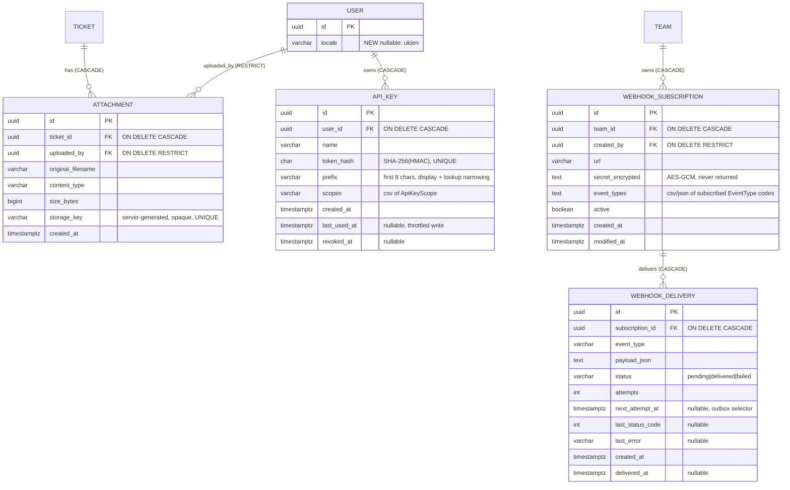

# Wave 3 — Technical Design (Attachments, Real-time board, Analytics, API/Webhooks + API-keys, i18n)

> **Status:** Authoritative technical design for the PO-approved "Wave 3" batch (5 features). Implement strictly to this document; it extends [`ARCHITECTURE.md`](./ARCHITECTURE.md), [`API_CONTRACT.md`](./API_CONTRACT.md), [`WAVE1_DESIGN.md`](./WAVE1_DESIGN.md), [`WAVE2_DESIGN.md`](./WAVE2_DESIGN.md), and [`USER_MANAGEMENT_DESIGN.md`](./USER_MANAGEMENT_DESIGN.md).
> **Author role:** Software Architect (delivery pipeline: BA → Architect → Developer → QA).
> **This is the largest, most infra-touching wave.** It adds the first stateful volume (attachment blobs), the first push transport (SignalR/WebSockets), the first non-session credential (API keys), the first outbound network calls the app itself initiates (webhooks), and a mechanical UI-wide localization pass. Read §12 (phased build order) before starting — the ordering is load-bearing.
> **Conventions inherited (do NOT re-derive):** UTC ISO-8601 with trailing `Z`; canonical lowercase enums stored as text + DB CHECK ([ADR-0002]); GUID PKs with `ValueGeneratedNever`; normalized companion columns for case-insensitive uniqueness ([ADR-0002]); stateful opaque bearer sessions + SHA-256(HMAC pepper) hashed tokens ([ADR-0001]/[ADR-0006], see `CryptoTokenGenerator`); Argon2id passwords (V2); `IEmailSender` port ([ADR-0004]); `IClock` for time; `ServiceException(ServiceErrorCode)` → `ErrorEnvelope` mapping (`Common/ServiceException.cs`, `Api/Errors/…`, API_CONTRACT §2); **user-initiated transactions wrapped in `_db.Database.CreateExecutionStrategy().ExecuteAsync(async () => { await using var tx = await _db.Database.BeginTransactionAsync(ct); … await tx.CommitAsync(ct); })`** per the Npgsql retry constraint (fix `14e4424`; see `NotificationEmailDispatcher.DrainOnceAsync`); `displayName = name?.Trim() || email`; resolve-then-check 404-then-403 anti-IDOR ordering ([ADR-0007]); hosted-service pattern = `BackgroundService` + `IServiceProvider.CreateScope()` (see `HostedServices/DatabaseInitializer.cs`, `HostedServices/NotificationEmailWorker.cs`); **integration tests boot the real API over in-memory SQLite** (`EnsureCreated`, `PRAGMA foreign_keys=ON`) with `FakeEmailSender`/`TestClock` and a `CustomWebApplicationFactory` that **removes** hosted workers ([ADR-0002]/[ADR-0004], `tests/…/Infrastructure/CustomWebApplicationFactory.cs`); the **Wave-2 event backbone** (`IDomainEventPublisher` → `ActivityRecorder` + `NotificationFanout`, see `Application/Events/`) is the integration point for webhooks **and** real-time.
> **New decisions:** captured as [ADR-0018](./adr/0018-attachments-local-volume-storage.md) … [ADR-0022](./adr/0022-i18n-frontend-localization.md).

---

## 1. Summary, scope & assumptions

### 1.1 Scope (full Wave 3)

Five areas. Two of them (real-time, webhooks) are **new consumers hung off the existing Wave-2 event backbone** — the single most important reuse decision in this wave. Attachments and API-keys add new aggregates + real infra; i18n is a mechanical frontend pass with a tiny backend surface.

| # | Area | New aggregates / tables | New infra | Hangs off event backbone? |
|---|---|---|---|---|
| 1 | **Attachments** (files on tickets) | `Attachment` | Docker named volume; nginx `client_max_body_size` | Optional (emits `attachment_added` — decided **yes**, §6) |
| 2 | **Real-time board** (WebSockets) | none | SignalR hub; nginx `Upgrade`/`Connection` proxy on the hub path | **Yes** — a 3rd `ITicketEventHandler` pushes to SignalR groups |
| 3 | **Analytics / reporting** | none (aggregate over existing) | bundled chart lib (npm) | No |
| 4a | **Webhooks** (outbound) | `WebhookSubscription`, `WebhookDelivery` | outbound HTTP (`IHttpClientFactory`); a **2nd outbox worker mirroring the email dispatcher** | **Yes** — a 4th `ITicketEventHandler` enqueues deliveries |
| 4b | **API keys** (personal access tokens) | `ApiKey` | a 2nd auth path in `BearerAuthMiddleware` | No |
| 5 | **i18n** (uk / en) | none (adds `users.locale`, optional) | react-i18next bundle | No |

**Design keystone (reuse, not reinvention):** the Wave-2 backbone already publishes a `TicketEvent` list after every ticket/comment mutation commits, and fans it to `ITicketEventHandler` implementations registered as `services.AddScoped<ITicketEventHandler, …>()` (see `ApplicationServiceCollectionExtensions` lines 31–33). **Real-time and webhooks each add exactly one more handler to that list** — no changes to `TicketService`/`CommentService` emission points, no new emission mechanism. This is why they cost little and stay testable. See §6 and [ADR-0019]/[ADR-0021].

### 1.2 What is deliberately NOT in Wave 3

- **No object storage (S3/MinIO), no Redis, no message broker.** Attachments live on a local Docker volume ([ADR-0018]); the webhook outbox is a DB table drained by a hosted worker mirroring the email worker ([ADR-0021]); real-time needs no backplane on a single server ([ADR-0019]).
- **No horizontal scale-out.** SignalR without a backplane is correct only for the single-server deploy; the Redis-backplane requirement if that ever changes is documented (§6.2, [ADR-0019]) but not built.
- **No antivirus scanning** of uploads — explicitly out of scope; the exact hook point is documented (§7.1) so it is a drop-in later.
- **No inbound/public write API beyond the scoped API-key subset** decided in §5.4; no GraphQL; no per-key rate-limit enforcement (the hook is noted, [ASSUMPTION W3-APIKEY-RATELIMIT]).
- **No per-recipient email localization work beyond the pragmatic default** in [ASSUMPTION W3-I18N-EMAIL].
- **No rollup/materialized analytics tables** — analytics aggregate live over existing rows (§4 confirms none needed at this scale); the trigger to add one is documented (§8, R-A1).

### 1.3 ASSUMPTIONS (the PO can veto any — each is a localized change)

Every assumption below is a conscious default matching an existing pattern or the single-server deploy reality. Vetoing any is small and localized.

**Attachments**
- **[ASSUMPTION W3-ATT-STORAGE]** Blobs are stored on a **local filesystem Docker named volume** (`attachments:/var/lib/tickettracker/attachments`) mounted into the `api` container; only **metadata** lives in the DB (`Attachment` table). Rationale: matches the single-server deploy ([ADR-0005]); no new managed dependency; survives `docker compose down` like `pgdata`. The `IAttachmentStorage` port (§7.1) is the S3-swap seam. Veto surface: bind a different `IAttachmentStorage` implementation.
- **[ASSUMPTION W3-ATT-LIMITS]** Max upload size = **10 MB** per file (`ATTACHMENTS_MAX_BYTES=10485760`, env). Allowed content-types (allowlist, [ADR-0018] §Decision) = images (`image/png`, `image/jpeg`, `image/gif`, `image/webp`), PDF (`application/pdf`), plain text (`text/plain`), CSV (`text/csv`), and the common office/zip types (`application/zip`, `application/msword`, `application/vnd.openxmlformats-officedocument.wordprocessingml.document`, `application/vnd.ms-excel`, `application/vnd.openxmlformats-officedocument.spreadsheetml.sheet`). **Deny everything else** (esp. `text/html`, `image/svg+xml`, `application/x-msdownload`, scripts). Rationale: a conservative allowlist plus forced-download defeats stored-XSS/drive-by-exec (§7.1). Veto surface: `AttachmentPolicy.AllowedContentTypes` + `ATTACHMENTS_MAX_BYTES`.
- **[ASSUMPTION W3-ATT-DELETE]** Delete is **uploader OR admin OR any member of the ticket's team** — i.e. the same `M(team of ticket)` write scope that already governs editing a ticket, plus no special uploader gate. Rationale: an attachment is collaborative ticket content like a comment's *presence* on a shared board; but unlike a comment's *words* it carries no authored voice, so team-write is the natural scope and avoids "I can't remove a wrong file a teammate attached" friction. (Comment **delete** is author-or-admin because words are personal; a file is not.) Veto surface: tighten `AttachmentService.DeleteAsync` to `uploader || admin`.
- **[ASSUMPTION W3-ATT-EVENT]** Uploading an attachment **raises `attachment_added`** on the event backbone → **activity + notification** (like `comment_added`); **delete raises `attachment_deleted` → activity only** (mirrors `comment_deleted`, [ASSUMPTION W2-COMMENT-EVENTS]). Rationale: a new file is exactly the kind of change a watcher cares about; a removal is audit-worthy but low-value to email. Uploading auto-watches the uploader (mirrors comment auto-watch, §6.3 of WAVE2). Veto surface: two members of the `EventType` enum + emission in `AttachmentService`.
- **[ASSUMPTION W3-ATT-QUOTA]** **No per-team/per-ticket quota** in Wave 3 (only the per-file cap). Rationale: single-server scale is small; a quota adds counting + a new 409. The hook (sum `size_bytes` for the team before insert) is noted (§7.1). Veto surface: add a `ATTACHMENTS_TEAM_QUOTA_BYTES` check in `CreateAsync`.

**Real-time**
- **[ASSUMPTION W3-RT-TRANSPORT]** **ASP.NET Core SignalR** over WebSockets (fallback to SSE/long-poll is SignalR's built-in negotiate, unused behind nginx but free). Rationale: first-party, integrates with DI + the existing auth model, and its "thin hub over a testable notifier" shape keeps correctness out of the hard-to-test hub ([ADR-0019]). Veto surface: raw WebSockets middleware (much more code) — rejected.
- **[ASSUMPTION W3-RT-TOKEN]** The hub authenticates with the **existing opaque bearer token passed as the `access_token` query-string parameter on the negotiate/connect** (browsers cannot set `Authorization` on a WebSocket handshake). Over TLS this is as safe as the header (query string is inside the encrypted tunnel; see Microsoft SignalR security guidance). The token is resolved by **`AuthService.ResolveSessionUserAsync`** (the exact method the middleware already uses) in a custom `IUserIdProvider` + hub `OnConnectedAsync` gate — **not** a JWT scheme. Rationale: one source of truth for "who is this token", zero new credential type for real-time. Veto surface: mint a short-lived JWT for the hub only (more moving parts) — rejected. **Note:** nginx must not log the query string of the hub path to avoid token-in-logs (§7.5, R-A5).
- **[ASSUMPTION W3-RT-GROUPS]** Group membership is **per-team** (`team:{teamId}`) for board updates **plus** per-ticket (`ticket:{ticketId}`) for the open ticket-detail page, **plus** per-user (`user:{userId}`) for the notification bell. Rationale: the board subscribes to its team; a ticket page subscribes to its ticket; the bell subscribes to the user. A connection joins `team:*` for each team it can access + `user:{me}` on connect; it joins/leaves `ticket:{id}` as the user opens/closes a ticket. Veto surface: drop per-ticket groups and refetch the ticket on any team event (chattier).
- **[ASSUMPTION W3-RT-FALLBACK]** The Wave-2 **polling stays as a graceful fallback but is throttled when connected**: while the SignalR connection is `Connected`, the bell's `refetchInterval` is raised from 30s to a slow safety net (e.g. 120s) and board/ticket queries rely on push-driven invalidation; on `Disconnected`/`Reconnecting` the SPA reverts to the Wave-2 30s polling. Rationale: push is primary, polling is the safety net so a dropped socket never leaves the UI stale ([ADR-0019]). Veto surface: `refetchInterval` values in the SPA hooks.
- **[ASSUMPTION W3-RT-PAYLOAD]** Pushed messages are **thin signals ("something changed in team T / ticket K"), NOT full entities** — the client reacts by invalidating the relevant React Query key (it already knows how to refetch, and refetch re-runs server-side authz). Rationale: avoids duplicating DTO shaping + authorization in the push path; the socket only says "refresh", the authoritative read still goes through the REST endpoint. Veto surface: send full DTOs (more coupling, must re-check authz per subscriber) — rejected for Wave 3.

**Analytics**
- **[ASSUMPTION W3-AN-METRICS]** Initial metric set (per team, over an optional date range): **(a)** tickets by state, **(b)** by priority, **(c)** by type, **(d)** by label, **(e)** open-vs-done counts, **(f)** throughput = tickets moved to `done` per ISO week, **(g)** average & median cycle time (`created_at`→first reached `done`), **(h)** overdue count, **(i)** WIP-vs-limit per state. Rationale: this is the standard Kanban health set answerable purely from existing columns + `activity_entries` (for throughput/cycle-time timing). Veto surface: add/remove entries in `AnalyticsService` + the `DashboardDto`.
- **[ASSUMPTION W3-AN-ENDPOINT]** **One composite endpoint** `GET /api/analytics/dashboard?teamId=&from=&to=` returning a single `DashboardDto`, not several small endpoints. Rationale: the dashboard renders all cards from one round-trip; one query batch is cheaper and one cache key is simpler. Veto surface: split into per-widget endpoints.
- **[ASSUMPTION W3-AN-CHARTLIB]** Charts use **Chart.js via `react-chartjs-2`**, bundled through npm/Vite (NO external CDN — CSP is `script-src 'self'`, see `frontend/nginx.conf` line 33). Rationale: lightweight, tree-shakeable, no runtime CDN (respects the existing strict CSP), mature. Alternative considered: Recharts (heavier SVG DOM at 100+ points) — rejected. Veto surface: swap the chart component library (charts are isolated in `features/analytics/`).
- **[ASSUMPTION W3-AN-TIMING-SOURCE]** Throughput & cycle-time derive "when did this ticket reach `done`" from the **`activity_entries` `ticket_moved` events** written by Wave 2 (`data_json` `{from,to}`), falling back to `modified_at` only when no such entry exists (pre-Wave-2 tickets). Rationale: Wave 2 already records every state move; no new table needed (§4). Veto surface: add a dedicated `ticket_state_transitions` rollup (R-A1).
- **[ASSUMPTION W3-AN-NO-TABLE]** **No new tables.** All nine metrics aggregate over `tickets`, `ticket_labels`, `wip_limits`, and `activity_entries` inside the already team-scoped query. Justified in §4/§8. A rollup table is warranted only if p95 dashboard latency exceeds budget at real data volume (trigger documented, R-A1).

**Webhooks**
- **[ASSUMPTION W3-WH-DELIVERY]** Outbound delivery mirrors the **email outbox pattern exactly**: the event handler enqueues a `WebhookDelivery` row (status `pending`); a `WebhookDeliveryDispatcher.DrainOnceAsync(now, ct)` (directly-callable, clock-injected) plus a thin `WebhookDeliveryWorker : BackgroundService` sends via `IHttpClientFactory`. Rationale: reuses the proven, testable [ADR-0014] shape; the factory removes the worker in tests and drives `DrainOnceAsync` directly. Veto surface: n/a (this is the pattern the PO asked to mirror).
- **[ASSUMPTION W3-WH-RETRY]** Retry policy: **max 5 attempts**, exponential backoff (`~1m, 5m, 30m, 2h, 6h` via `next_attempt_at`), per-attempt HTTP timeout **10s**, success = HTTP **2xx**. After max attempts the row is `failed` (kept for audit). Rationale: standard webhook backoff; bounded so a dead endpoint cannot retry forever. Veto surface: `WebhookOptions` (max attempts, backoff schedule, timeout).
- **[ASSUMPTION W3-WH-SIGNATURE]** Each request carries **`X-TicketTracker-Signature: sha256=<hex>`** = HMAC-SHA256 of the **raw request body** keyed by the subscription's `secret`, plus `X-TicketTracker-Event`, `X-TicketTracker-Delivery` (delivery id), `X-TicketTracker-Timestamp`. Rationale: the industry-standard verifiable-payload scheme (GitHub-style). The secret is stored **encrypted at rest** (see [ASSUMPTION W3-WH-SECRET]). Veto surface: signature header name/scheme.
- **[ASSUMPTION W3-WH-SECRET]** The subscription `secret` is **shown once on create** (like an API key) and stored **hashed is NOT enough** — the worker must re-sign every delivery, so the secret must be **recoverable**: store it **encrypted** with a symmetric key from env (`WEBHOOK_SIGNING_KEY`), via a small `ISecretProtector` (AES-GCM). Rationale: unlike passwords/API-keys (verify-only → hash), a signing secret must be used to compute HMAC on each send → reversible encryption, not a one-way hash. Veto surface: `ISecretProtector` implementation; or accept plaintext-at-rest (rejected — a DB leak would forge signatures).
- **[ASSUMPTION W3-WH-SSRF]** **SSRF policy = allowlist scheme + denylist targets.** Subscription URLs must be **`https://`** (http rejected except when `WEBHOOKS_ALLOW_INSECURE=true` for local dev), and at **delivery time** the resolved host must not be a private/loopback/link-local/metadata address (block `127.0.0.0/8`, `10/8`, `172.16/12`, `192.168/16`, `169.254/16` incl. `169.254.169.254`, `::1`, ULA `fc00::/7`). Rationale: outbound-from-server is a classic SSRF vector; deny internal targets so a subscription cannot probe the compose network / cloud metadata. Veto surface: `WebhookUrlValidator` policy. **Note:** DNS-rebinding is mitigated by re-resolving + checking at send time, not only at subscribe time (§7.4).
- **[ASSUMPTION W3-WH-EVENTS]** Subscribable event-types = the existing `EventType` set (§6.1 of WAVE2) **plus** `attachment_added`/`attachment_deleted` (§6). A subscription stores an array of subscribed types; the handler enqueues a delivery only for a matching, active subscription. Rationale: reuse the canonical event vocabulary the whole app already speaks. Veto surface: a curated public subset.

**API keys**
- **[ASSUMPTION W3-APIKEY-SCOPE]** API keys grant access to a **versioned read/write subset under `/api/v1/*`**: **read** board/tickets/comments/labels/attachments-metadata; **write** create/update/patch-state/comment (NOT delete, NOT team/user/admin, NOT attachment upload/download in v1). Scopes are coarse: **`tickets:read`**, **`tickets:write`** (write implies read). Rationale: a public API should start **read-first + safe writes**, excluding destructive and administrative surface until demand + security review justify more. Deletes and file transfer are deferred (a key leak should not nuke data or exfiltrate blobs). Veto surface: `ApiKeyScope` enum + the `/api/v1` controller allowlist.
- **[ASSUMPTION W3-APIKEY-TRANSPORT]** API keys authenticate via **`Authorization: Bearer <key>`** using a **distinguishable prefix** (`ptk_…`, "personal token key") so `BearerAuthMiddleware` routes a `ptk_`-prefixed token to `ApiKeyAuthenticator` and everything else to the existing session path. Rationale: one header, no client confusion, prefix-routing avoids two DB lookups per request. The key is **hashed at rest** (SHA-256(HMAC pepper), reusing `ITokenGenerator`) with a stored **`prefix`** (first 8 chars) for display/lookup narrowing. Veto surface: a distinct `X-Api-Key` header (also fine; prefix-Bearer chosen for tooling familiarity).
- **[ASSUMPTION W3-APIKEY-RATELIMIT]** **No enforced rate-limiting** in Wave 3; `last_used_at` is recorded (throttled write, §7.3) so abuse is observable. Hook: ASP.NET rate-limiter partitioned by key id. Rationale: single-server, small user base; premature. Veto surface: add `AddRateLimiter` keyed on the resolved key.
- **[ASSUMPTION W3-APIKEY-ADMIN]** A key **inherits its owner's authorization at request time** (team memberships + admin flag are read live), but is **scope-limited** as above and **cannot reach `/api/admin/*`** even if the owner is an admin (a leaked key must never be an admin credential). Rationale: least privilege for a long-lived credential. Veto surface: the `/api/v1` allowlist (admin is simply not in it).

**i18n**
- **[ASSUMPTION W3-I18N-DEFAULT]** Languages **uk + en**; **default `uk`** (the PO/users are Ukrainian). Detection order: persisted user choice → `localStorage` → browser `navigator.language` → `uk`. Rationale: PO stated the audience. Veto surface: `i18n.fallbackLng`/default in the i18next init.
- **[ASSUMPTION W3-I18N-PERSIST]** Language choice persists in **`localStorage` (authoritative for the UI)** and is **mirrored to an optional `users.locale` column** so a logged-in user's choice follows them across devices and the backend can localize **emails**. Rationale: localStorage is instant/offline; the profile column enables server-side email locale. Veto surface: drop `users.locale` (localStorage-only) — then emails stay single-language.
- **[ASSUMPTION W3-I18N-ERRORS]** The backend keeps returning **stable error CODES**; the SPA maps code→localized message by **extending `frontend/src/lib/errors.ts`** (its `FRIENDLY` map becomes i18n keys). No backend message localization for API errors. Rationale: codes are the contract; localization is a presentation concern ([ADR-0022]). Veto surface: n/a (matches existing design).
- **[ASSUMPTION W3-I18N-EMAIL]** Emails are localized **per recipient using `users.locale`** (default `uk`) via server-side resource files, but the **initial Wave-3 delivery localizes only the two new/changed templates and the digest**; verification/reset templates are localized if cheap, else remain English with a follow-up. Rationale: pragmatic — get the UI fully localized first; email templates are fewer and lower-traffic. Veto surface: localize all templates now, or keep all email English (one locale). Recommended default: **localize the digest + attachment/webhook-relevant copy; verification/reset best-effort.**

**No blocking open questions.** Non-blocking PO-confirmation items are in §13.

### 1.4 Traceability (area → design section)

| Area | Data model | API | Authz | Infra | Security | Worker/handler seam | Frontend | Tests | ADR |
|---|---|---|---|---|---|---|---|---|---|
| 1 Attachments | §4.2 | §5.2 | §6 | §9.1 | §7.1 | §6.3 (event) | §10.1 | §11 A | [0018] |
| 2 Real-time | none | §5.3 (hub) | §6 | §9.2 | §7.5 | §6.4 (`RealtimeNotifier`) | §10.2 | §11 B | [0019] |
| 3 Analytics | none | §5.4 | §6 | — | §7.6 | — | §10.3 | §11 C | [0020] |
| 4a Webhooks | §4.3/§4.4 | §5.5 | §6 | §9.3 | §7.4 | §6.3 + §8 (worker) | §10.4 | §11 D | [0021] |
| 4b API keys | §4.5 | §5.6 | §6 | — | §7.3 | §7.3 (auth path) | §10.4 | §11 E | [0021] |
| 5 i18n | §4.6 (`users.locale`) | §5.7 | §6 (Self) | — | — | — | §10.5 | §11 F | [0022] |

---

## 2. Architecture drivers (ASR) & the two new backbone consumers in one picture

| # | ASR | Consequence |
|---|---|---|
| ASR-W3-1 | Files must be stored durably on the single server without object storage, and served without becoming an exec/XSS vector. | Local named volume + DB metadata; opaque server-generated storage keys; content-type allowlist; forced `Content-Disposition: attachment`; `X-Content-Type-Options: nosniff` ([ADR-0018], §7.1). |
| ASR-W3-2 | The board/bell must update live on one server, staying fully testable, with polling as a safety net. | SignalR hub + a **3rd `ITicketEventHandler`** (`RealtimeNotifier`) over a testable `IRealtimeNotifier` seam; no backplane; polling throttled-not-removed ([ADR-0019], §6.4). |
| ASR-W3-3 | Outbound webhooks must be reliable (retry/backoff), safe (SSRF/signature), and testable — with no broker. | DB outbox (`webhook_deliveries`) + **4th `ITicketEventHandler`** enqueues; a `DrainOnceAsync` dispatcher + thin worker **mirroring the email worker**; SSRF denylist at send; HMAC signature ([ADR-0021], §6.3/§8). |
| ASR-W3-4 | A public credential must coexist with sessions, be least-privilege, and never become an admin key. | Prefix-routed `Authorization: Bearer ptk_…` → `ApiKeyAuthenticator`; hashed at rest; scoped to `/api/v1` read/safe-write; `/api/admin/*` unreachable by key ([ADR-0021], §7.3). |
| ASR-W3-5 | Everything must stay testable on in-memory SQLite with faked clock/email/HTTP and no real timers/sockets. | Both new workers are thin timers over `DrainOnceAsync`; the SignalR push is a thin handler over `IRealtimeNotifier` (faked in tests); outbound HTTP via a fake `HttpMessageHandler`; the factory removes both new hosted workers ([ADR-0002], §11). |
| ASR-W3-6 | Every new read/write must keep team-scoped authz (OWASP A01) and anti-IDOR ordering. | Attachment download/upload/delete, analytics, webhook mgmt all resolve-then-`RequireTeamAccess`; notifications/keys are Self; API-key requests re-derive the owner's live authz ([ADR-0007]). |

```mermaid
flowchart LR
    subgraph Request path (synchronous, one HTTP call)
      Ctrl[Controller] --> Svc[TicketService / CommentService / AttachmentService]
      Svc -->|1. mutate + SaveChanges| DB[(DB)]
      Svc -->|2. publish AFTER commit| Pub[IDomainEventPublisher]
      Pub --> AR[ActivityRecorder]
      Pub --> NF[NotificationFanout]
      Pub --> RN[RealtimeNotifier - NEW W3]
      Pub --> WE[WebhookEnqueuer - NEW W3]
      AR --> DB
      NF --> DB
      RN -->|group signal| Hub[[SignalR Hub]]
      WE -->|insert pending delivery| DB
    end
    subgraph Background timers (decoupled, mirror the email worker)
      EmailTimer[NotificationEmailWorker] --> EmailDrain[NotificationEmailDispatcher.DrainOnceAsync]
      WhTimer[WebhookDeliveryWorker - NEW W3] --> WhDrain[WebhookDeliveryDispatcher.DrainOnceAsync]
      WhDrain -->|pending & due, HMAC-signed, SSRF-checked| Http[[IHttpClientFactory → subscriber URL]]
      WhDrain -->|update status/attempts/next_attempt_at| DB
    end
    Hub -.->|WebSocket, access_token query, TLS| Browser[SPA - throttled polling fallback]
```

---

## 3. Data model — overview & ER delta

Four new tables (`attachments`, `webhook_subscriptions`, `webhook_deliveries`, `api_keys`) and one optional column (`users.locale`). All PKs `uuid` (`ValueGeneratedNever`); all timestamps `timestamptz` (UTC); enums/statuses as canonical lowercase text + CHECK ([ADR-0002]). New `DbSet`s go on **both** `AppDbContext` and `IAppDbContext` (mirroring every prior wave). **Real-time and analytics need NO migration** (confirmed §11 migration plan).



---

## 4. Data model — entities, columns, constraints, indexes, cascades

### 4.1 Cascade philosophy (unchanged from ARCHITECTURE §4.3 / WAVE2 §4.1)

RESTRICT protects authored content + user integrity; CASCADE for associations/owned artifacts. Wave 3:

| Relationship | on-delete | Why |
|---|---|---|
| Ticket → Attachment | **CASCADE** | an attachment is owned by the ticket (mirrors Comment); deleting a ticket drops its files (metadata rows). **Blob cleanup is a service concern — see §7.1 orphan note.** |
| User → Attachment (uploaded_by) | **RESTRICT** | preserve "who uploaded" integrity; no user-delete in scope (mirrors `created_by`/`author_id`). |
| Team → WebhookSubscription | **CASCADE** | a subscription is owned by its team; deleting a team (only possible with no tickets/epics, V9) drops its subscriptions. |
| User → WebhookSubscription (created_by) | **RESTRICT** | preserve authorship of who wired the integration. |
| WebhookSubscription → WebhookDelivery | **CASCADE** | deliveries are owned by the subscription; deleting the subscription drops its delivery audit rows. |
| User → ApiKey | **CASCADE** | a key is owned by its user; deleting the user drops their keys (no user-delete in scope, but the association is clean). |

No existing RESTRICT guard is weakened. Team deletion is still blocked by `team_has_children` when tickets/epics exist (V9); subscriptions/labels never block it (pure metadata).

### 4.2 `Attachment` (metadata; blob on disk — [ADR-0018])

```csharp
// Domain/Entities/Attachment.cs
public class Attachment
{
    public Guid Id { get; set; }
    public Guid TicketId { get; set; }
    public Ticket? Ticket { get; set; }
    public Guid UploadedBy { get; set; }
    public User? Uploader { get; set; }
    public string OriginalFilename { get; set; } = "";  // sanitized display name only
    public string ContentType { get; set; } = "";       // from the allowlist (validated)
    public long SizeBytes { get; set; }
    public string StorageKey { get; set; } = "";         // server-generated opaque key; NEVER a client path
    public DateTime CreatedAt { get; set; }
}
```

| Column | Type | Constraints | Notes |
|---|---|---|---|
| `id` | uuid | PK, `ValueGeneratedNever` | |
| `ticket_id` | uuid | FK → `tickets.id`, **CASCADE**, not null, indexed | |
| `uploaded_by` | uuid | FK → `users.id`, **RESTRICT**, not null, indexed | |
| `original_filename` | varchar(260) | not null | **display only**; sanitized (strip path separators, control chars); never used to build the disk path (§7.1) |
| `content_type` | varchar(150) | not null | must be in the allowlist (service-validated; CHECK optional — allowlist is authoritative in the service, like WIP bounds) |
| `size_bytes` | bigint | not null | ≤ `ATTACHMENTS_MAX_BYTES`; enforced streaming (§7.1) |
| `storage_key` | varchar(80) | not null, **UNIQUE** | server-generated, e.g. `{yyyy}/{MM}/{guid}` or a flat `{guid}` — **opaque, path-traversal-proof** (no user input); the on-disk filename |
| `created_at` | timestamptz | not null, indexed (with ticket) | |

Index `ix_attachments_ticket_created (ticket_id, created_at)` — list a ticket's attachments chronologically. `ux_attachments_storage_key (storage_key)` — integrity of the opaque key. **Backfill:** none (new empty table). EF config mirrors the Comment block (CASCADE ticket, RESTRICT user).

### 4.3 `WebhookSubscription` ([ADR-0021])

```csharp
// Domain/Entities/WebhookSubscription.cs
public class WebhookSubscription
{
    public Guid Id { get; set; }
    public Guid TeamId { get; set; }
    public Team? Team { get; set; }
    public Guid CreatedBy { get; set; }
    public string Url { get; set; } = "";
    public string SecretEncrypted { get; set; } = ""; // AES-GCM ciphertext (ISecretProtector); never returned
    public string EventTypes { get; set; } = "";      // canonical EventType codes (json/csv); "*" = all
    public bool Active { get; set; } = true;
    public DateTime CreatedAt { get; set; }
    public DateTime ModifiedAt { get; set; }
}
```

| Column | Type | Constraints | Notes |
|---|---|---|---|
| `id` | uuid | PK | |
| `team_id` | uuid | FK → `teams.id`, **CASCADE**, not null, indexed | team-scoped |
| `created_by` | uuid | FK → `users.id`, **RESTRICT**, not null | authorship |
| `url` | varchar(2048) | not null | `https://` (SSRF policy §7.4); validated on create/update |
| `secret_encrypted` | text | not null | AES-GCM of the signing secret; **never** serialized back |
| `event_types` | text | not null | subscribed `EventType` codes; `"*"` = all notifiable + attachment events |
| `active` | boolean | not null, default true | disabled subscriptions enqueue nothing |
| `created_at` | timestamptz | not null | |
| `modified_at` | timestamptz | not null | advances on url/events/active/secret change (no-op diff, like team rename §6.2 of ARCHITECTURE) |

Index `ix_webhook_subscriptions_team (team_id)`. **Backfill:** none.

### 4.4 `WebhookDelivery` (the outbox — mirrors the notification outbox role)

| Column | Type | Constraints | Notes |
|---|---|---|---|
| `id` | uuid | PK | also the `X-TicketTracker-Delivery` header value |
| `subscription_id` | uuid | FK → `webhook_subscriptions.id`, **CASCADE**, not null, indexed | |
| `event_type` | varchar(40) | not null, CHECK ∈ event set | which event |
| `payload_json` | text | not null | the exact bytes signed + sent (rendered once at enqueue) |
| `status` | varchar(16) | not null, CHECK ∈ {pending,delivered,failed} | outbox state |
| `attempts` | int | not null, default 0 | incremented per send try |
| `next_attempt_at` | timestamptz | null, indexed | **the outbox selector**: `status='pending' AND next_attempt_at <= now`; null once terminal |
| `last_status_code` | int | null | last HTTP status observed |
| `last_error` | varchar(500) | null | last failure reason (timeout, 5xx, SSRF-blocked, …) |
| `created_at` | timestamptz | not null | |
| `delivered_at` | timestamptz | null | set on first 2xx |

Index `ix_webhook_deliveries_outbox (status, next_attempt_at)` — the drain scans it cheaply, exactly like `ix_notifications_outbox (emailed_at, created_at)`. `ix_webhook_deliveries_subscription (subscription_id, created_at)` — per-subscription audit list. **Backfill:** none.

### 4.5 `ApiKey` (personal access token — [ADR-0021])

```csharp
// Domain/Entities/ApiKey.cs
public class ApiKey
{
    public Guid Id { get; set; }
    public Guid UserId { get; set; }
    public User? User { get; set; }
    public string Name { get; set; } = "";
    public string TokenHash { get; set; } = "";  // SHA-256(HMAC pepper) — ITokenGenerator.Hash, like sessions
    public string Prefix { get; set; } = "";     // first 8 chars of the raw key (e.g. "ptk_ab12") — display + lookup
    public string Scopes { get; set; } = "";     // csv of ApiKeyScope: "tickets:read","tickets:write"
    public DateTime CreatedAt { get; set; }
    public DateTime? LastUsedAt { get; set; }    // throttled write (§7.3)
    public DateTime? RevokedAt { get; set; }     // null = active
}
```

| Column | Type | Constraints | Notes |
|---|---|---|---|
| `id` | uuid | PK | |
| `user_id` | uuid | FK → `users.id`, **CASCADE**, not null, indexed | owner |
| `name` | varchar(100) | not null | user label ("CI pipeline") |
| `token_hash` | char(64) | not null, **UNIQUE**, indexed | SHA-256(HMAC) of the raw key; **raw shown once on create, never stored** (mirrors sessions/verification tokens, [ADR-0006]) |
| `prefix` | varchar(12) | not null, indexed | `ptk_` + 8 hex; display in the list and narrows lookup |
| `scopes` | varchar(120) | not null | csv of `ApiKeyScope`; write implies read |
| `created_at` | timestamptz | not null | |
| `last_used_at` | timestamptz | null | updated at most once/60s per key (throttle, §7.3) |
| `revoked_at` | timestamptz | null | revoke = set now; a revoked key never authenticates |

Index `ix_api_keys_user (user_id)`; unique `ux_api_keys_token_hash (token_hash)`. **Auth lookup:** hash the presented raw key → `WHERE token_hash = @h AND revoked_at IS NULL` (single indexed query, like session resolution). **Backfill:** none.

### 4.6 `User` change (i18n locale — optional, [ASSUMPTION W3-I18N-PERSIST])

Add **`locale varchar(5) null`** (`uk`|`en`; null = "use client detection / default `uk`"). EF: `.HasColumnName("locale").HasMaxLength(5)`. Existing rows stay `null` (no backfill needed — null means "unset", the SPA/emails fall back to `uk`). This is the **only** schema change i18n needs and it is small enough to ride the API-keys migration (§11) rather than its own.

### 4.7 `IAppDbContext` / `AppDbContext` additions

Add `DbSet<Attachment> Attachments`, `DbSet<WebhookSubscription> WebhookSubscriptions`, `DbSet<WebhookDelivery> WebhookDeliveries`, `DbSet<ApiKey> ApiKeys` to **both**. Navigations: `Ticket.Attachments`, `Team.WebhookSubscriptions`, `WebhookSubscription.Deliveries` (collections). No back-nav from `User` to keys (query by `user_id`).

---

## 5. API contract additions & changes

All bodies camelCase JSON; timestamps ISO-8601 UTC `Z`. Errors use the uniform envelope (API_CONTRACT §2). Auth legend: `Public`; `Auth` = any verified non-blocked session; `M(team)` = admin or member of the resource's team; `Self` = the authenticated user acting on their own data (no id in path); **`Key`** = accessible via API key (scoped, `/api/v1/*` only). **The developer updates `docs/API_CONTRACT.md` and `docs/ARCHITECTURE.md` per §11.**

### 5.1 New/changed endpoint summary (add to API_CONTRACT §1 route table)

| Method | Path | Auth | Purpose | Phase |
|---|---|---|---|---|
| POST | `/api/tickets/{id}/attachments` | **M(team of ticket)** | Upload a file (multipart) | 1 |
| GET | `/api/tickets/{id}/attachments` | **M(team of ticket)** | List a ticket's attachment metadata | 1 |
| GET | `/api/attachments/{id}` | **M(team of ticket)** | Download the blob (forced attachment) | 1 |
| DELETE | `/api/attachments/{id}` | **M(team of ticket)** | Delete file + blob | 1 |
| — | `/hubs/board` (SignalR negotiate + WS) | **session token via `access_token`** | Real-time push transport | 3 |
| GET | `/api/analytics/dashboard?teamId=&from=&to=` | **M(team)** | Composite dashboard metrics | 4 |
| GET | `/api/teams/{id}/webhooks` | **M(team)** | List a team's webhook subscriptions | 2 |
| POST | `/api/teams/{id}/webhooks` | **M(team)** | Create a subscription (secret shown once) | 2 |
| PUT | `/api/webhooks/{id}` | **M(team of subscription)** | Update url/events/active | 2 |
| DELETE | `/api/webhooks/{id}` | **M(team of subscription)** | Delete a subscription | 2 |
| GET | `/api/webhooks/{id}/deliveries` | **M(team of subscription)** | Delivery audit (paged) | 2 |
| POST | `/api/webhooks/{id}/ping` | **M(team of subscription)** | Enqueue a test delivery | 2 |
| GET | `/api/me/api-keys` | **Self** | List my keys (prefix + metadata, never the secret) | 2 |
| POST | `/api/me/api-keys` | **Self** | Create a key (raw shown once) | 2 |
| DELETE | `/api/me/api-keys/{id}` | **Self** | Revoke a key | 2 |
| GET | `/api/v1/tickets?…` | **Key (`tickets:read`)** | Public read: board/tickets | 2 |
| GET | `/api/v1/tickets/{id}` | **Key (`tickets:read`)** | Public read: ticket detail | 2 |
| POST | `/api/v1/tickets` | **Key (`tickets:write`)** | Public write: create ticket | 2 |
| PUT | `/api/v1/tickets/{id}` | **Key (`tickets:write`)** | Public write: edit ticket | 2 |
| PATCH | `/api/v1/tickets/{id}/state` | **Key (`tickets:write`)** | Public write: move ticket | 2 |
| POST | `/api/v1/tickets/{id}/comments` | **Key (`tickets:write`)** | Public write: add comment | 2 |
| GET | `/api/v1/tickets/{id}/comments` | **Key (`tickets:read`)** | Public read: list comments | 2 |
| GET | `/api/me/profile` (locale) / PUT | **Self** | Read/set locale (fold into existing `/api/me/profile`) | 5 |

Changed existing: ticket detail DTO gains `attachments[]` (`{id, filename, contentType, sizeBytes, uploadedBy(displayName), createdAt}`); board card **does not** carry attachments (keeps the board query lean — mirrors `isWatching`); `/api/me/profile` gains an optional `locale` field (§5.7).

### 5.2 Attachments

**AttachmentDto** `(Guid Id, Guid TicketId, string Filename, string ContentType, long SizeBytes, Guid UploadedBy, string UploadedByDisplayName, DateTime CreatedAt)`.

**`POST /api/tickets/{id}/attachments` — M(team of ticket).** `multipart/form-data`, one part `file`. Resolve ticket → **404**; `RequireTeamAccess(ticket.TeamId)` → **403**. The controller **streams** the part to disk (no full-buffer; enforce `ATTACHMENTS_MAX_BYTES` while reading — abort + delete partial on overflow), validates the content-type against the allowlist **by declared type AND a magic-byte sniff** (§7.1), generates an opaque `storage_key`, writes the metadata row, emits `attachment_added` (§6.3), auto-watches the uploader. **201** → `AttachmentDto`. **Errors:** `404`; `403`; `400 validation_error` (missing file, empty file); `413 payload_too_large` (new code, §5.8); `415 unsupported_media_type` (new code) for a disallowed type.

**`GET /api/tickets/{id}/attachments` — M(team of ticket).** Resolve→404, RequireTeamAccess→403. **200** → `AttachmentDto[]` (chronological). **Errors:** `404`; `403`.

**`GET /api/attachments/{id}` — M(team of ticket).** Resolve the attachment → its ticket → its team; **404** if the attachment is absent, **403** if the caller lacks team access (resolve-then-check). Streams the blob with **`Content-Disposition: attachment; filename="<sanitized original>"`**, `Content-Type: <stored type>`, **`X-Content-Type-Options: nosniff`**, `Cache-Control: private`. **Never** `inline`. **200** (stream). **Errors:** `404`; `403`. (Auth is required — this is NOT a public/presigned URL; the SPA fetches it with the bearer token, §10.1.)

**`DELETE /api/attachments/{id}` — M(team of ticket) ([ASSUMPTION W3-ATT-DELETE]).** Resolve→404, RequireTeamAccess→403. Delete the metadata row **then** best-effort delete the blob (order chosen so a crash leaves an orphan blob, not a dangling row — orphans are reaped, §7.1). Emit `attachment_deleted` (activity only). **204.** **Errors:** `404`; `403`.

### 5.3 Real-time hub (`/hubs/board`)

Not a REST resource — a SignalR hub. **Transport auth ([ASSUMPTION W3-RT-TOKEN]):** the SPA connects with `accessTokenFactory: () => getToken()`; SignalR sends the opaque token as `?access_token=…` on the WS handshake. A small `HubAuthMiddleware`/`OnConnectedAsync` gate calls `AuthService.ResolveSessionUserAsync(token)`; a null principal → **abort the connection** (no group joins). On connect the hub joins `user:{userId}` and `team:{teamId}` for each of the principal's teams (admins join the teams they explicitly open, since admin `teams[]` may be empty — the SPA calls a `SubscribeTeam(teamId)` hub method that server-side re-checks `CanAccessTeam` before joining). `SubscribeTicket(ticketId)`/`UnsubscribeTicket(ticketId)` join/leave `ticket:{id}` with the same server-side access check.

**Server→client messages (thin signals, [ASSUMPTION W3-RT-PAYLOAD]):**
- `boardChanged { teamId }` → SPA invalidates `['tickets', teamId, …]`.
- `ticketChanged { ticketId, teamId }` → SPA invalidates `['ticket', id]`, `['comments', id]`, `['activity', id]`, `['attachments', id]`.
- `notify { }` (to `user:{id}`) → SPA invalidates `['notifications','unread-count']` + `['notifications']`.

No entity payloads; the client refetches through the authorized REST path. **Hub methods (client→server):** `SubscribeTeam(teamId)`, `SubscribeTicket(ticketId)`, `UnsubscribeTicket(ticketId)` — each `RequireTeamAccess`-checked server-side before `Groups.AddToGroupAsync`.

### 5.4 Analytics

**`GET /api/analytics/dashboard?teamId=&from=&to=` — M(team).** `teamId` required; resolve team → **404**, `RequireTeamAccess` → **403** (admin sees any). `from`/`to` are optional `YYYY-MM-DD` (UTC calendar days); default range = last 12 weeks; `from > to` → **400**. Returns one `DashboardDto`:

```jsonc
{
  "teamId": "f1...", "from": "2026-04-08", "to": "2026-07-01",
  "byState":    { "new": 10, "ready_for_implementation": 6, "in_progress": 8, "ready_for_acceptance": 5, "done": 8 },
  "byPriority": { "low": 4, "medium": 20, "high": 10, "urgent": 3 },
  "byType":     { "bug": 12, "feature": 20, "fix": 5 },
  "byLabel":    [ { "labelId": "lb01", "name": "Backend", "color": "#3b82f6", "count": 9 } ],
  "openVsDone": { "open": 29, "done": 8 },
  "throughput": [ { "weekStart": "2026-06-22", "doneCount": 4 } ],
  "cycleTime":  { "avgDays": 6.4, "medianDays": 5.0, "sampleSize": 8 },
  "overdueCount": 3,
  "wip": [ { "state": "in_progress", "count": 8, "limit": 3, "overLimit": true } ]
}
```

All aggregates run **inside the team-scoped query** (§7.6). **Errors:** `400 validation_error` (missing/invalid `teamId`, bad date, `from>to`); `404` (unknown team); `403`. **Auth:** session only (NOT an API-key surface in v1 — analytics is a UI concern).

### 5.5 Webhooks (management, M(team))

**WebhookSubscriptionDto** `(Guid Id, Guid TeamId, string Url, IReadOnlyList<string> EventTypes, bool Active, DateTime CreatedAt, DateTime ModifiedAt)` — **never** includes the secret.

**`GET /api/teams/{id}/webhooks` — M(team).** Resolve team→404, RequireTeamAccess→403. **200** → `WebhookSubscriptionDto[]`.

**`POST /api/teams/{id}/webhooks` — M(team).** Body `{ "url": "https://…", "eventTypes": ["ticket_moved","comment_added"] , "active": true }`. Validate url (SSRF policy §7.4 → **400 validation_error** keyed `url` if not https / blocked host / malformed); validate each event type ∈ `EventType` set (or `"*"`). The server **generates a signing secret**, encrypts it (`ISecretProtector`), and returns it **once**. **201** → `{ "subscription": WebhookSubscriptionDto, "secret": "whsec_…" }`. **Errors:** `400 validation_error`; `404`; `403`.

**`PUT /api/webhooks/{id}` — M(team of subscription).** Resolve subscription→404, `RequireTeamAccess(sub.TeamId)`→403. Update url/eventTypes/active (no-op diff → no `modifiedAt` bump). Team immutable. Optional `"rotateSecret": true` returns a new secret once. **200** → `WebhookSubscriptionDto` (+ `secret` only when rotated). **Errors:** `400`; `404`; `403`.

**`DELETE /api/webhooks/{id}` — M(team of subscription).** Resolve→404, RequireTeamAccess→403. Cascade-drops deliveries. **204.**

**`GET /api/webhooks/{id}/deliveries?limit=&cursor=` — M(team of subscription).** Resolve→404, RequireTeamAccess→403. Keyset-paged delivery audit (newest-first), **excluding** `payload_json` bodies by default (opt-in `?includePayload=true`) to keep the list light. **200** → `{ items: WebhookDeliveryDto[], hasMore, nextCursor }` where `WebhookDeliveryDto(Guid Id, string EventType, string Status, int Attempts, int? LastStatusCode, string? LastError, DateTime CreatedAt, DateTime? DeliveredAt)`.

**`POST /api/webhooks/{id}/ping` — M(team of subscription).** Enqueues one `webhook_ping` test delivery (payload `{ "ping": true, "subscriptionId": "…" }`). **202** → `{ "deliveryId": "…" }`. Lets a user verify signature/endpoint without waiting for a real event.

### 5.6 API keys (Self) + the public v1 surface (Key)

**ApiKeyDto** `(Guid Id, string Name, string Prefix, IReadOnlyList<string> Scopes, DateTime CreatedAt, DateTime? LastUsedAt, DateTime? RevokedAt)` — **never** the raw key or hash.

**`GET /api/me/api-keys` — Self.** **200** → `ApiKeyDto[]` (the caller's keys, active + revoked, newest-first).

**`POST /api/me/api-keys` — Self.** Body `{ "name": "CI pipeline", "scopes": ["tickets:write"] }`. Validate name (≤100, non-blank) + scopes (each ∈ `ApiKeyScope`; `tickets:write` implies read). Generate a raw key `ptk_<base64url-32-bytes>`, store its `Hash` + `prefix`, return the **raw once**. **201** → `{ "key": ApiKeyDto, "secret": "ptk_…" }`. **Errors:** `400 validation_error` keyed `name`/`scopes`.

**`DELETE /api/me/api-keys/{id}` — Self.** Resolve by id **and** `user_id = me` → **404** (self-owned 404-masking, like notifications §5.3 of WAVE2). Set `revoked_at = now` (idempotent). **204.**

**Public v1 (`/api/v1/*`, Key-authenticated, [ASSUMPTION W3-APIKEY-SCOPE]):** these are **thin controllers reusing the exact same `TicketService`/`CommentService`** as the session UI — same validation, same team-scoped authz (the key's owner's live memberships/admin flag populate `ICurrentUser`, §7.3), same DTOs (minus `isWatching`). The **only** differences: (1) the request is authenticated by an API key rather than a session; (2) a scope gate (`tickets:read` for GET, `tickets:write` for mutating) runs after auth; (3) the route prefix is versioned. Bodies/errors are identical to §6 of API_CONTRACT for the corresponding session routes. A key on a `/api/v1` route that its scope doesn't cover → **403 forbidden** (`insufficient_scope`, §5.8). Team access still 403s exactly as for a member.

### 5.7 i18n locale (Self)

Fold locale into the existing self-profile surface: extend **`PUT /api/me/profile`** to accept an optional `"locale": "uk"|"en"|null` (null clears → client detection). Add `locale` to the returned `UserDto` and to `GET /api/auth/me`/login payloads so the SPA can set the language on bootstrap. Validate `locale ∈ {uk,en}` else **400 validation_error** keyed `locale`. This is the **only** backend API change for i18n. (Rationale for folding rather than a new endpoint: it is a profile attribute like `name`, already Self, no new route/middleware.)

### 5.8 New `ServiceErrorCode` values

Add to `ServiceErrorCode`, `ServiceErrorCodes.ToWire`, and the API `ErrorStatusMap`:

| Enum value | Wire `code` | HTTP | When |
|---|---|---|---|
| `PayloadTooLarge` | `payload_too_large` | **413** | Upload exceeds `ATTACHMENTS_MAX_BYTES` |
| `UnsupportedMediaType` | `unsupported_media_type` | **415** | Upload content-type not in the allowlist (declared or sniffed) |
| `InsufficientScope` | `insufficient_scope` | **403** | API key lacks the scope for the v1 route |

All other Wave-3 conditions reuse existing codes: `Forbidden` (403 team-scope / admin-zone-by-key), `NotFound` (404), `ValidationError` (400 — url/scope/locale/date/file), `Unauthorized` (401 — bad/revoked key, bad hub token). No new 401 code (a bad API key is `unauthorized`, same as a bad session token).

---

## 6. Event backbone reuse — the real-time & webhook handlers (the core)

### 6.1 Two new event types ([ASSUMPTION W3-ATT-EVENT])

Extend `Domain/Enums/EventType.cs` (canonical lowercase, stored + CHECK on `notifications.event_type`, `activity_entries.event_type`, and now `webhook_deliveries.event_type`):

| Code | Raised when | Notify? | Activity? | Webhook? | Summary template |
|---|---|---|---|---|---|
| `attachment_added` | attachment upload commits | yes | yes | yes | "{actor} attached {filename}" |
| `attachment_deleted` | attachment delete | **no** | yes | yes | "{actor} removed attachment {filename}" |

> **Migration note:** the `event_type` CHECK constraints on `notifications`/`activity_entries` (and the new `webhook_deliveries`) must include the two new codes. This is why **attachments (Phase 1) must extend the CHECK** — see §11: the attachments migration alters those CHECKs OR (simpler, provider-portable) we drop DB CHECK on `event_type` in favor of the service-authoritative enum. **Decision:** keep the CHECK but extend it in the attachments migration (`ck_notifications_event_type`, `ck_activity_entries_event_type`) — a small, explicit ALTER; the developer regenerates the CHECK list from `EventTypeCanonical`. (SQLite `EnsureCreated` rebuilds it from the model automatically for tests.)

### 6.2 No changes to emission points

`TicketService`/`CommentService` already publish after commit. The **only** new emitter is `AttachmentService` (Phase 1), which — like `CommentService.AddAsync` — auto-watches the uploader and publishes `attachment_added`/`attachment_deleted` via the injected `IDomainEventPublisher`. Real-time and webhooks add **no** emission; they add **consumers**.

### 6.3 `WebhookEnqueuer` — the 4th `ITicketEventHandler` ([ADR-0021])

```csharp
// Application/Events/WebhookEnqueuer.cs   (registered: services.AddScoped<ITicketEventHandler, WebhookEnqueuer>())
public sealed class WebhookEnqueuer : ITicketEventHandler
{
    public async Task HandleAsync(IReadOnlyList<TicketEvent> events, CancellationToken ct)
    {
        // For each event: find the ticket's team; find active subscriptions of that team whose
        // event_types contains this event type (or "*"); insert one WebhookDelivery{ status=pending,
        // next_attempt_at=now, attempts=0, payload_json=Render(event) } per (subscription, event).
        // Owns its own SaveChanges; logs + swallows on failure (never rethrows — mirrors NotificationFanout).
    }
}
```

It writes rows only (like `NotificationFanout`); the **actual HTTP send is the worker's job** (§8), so a slow/dead subscriber never touches the request path. `payload_json` is rendered once at enqueue (the event's structured data + summary + ids), so the worker just signs+sends bytes. This is the same "instant enqueue, decoupled send" split as notifications→email.

### 6.4 `RealtimeNotifier` — the 3rd `ITicketEventHandler` ([ADR-0019])

```csharp
// Application/Events/RealtimeNotifier.cs   (registered: services.AddScoped<ITicketEventHandler, RealtimeNotifier>())
public sealed class RealtimeNotifier : ITicketEventHandler
{
    private readonly IRealtimeNotifier _rt;   // testable seam — the ONLY thing the handler touches
    public async Task HandleAsync(IReadOnlyList<TicketEvent> events, CancellationToken ct)
    {
        foreach (var e in events)
        {
            var teamId = /* resolve ticket.team_id (AsNoTracking), like NotificationFanout */;
            if (teamId is null) continue;
            await _rt.BoardChangedAsync(teamId.Value, ct);
            await _rt.TicketChangedAsync(e.TicketId, teamId.Value, ct);
        }
        // notify-bell signal: the handler ALSO pings user:{recipientId} for the just-fanned notifications,
        // OR (simpler) NotificationFanout pings user:{id} directly after it inserts rows. Decision: keep
        // the bell ping in NotificationFanout (it already knows the recipients) via the SAME IRealtimeNotifier.
    }
}
```

**The testable seam** — `Application/Abstractions/IRealtimeNotifier.cs`:
```csharp
public interface IRealtimeNotifier
{
    Task BoardChangedAsync(Guid teamId, CancellationToken ct);
    Task TicketChangedAsync(Guid ticketId, Guid teamId, CancellationToken ct);
    Task NotifyUserAsync(Guid userId, CancellationToken ct);
}
```
Two implementations: **`SignalRRealtimeNotifier`** (API layer, wraps `IHubContext<BoardHub>` → `Clients.Group("team:"+teamId).SendAsync("boardChanged", …)`) bound in `Program.cs`; and a **`NullRealtimeNotifier`** (no-op) or a **recording fake** in tests. The **hub itself has near-zero logic** (connect-auth + group join/leave), so it needs only a thin smoke test; all push *correctness* lives in `RealtimeNotifier` over `IRealtimeNotifier`, which tests assert against a fake ([ADR-0019]). This is the exact "correctness in a testable method, transport in a thin shell" principle the email worker uses.

**Why a handler, not calling the hub from services:** keeping it a backbone handler means (1) real-time reuses the single after-commit emission the whole app already has, (2) `TicketService` stays HTTP/transport-agnostic (no `IHubContext` leaking into Application), and (3) it flips on/off by registering/not-registering one handler.

---

## 7. Security notes

### 7.1 Attachment upload/download ([ADR-0018], ASR-W3-1)
- **Path traversal:** the on-disk filename is the **server-generated opaque `storage_key`** (a GUID-derived path), never the client filename. `original_filename` is stored **display-only**, sanitized (strip `/ \ .. `, control chars, NUL) and only ever emitted in `Content-Disposition`. The storage root is a fixed configured directory; the final path is `Path.Combine(root, storageKey)` with a post-combine assertion that the resolved absolute path is still **under** the root (defense in depth against any key bug).
- **Content-type allowlist + sniff:** validate the **declared** content-type against `AttachmentPolicy.AllowedContentTypes` AND sniff the **magic bytes** of the stream; reject on mismatch (e.g. an `.exe` renamed to `image/png`). Explicitly deny `text/html`, `image/svg+xml` (SVG can carry script), and executables.
- **No inline execution / stored-XSS:** download always sets `Content-Disposition: attachment` (forced download, never rendered in-origin), `Content-Type` = the stored type, and **`X-Content-Type-Options: nosniff`** so the browser cannot re-interpret the body. The SPA never embeds an attachment URL as ``/`<iframe>` from the API origin without the download disposition. (The strict CSP in `frontend/nginx.conf` `object-src 'none'`, `script-src 'self'` further contains any escaped content.)
- **Size cap:** enforced **while streaming** (abort + delete the partial file once the byte counter exceeds `ATTACHMENTS_MAX_BYTES`), plus nginx `client_max_body_size` (§9.1) as the outer guard so an oversized upload is rejected at the proxy before hitting Kestrel.
- **Auth on download:** the download endpoint is **authenticated + team-scoped** (resolve attachment→ticket→team, 404-then-403). No public/presigned URLs in Wave 3.
- **Quota:** none in Wave 3 ([ASSUMPTION W3-ATT-QUOTA]); hook = sum `size_bytes` for the team pre-insert → new 409.
- **Orphan blobs:** delete removes the row then best-effort the blob; a crash between leaves an orphan blob (not a dangling row). A tiny periodic reaper (or a manual op script) can delete blobs whose `storage_key` has no row. **Antivirus scanning is OUT of scope**; the hook is a single call in `AttachmentService.CreateAsync` after the stream is written and before the row commits (an `IAttachmentScanner` no-op today) — documented so it is a drop-in later.

### 7.2 Real-time — see §7.5 (grouped with infra since the controls are transport-level).

### 7.3 API keys ([ADR-0021], ASR-W3-4)
- **Hashing + one-time reveal:** the raw key (`ptk_<32 bytes base64url>`) is shown **once** on create; only `Hash(raw)` (SHA-256 keyed by the existing `AUTH_TOKEN_SECRET` pepper via `ITokenGenerator`) + an 8-char `prefix` are stored. Lookup hashes the presented key and matches `token_hash` (indexed, unique) with `revoked_at IS NULL`.
- **Coexistence with sessions (the middleware change):** `BearerAuthMiddleware` extracts the bearer token as today; **if it starts with `ptk_`** it calls a new `ApiKeyAuthenticator.ResolveAsync(rawKey)` (returns a `CurrentPrincipal` built from the owner's **live** admin flag + team memberships, plus the key's scopes on `ICurrentUser`), else it calls `AuthService.ResolveSessionUserAsync` exactly as now. This keeps one header, one middleware, and one `ICurrentUser` for controllers. `ICurrentUser` gains a `Scopes`/`IsApiKey` facet so the v1 scope gate can read it.
- **Least privilege / no admin-by-key:** API keys are accepted **only on `/api/v1/*`** ([ASSUMPTION W3-APIKEY-ADMIN]); the middleware rejects a `ptk_` token on any non-`/api/v1` path with **401** (or the v1 controller allowlist simply excludes admin). A leaked key can never reach `/api/admin/*` or delete data (scope excludes it).
- **`last_used_at`:** updated at most once per 60s per key (compare-and-skip) to avoid a write on every request; enough to spot abuse.
- **Revocation is immediate:** `revoked_at` set → the next lookup fails (no caching of principals across requests).

### 7.4 Webhooks — SSRF + signature + secret ([ADR-0021], ASR-W3-3)
- **SSRF ([ASSUMPTION W3-WH-SSRF]):** URLs must be `https://` (http only if `WEBHOOKS_ALLOW_INSECURE=true`). At **delivery time** (not only at subscribe) the worker resolves the host and **rejects** private/loopback/link-local/ULA/metadata addresses (blocklist in §1.3) — this defeats DNS-rebinding (a host that resolved public at subscribe could resolve internal at send). Redirects are **not followed** (a 3xx is a failed delivery), so a subscriber cannot bounce the request to an internal target. Per-attempt 10s timeout; response body is read up to a small cap and discarded (we only care about status).
- **Signature ([ASSUMPTION W3-WH-SIGNATURE]):** `X-TicketTracker-Signature: sha256=HMAC_SHA256(secret, rawBody)` + `X-TicketTracker-Event`, `X-TicketTracker-Delivery`, `X-TicketTracker-Timestamp`. Subscribers verify by recomputing the HMAC — proves authenticity + integrity and lets them reject replays via the timestamp.
- **Secret storage ([ASSUMPTION W3-WH-SECRET]):** because the worker must **re-sign every delivery**, the secret is stored **encrypted (AES-GCM via `ISecretProtector`, key from `WEBHOOK_SIGNING_KEY`)**, not hashed. It is returned **once** at create/rotate and never again. A DB leak alone does not reveal signing secrets (they are encrypted with an env key held outside the DB).
- **Delivery isolation:** per-delivery try/catch in the drain (a dead subscriber's row goes to backoff, never blocks others) — mirrors the email worker's per-recipient try/catch (R-4 analog).

### 7.5 Real-time / SignalR ([ADR-0019])
- **Connection auth:** the token arrives as `?access_token=` (browser WS cannot set headers) and is resolved by the **same** `AuthService.ResolveSessionUserAsync` — a blocked/expired/unknown token aborts the connection. Over TLS the query string is inside the encrypted tunnel (per Microsoft SignalR security guidance).
- **Token-in-logs:** nginx must **not** log the hub location's query string (the `access_token`). Use a dedicated `location /hubs/` with `access_log off;` or a log_format that omits the args (§9.2). Also keep the WS `proxy_read_timeout` long so idle sockets aren't dropped, but not infinite.
- **Group authorization:** joining any `team:`/`ticket:` group runs a **server-side `CanAccessTeam` check** in the hub method — a client cannot subscribe to a team it can't see. Messages are thin signals (no entity data), so even a mis-joined group would leak only "something changed", and the follow-up REST refetch re-checks authz. Defense in depth: the SPA only calls `SubscribeTeam` for teams in its `/me` payload.
- **DoS surface:** connection count is bounded by real users on one server; no backplane means no cross-node fan-out amplification.

### 7.6 Analytics ([ADR-0020])
- Every aggregate is computed **inside** `WHERE team_id = @teamId` (after `RequireTeamAccess`), so no metric can leak another team's data — the same guard as the board. `from`/`to` are bounded `DateOnly`. No free-form SQL; all via LINQ/EF `GroupBy`+`Count`. Admin sees any team (scoping ignored, [ADR-0007]).

### 7.7 Recommended security-engineer pass targets after build
1. **Attachment upload/download** — fuzz filenames (traversal, unicode, long), content-type spoofing (magic-byte sniff bypass), oversized/slow-loris uploads, and confirm no `inline` disposition anywhere.
2. **API-key middleware** — prefix-routing edge cases (`ptk_` on non-v1 paths → 401), revoked-key immediacy, scope escalation attempts, timing of the hash lookup.
3. **Webhook SSRF** — DNS-rebinding, redirect-to-internal, IPv6 literal/ULA bypasses, and signature verification correctness (raw-body vs re-serialized).
4. **SignalR** — token in query logs, group-join authorization bypass, connection auth with expired/blocked tokens.
Recommend running these against a deployed instance (the SSRF + DNS tests especially need real networking).

---

## 8. Webhook outbox worker design (mirrors [ADR-0014] exactly) — implementation-detail

### 8.1 Shape: thin timer over a directly-callable drain (identical pattern to `NotificationEmailDispatcher`)

```csharp
// Application/Services/WebhookDeliveryDispatcher.cs  (registered scoped)
public sealed class WebhookDeliveryDispatcher
{
    private readonly IAppDbContext _db;
    private readonly IWebhookSender _sender;        // wraps IHttpClientFactory; faked in tests
    private readonly ISecretProtector _secrets;     // AES-GCM decrypt of the subscription secret
    private readonly IWebhookUrlValidator _ssrf;    // block private/loopback at send time
    private readonly WebhookOptions _options;
    private readonly ILogger<WebhookDeliveryDispatcher> _logger;

    /// Drain due deliveries once. Selects status='pending' AND next_attempt_at <= now (bounded),
    /// signs + sends each (per-delivery try/catch), and updates status/attempts/next_attempt_at.
    /// Takes `now` as a parameter (never wall-clock) so tests drive it deterministically.
    /// Returns the number of deliveries attempted. Runs inside CreateExecutionStrategy().ExecuteAsync
    /// + BeginTransactionAsync (Npgsql-retry-safe; also correct on SQLite) — exactly like the email drain.
    public Task<int> DrainOnceAsync(DateTime now, CancellationToken ct);
}

// Api/HostedServices/WebhookDeliveryWorker.cs  (BackgroundService — thin; copy of NotificationEmailWorker)
protected override async Task ExecuteAsync(CancellationToken stoppingToken)
{
    if (!_options.Enabled) { _logger.LogInformation("WEBHOOKS_ENABLED is false; worker disabled."); return; }
    using var timer = new PeriodicTimer(TimeSpan.FromSeconds(Math.Max(1, _options.WorkerPollSeconds)));
    while (await timer.WaitForNextTickAsync(stoppingToken))
    {
        try
        {
            using var scope = _services.CreateScope();
            var dispatcher = scope.ServiceProvider.GetRequiredService<WebhookDeliveryDispatcher>();
            var clock = scope.ServiceProvider.GetRequiredService<IClock>();
            await dispatcher.DrainOnceAsync(clock.UtcNow, stoppingToken);
        }
        catch (OperationCanceledException) when (stoppingToken.IsCancellationRequested) { break; }
        catch (Exception ex) { _logger.LogError(ex, "Webhook delivery drain failed; will retry next tick."); }
    }
}
```

Register `builder.Services.AddHostedService<WebhookDeliveryWorker>();` next to `NotificationEmailWorker` in `Program.cs`. **The `CustomWebApplicationFactory` MUST also remove `WebhookDeliveryWorker`** (extend the existing `hostedToRemove` filter that already names `DatabaseInitializer` + `NotificationEmailWorker`, lines 75–82).

### 8.2 `DrainOnceAsync` algorithm (inside the execution-strategy transaction)

```
cutoff select: WHERE status='pending' AND next_attempt_at <= now, ORDER BY next_attempt_at, LIMIT batch
for each delivery:
    sub = load subscription; if inactive/deleted → mark delivery 'failed', next_attempt_at=null, continue
    if !ssrf.IsAllowed(sub.Url at send time) → attempts++, last_error="ssrf_blocked", schedule/next-or-fail
    secret = secrets.Unprotect(sub.SecretEncrypted)
    body = delivery.PayloadJson (bytes)
    sig  = "sha256=" + HmacSha256Hex(secret, body)
    try (per-delivery try/catch, 10s timeout, no redirects):
        resp = sender.SendAsync(sub.Url, body, headers{ Signature=sig, Event, Delivery=id, Timestamp })
        if resp is 2xx: status='delivered', delivered_at=now, next_attempt_at=null, last_status_code=resp
        else:           attempts++, last_status_code=resp, schedule-or-fail
    catch (timeout/network): attempts++, last_error=ex, schedule-or-fail
schedule-or-fail: if attempts >= MaxAttempts → status='failed', next_attempt_at=null
                  else next_attempt_at = now + Backoff[attempts]   (1m,5m,30m,2h,6h)
SaveChanges; Commit
```

- **Idempotency / at-least-once:** like the email drain, a crash after send but before commit re-selects the row next tick and re-sends (a subscriber must be idempotent on `X-TicketTracker-Delivery` — documented in the webhook payload contract). This is the accepted at-least-once trade-off (mirrors [ADR-0014] R-3).
- **Isolation:** per-delivery try/catch — one dead endpoint never blocks others (mirrors the email per-recipient try/catch, R-4).
- **Ping:** `POST /api/webhooks/{id}/ping` just inserts a `webhook_ping` delivery with `next_attempt_at=now`; the same drain sends it.

### 8.3 Config (env, bound to a small `WebhookOptions` in `Program.cs`, next to `NotificationOptions`)

| Variable | Default | Purpose |
|---|---|---|
| `WEBHOOKS_ENABLED` | `true` | master switch (worker returns immediately if false) |
| `WEBHOOK_WORKER_POLL_SECONDS` | `10` | drain tick interval |
| `WEBHOOK_MAX_ATTEMPTS` | `5` | attempts before `failed` |
| `WEBHOOK_TIMEOUT_SECONDS` | `10` | per-attempt HTTP timeout |
| `WEBHOOK_SIGNING_KEY` | `(generate)` | AES-GCM key for `ISecretProtector`; **required in Production** (fail-fast, like `AUTH_TOKEN_SECRET`) |
| `WEBHOOKS_ALLOW_INSECURE` | `false` | allow `http://` + skip private-IP block (local dev only) |

### 8.4 Deterministic test drive (ASR-W3-5)
Tests never wait on the timer: (1) perform an HTTP action that fans an event with an active subscription → a `pending` delivery row exists; (2) resolve `WebhookDeliveryDispatcher` from a scope, call `DrainOnceAsync(Factory.Clock.UtcNow, ct)` with a **fake `IWebhookSender`** that returns a scripted status → assert `delivered`/`failed`, `attempts`, `next_attempt_at`; (3) advance `TestClock` past the backoff and drain again to assert retry; (4) a fake sender returning 500 five times → `failed`; (5) SSRF: a subscription URL resolving to a blocked host → `last_error=ssrf_blocked`, never sent. Exactly the `TestClock` + fake-adapter pattern the email worker uses; the fake `IWebhookSender` replaces `FakeEmailSender`.

---

## 9. INFRA design (exact changes + how to verify)

### 9.1 Attachments — Docker volume + nginx body size ([ADR-0018])

**`docker-compose.yml`** — add a named volume mounted into `api`:
```yaml
services:
  api:
    # …existing…
    volumes:
      - attachments:/var/lib/tickettracker/attachments   # NEW: durable blob store (ADR-0018)
    # env_file already carries ATTACHMENTS_* from .env
volumes:
  pgdata:
  attachments:        # NEW named volume — survives `down`/restart like pgdata
```
Add to `.env.example`:
```
ATTACHMENTS_ROOT=/var/lib/tickettracker/attachments
ATTACHMENTS_MAX_BYTES=10485760          # 10 MB
```
The API creates `ATTACHMENTS_ROOT` on startup if missing (the container runs non-root — the volume must be writable by that uid; document the `chown`/`user` note, or create the dir in the Dockerfile with correct ownership). **Kestrel** also has a default multipart body limit — raise it for the upload endpoint via `[RequestSizeLimit]`/`MultipartBodyLengthLimit` to `ATTACHMENTS_MAX_BYTES` (else Kestrel 400s before the service sees it).

**`frontend/nginx.conf`** — raise the body limit for the upload path (default nginx cap is 1 MB, which would 413 a 2 MB image before it reaches the API):
```nginx
location /api/ {
    # …existing proxy_set_header lines…
    client_max_body_size 12m;   # NEW: > ATTACHMENTS_MAX_BYTES (10m) + multipart overhead
    proxy_read_timeout 60s;
}
```
(Setting it on the `/api/` location, or server-wide, is fine; 12m gives headroom over the 10 MB cap.)

**Verify on deploy:** (1) `docker volume ls` shows `tickettracker_attachments`; (2) upload a 9 MB allowed file → 201, download → correct bytes + `Content-Disposition: attachment`; (3) upload 11 MB → **413** at nginx (not a truncated 502); (4) `docker compose restart api` then re-download the file → still present (volume durability); (5) upload `text/html` → **415**.

### 9.2 Real-time — nginx WebSocket proxy for the hub path ([ADR-0019])

**`frontend/nginx.conf`** — add a hub location that upgrades the connection (the existing `/api/` block does **not** set `Upgrade`/`Connection`, so WS would fail there). Add the connection-upgrade map at http scope and a `/hubs/` location:
```nginx
# at http {} scope (or top of the conf if included there):
map $http_upgrade $connection_upgrade { default upgrade; '' close; }

# inside server {}:
location /hubs/ {
    proxy_pass http://api:8080/hubs/;
    proxy_http_version 1.1;
    proxy_set_header Upgrade $http_upgrade;              # NEW — WebSocket handshake
    proxy_set_header Connection $connection_upgrade;    # NEW
    proxy_set_header Host $host;
    proxy_set_header X-Real-IP $remote_addr;
    proxy_set_header X-Forwarded-For $proxy_add_x_forwarded_for;
    proxy_set_header X-Forwarded-Proto $scheme;
    proxy_read_timeout 3600s;   # keep long-lived sockets open (was 60s on /api/)
    proxy_send_timeout 3600s;
    access_log off;             # do NOT log ?access_token=… (R-A5, §7.5)
}
```
Also extend the CSP `connect-src` to allow the WS scheme on the same origin: `connect-src 'self'` already covers same-origin `ws://`/`wss:` in modern browsers when the page origin matches, but add `wss:` explicitly if a browser is strict: `connect-src 'self' wss:` (test — most treat `'self'` as covering same-origin WS). **`docker-compose.yml` is unaffected** (same `web`→`api` service; only nginx conf changes). No new port (WS rides the existing `:8080`/TLS).

**Verify on deploy:** (1) open the board in two browsers on the same team; move a card in one → the other's board updates within ~1s without a manual refresh; (2) browser devtools shows a `101 Switching Protocols` on `/hubs/board`; (3) kill the socket (offline toggle) → the SPA reverts to 30s polling and still updates; (4) confirm nginx access log has no `access_token` entries for `/hubs/`.

### 9.3 Webhooks — outbound HTTP + config (no compose topology change)
Webhooks make **outbound** calls from the `api` container to the internet, so no inbound port/proxy change. Register a named `HttpClient` (`IHttpClientFactory`) with `AllowAutoRedirect=false` and the 10s timeout. Add `WEBHOOKS_*` + `WEBHOOK_SIGNING_KEY` to `.env.example` (§8.3). **Egress note:** the single-server host must allow outbound HTTPS (usually does); document that if the host is firewalled, subscriptions to external URLs will fail (surfaced as `failed` deliveries with `last_error`).

**Verify on deploy:** create a subscription pointing at a request-bin / `POST /api/webhooks/{id}/ping` → the bin receives a signed request within ~10s; a subscription to `http://169.254.169.254/…` → delivery `failed` with `ssrf_blocked`, nothing sent.

### 9.4 API keys, analytics, i18n — no infra change
API keys and analytics are pure app code (no new port/volume/proxy). i18n is frontend bundle + one nullable column. The chart lib and react-i18next are **npm dependencies bundled by Vite** — no CDN, so the strict CSP (`script-src 'self'`) is unaffected.

---

## 10. Frontend impact notes (for the developer — not full UI)

### 10.1 Attachments (`features/tickets/`)
- **Ticket detail** (`TicketPage.tsx`): an **Attachments** section listing `attachments[]` (icon by content-type, filename, size, uploader displayName, relative time) with a **download** action (fetch `GET /api/attachments/{id}` **with the bearer header** — cannot be a plain `<a href>` since it needs auth; fetch → blob → `URL.createObjectURL` → programmatic download, or a short-lived same-tab fetch) and a **delete** action (confirm → `DELETE`). An **upload** control (`<input type=file>` → `FormData` → `POST` multipart). New `useAttachments(ticketId)` hook + `attachmentsApi` in `api/endpoints.ts`; query key `['attachments', ticketId]`; invalidate on upload/delete and on `ticketChanged` push.
- Show client-side pre-checks (size, extension) for UX but the **server is authoritative** (413/415). Surface those two new codes in `lib/errors.ts`.

### 10.2 Real-time (`lib/realtime.ts` + a `useRealtime` hook)
- Add `@microsoft/signalr` (npm). A `RealtimeProvider`/`useRealtime` establishes **one** hub connection after auth (`accessTokenFactory: () => getToken()`, `withAutomaticReconnect()`), calls `SubscribeTeam(teamId)` when the board's team changes and `SubscribeTicket(id)`/`Unsubscribe` on the ticket page mount/unmount, and wires handlers: `boardChanged`→invalidate `['tickets', teamId, …]`; `ticketChanged`→invalidate the ticket's keys; `notify`→invalidate `['notifications',…]`.
- **Polling fallback ([ASSUMPTION W3-RT-FALLBACK]):** expose the connection state; when `Connected`, raise `useUnreadCount`'s `refetchInterval` from 30s→120s and rely on push; on disconnect, revert. Keep the Wave-2 hooks working unchanged when the socket is down (they already poll).
- Connect only when authenticated; disconnect on logout (token cleared). Handle reconnect (SignalR re-negotiates with a fresh token from `accessTokenFactory`).

### 10.3 Analytics (`features/analytics/`)
- New route `/analytics` (authenticated; team selector like the board). `useDashboard(teamId, from, to)` → `GET /api/analytics/dashboard`; render cards with **Chart.js via `react-chartjs-2`** (bar: by state/priority/type/label; line: throughput per week; stat tiles: cycle time, overdue, open/done; a WIP-vs-limit bar with over-limit highlight). Add a nav item (visible to any member). Charts must render acceptably at 100+ tickets (the endpoint returns pre-aggregated counts, so the client plots ≤ a few dozen points — NFR-PERF-1 satisfied by aggregating server-side).

### 10.4 Webhooks + API-keys management (`features/integrations/` or under `/settings`)
- **Webhooks** (team-scoped, `M(team)`): a screen listing a team's subscriptions (url, events, active, last delivery status), create/edit/delete, **show-secret-once** modal on create/rotate, a **deliveries** drawer (`GET /api/webhooks/{id}/deliveries`) with status/attempts/last error, and a **Ping** button. Team picker like labels.
- **API keys** (Self, under `/account` or `/settings/api-keys`): list the caller's keys (name, prefix, scopes, created, lastUsed, revoked), **create** with a **show-key-once** modal (copy button + "you won't see this again" warning), **revoke**. Reuse the `GeneratedPasswordNotice`/one-time-reveal pattern already in `features/users/`.

### 10.5 i18n (provider + switcher + extraction — the mechanical, LAST phase)
- Add `react-i18next` + `i18next` + `i18next-browser-languagedetector`. Wrap the app (in `main.tsx`, inside providers) with the i18next instance; **default `uk`**, detection order per [ASSUMPTION W3-I18N-DEFAULT], persist to `localStorage` and mirror to `PUT /api/me/profile { locale }` when logged in; set the language from `/me`'s `locale` on bootstrap.
- **Resource bundle structure** (`frontend/src/locales/{uk,en}/…json`), namespaced by area to match the feature folders: `common` (buttons, states, nav), `auth`, `board`, `tickets`, `teams`, `epics`, `labels`, `notifications`, `analytics`, `integrations`, `account`, `errors` (the code→message map, extending `lib/errors.ts`), `enums` (state/type/priority display labels — replaces the current `lib/labels.ts` mapping with i18n keys). A **language switcher** in `components/AppLayout.tsx` header.
- **Extraction plan:** replace hardcoded strings with `t('ns:key')` **feature-by-feature**, `uk` as the source-of-truth bundle, `en` filled in parallel; `lib/errors.ts` `FRIENDLY` map becomes `errors:<code>` keys; `lib/time.ts` uses locale-aware `Intl.DateTimeFormat`/`toLocaleDateString(locale, …)` (it already uses `toLocaleString`, so thread the active locale). This is **why i18n is LAST** — doing it before the other features would force re-extracting freshly-added strings from attachments/analytics/integrations UIs (§12).

---

## 11. Test guidance handoff (key behaviours QA must cover)

Compatible with the existing SQLite `WebApplicationFactory` infra ([ADR-0002]): `EnsureCreated()` builds the new tables/columns from the model; `TestClock` drives webhook backoff deterministically; new fakes are `FakeWebhookSender : IWebhookSender`, `RecordingRealtimeNotifier : IRealtimeNotifier`, and (for attachments) an **in-memory `IAttachmentStorage`** so tests don't touch disk. **The factory MUST remove `WebhookDeliveryWorker`** (extend the `hostedToRemove` filter). Bind `NullRealtimeNotifier`/recording fake + in-memory storage + fake sender in the factory's `ConfigureServices`.

- **A. Attachments.** upload allowed type → 201 + metadata; download → correct bytes, `Content-Disposition: attachment`, `X-Content-Type-Options: nosniff`, correct content-type; disallowed type (`text/html`, spoofed magic bytes) → **415**; oversize → **413** (simulate via the service cap; nginx cap is an infra test); download/list/delete on a non-member team's ticket → **403**; unknown attachment/ticket → **404**; delete removes row + blob; deleting the ticket cascades attachments away (metadata) and the blob-reaper note; `attachment_added` writes activity **and** a notification to watchers (not the actor), `attachment_deleted` writes activity only; storage key is opaque (no client filename on disk / no traversal).
- **B. Real-time.** `RealtimeNotifier` over the recording fake: a ticket move publishes `boardChanged(teamId)` + `ticketChanged(ticketId,teamId)`; a comment add publishes `ticketChanged` + a `notify(user)` per watcher; the actor's own action still pushes group signals (the board refetch re-filters). Hub smoke: a connection with a valid token joins `user:{id}`; `SubscribeTeam` for a non-member team is rejected (no group join); an invalid/blocked token aborts the connection. (SignalR transport is a thin smoke test; correctness is in the handler over the fake — [ADR-0019].)
- **C. Analytics.** dashboard for a member's team → correct counts by state/priority/type/label, open/done, overdue; throughput buckets by ISO week from `ticket_moved` activity; cycle-time avg/median over done tickets; WIP vs limit with `overLimit`; date range filters; `from>to` → 400; unknown team → 404; non-member → 403; admin sees any team; a team with 0 tickets → all-zero DTO (no crash). Verify aggregates stay inside the team scope (a second team's tickets never leak).
- **D. Webhooks.** create (member, `M(team)`) → 201 + secret-once (secret never returned again on GET/PUT); bad url (http / private IP / malformed) → 400 keyed `url`; enqueue on a matching event → one `pending` delivery per active matching subscription; `DrainOnceAsync` with a fake sender returning 200 → `delivered`, `delivered_at` set, correct HMAC signature over the raw body + headers; 500 → `attempts++`, `next_attempt_at` = now+backoff; after `WEBHOOK_MAX_ATTEMPTS` → `failed`; SSRF host at send → `ssrf_blocked`, never sent; ping enqueues + delivers; deliveries list is team-scoped (403 for non-member); inactive subscription enqueues nothing; delete cascades deliveries.
- **E. API keys.** create (Self) → 201 + raw-once (`ptk_…`), hash stored, prefix stored; list never returns raw/hash; revoke → immediate 401 on next use; a `ptk_` bearer on `/api/v1/tickets` with `tickets:read` → 200; write route with only `tickets:read` → **403 insufficient_scope**; write with `tickets:write` → 200 and the created ticket has `created_by` = the key owner; a key on `/api/admin/*` or any non-v1 path → 401; a key whose owner lost team access → 403 on that team (live authz); another user's key id on `DELETE /api/me/api-keys/{id}` → 404 (self-mask); `last_used_at` updates (throttled).
- **F. i18n.** `PUT /api/me/profile { locale: "en" }` → persists, returned in `/me`; invalid locale → 400; frontend: switching language flips visible strings and persists to localStorage + profile; error codes map to localized messages (extend `lib/errors.ts` → i18n); dates render locale-aware; default is `uk` for a fresh user. (Mostly frontend tests + one backend locale-persistence test.)
- **Parity guard (blocking, developer):** after each phase's model+config edits and its single migration, `dotnet ef migrations has-pending-model-changes` must be **clean**; confirm `Down()` reverses; confirm the two new `event_type` CHECK values are present under both PG (migration) and SQLite (`EnsureCreated`).

---

## 12. Migration plan (ONE ModelSnapshot; sequential, phase-aligned)

The repo has a **single `AppDbContextModelSnapshot`**; the latest migration is `20260701145003_AddWave2Notifications` (plus `AddWave2Labels`). Generate **exactly one migration per phase**, in order, each after all that phase's model+config edits are done. **Never** create two migrations in parallel or interleave model edits across a migration boundary. Run `dotnet ef migrations has-pending-model-changes` after each ([ADR-0003] parity guard). Migration names align to the build phases (§13 below? no — §12.1):

1. **`AddWave3Attachments`** (Phase 1): `attachments` table (+ `ix_attachments_ticket_created`, `ux_attachments_storage_key`, FK ticket CASCADE, FK user RESTRICT); **ALTER the `event_type` CHECK** on `notifications` and `activity_entries` to include `attachment_added`/`attachment_deleted`. *(Real-time in Phase 3 needs NO migration — confirmed.)*
2. **`AddWave3Webhooks`** (Phase 2): `webhook_subscriptions` (+ `ix_webhook_subscriptions_team`, FK team CASCADE, FK user RESTRICT); `webhook_deliveries` (+ CHECK on `status` and `event_type`, `ix_webhook_deliveries_outbox`, `ix_webhook_deliveries_subscription`, FK subscription CASCADE); `api_keys` (+ `ux_api_keys_token_hash`, `ix_api_keys_user`); **`users.locale`** (nullable) rides here so i18n needs no later migration. *(API keys + webhooks + the i18n column are one migration because they land in the same phase window; the v1 API/keys and webhooks are built together.)*
3. **No migration for Phase 3 (real-time) or Phase 4 (analytics) or Phase 5 (i18n)** — real-time is transport-only, analytics aggregates over existing rows, i18n's column already shipped in Phase 2. **Confirmed: 3 of 5 features need no migration; only Attachments and Webhooks/keys do.**

**SQLite/test parity:** all objects are provider-agnostic (text enums/status + CHECK, GUID-as-text, plain unique indexes, `ON DELETE CASCADE`/`RESTRICT` honored under `PRAGMA foreign_keys=ON`, nullable columns, `bigint`→SQLite INTEGER). `EnsureCreated()` rebuilds them (and the extended `event_type` CHECK) from the model. No Postgres-only feature is used.

**Docs to update (developer executes, additive):**
- `docs/API_CONTRACT.md`: §1 route table (all §5.1 rows); §2 add `payload_too_large` (413), `unsupported_media_type` (415), `insufficient_scope` (403); new sections for Attachments, Analytics, Webhooks, API-keys, the v1 surface, the SignalR hub; `attachments[]` on ticket detail; `locale` on the user object + `/api/me/profile`.
- `docs/ARCHITECTURE.md`: §4 (four new tables + `users.locale`, ER diagram); §5 route table; §8 env table (attachments/webhook/i18n vars); the hosted-service list (add `WebhookDeliveryWorker`); §9 Docker (attachments volume); nginx notes (hub upgrade + body size).
- `.env.example`: `ATTACHMENTS_ROOT`, `ATTACHMENTS_MAX_BYTES`, `WEBHOOKS_ENABLED`, `WEBHOOK_WORKER_POLL_SECONDS`, `WEBHOOK_MAX_ATTEMPTS`, `WEBHOOK_TIMEOUT_SECONDS`, `WEBHOOK_SIGNING_KEY`, `WEBHOOKS_ALLOW_INSECURE`.
- `frontend/nginx.conf`: `/hubs/` upgrade location + `client_max_body_size` on `/api/`.
- `docker-compose.yml`: `attachments` volume + `api` mount.

### 12.1 Phased developer build order

Each phase = model+migration → services/handlers → controllers/infra → frontend, independently compilable/testable/shippable. Ordered to (a) avoid EF snapshot conflicts (one migration per phase, strictly sequential), (b) **reuse the event backbone** — attachments adds the event types first, then webhooks + real-time consume events, (c) put **i18n LAST** so it doesn't churn freshly-extracted strings.

**Phase 1 — Attachments (adds the two new event types + first infra volume).**
1. `Attachment` model+config; extend `EventType` with `attachment_added`/`attachment_deleted`; `IAttachmentStorage` port + `LocalFileAttachmentStorage` impl → migration **`AddWave3Attachments`** (incl. the `event_type` CHECK ALTER) → parity guard.
2. `AttachmentService` (upload stream + validate + store + emit event + auto-watch; download; delete + blob) + `AttachmentsController`; Kestrel body limit; wire `attachment_*` into `EventSummaries`/notifiability.
3. Infra: compose volume + nginx `client_max_body_size`.
4. Frontend: attachments section on the ticket page.
Tests: §11 A. **Rationale first:** it introduces the new event codes the CHECK constraints must know about, so doing it first means the later migrations don't have to re-touch those CHECKs; it also de-risks the first stateful volume early.

**Phase 2 — Webhooks + API keys + i18n column (the integration surface + backbone consumer #4).**
1. `WebhookSubscription`, `WebhookDelivery`, `ApiKey` models+config; `users.locale` column → migration **`AddWave3Webhooks`** → parity guard.
2. `WebhookEnqueuer : ITicketEventHandler` (register scoped — backbone consumer #4); `WebhookService` (CRUD, SSRF-validate on create/update, secret gen+encrypt via `ISecretProtector`, ping) + `WebhooksController`; `WebhookDeliveryDispatcher.DrainOnceAsync` + `IWebhookSender`(+fake) + `WebhookDeliveryWorker` + `WebhookOptions` + env + **factory removal**.
3. `ApiKeyService` (create/list/revoke, Self) + `ApiKeysController`; `ApiKeyAuthenticator` + `BearerAuthMiddleware` prefix-routing; the `/api/v1` controllers (thin, reuse `TicketService`/`CommentService`) + scope gate; `ICurrentUser` scope facet.
4. Frontend: webhooks + api-keys management UI.
Tests: §11 D, E. **Rationale second:** it's the second (and only other) migration; it lands both the webhook backbone consumer and the key auth path together; the i18n column ships here so Phase 5 needs no migration.

**Phase 3 — Real-time (backbone consumer #3; NO migration).**
1. `IRealtimeNotifier` + `RealtimeNotifier : ITicketEventHandler` (register scoped — consumer #3); `BoardHub` (connect-auth via `ResolveSessionUserAsync`, group join/leave with `CanAccessTeam`); `SignalRRealtimeNotifier` bound in `Program.cs`; `NotificationFanout` pings `user:{id}` via `IRealtimeNotifier` after insert.
2. Infra: nginx `/hubs/` upgrade location.
3. Frontend: `@microsoft/signalr` + `useRealtime` + polling-throttle fallback.
Tests: §11 B. **Rationale third:** it needs no schema; it reuses the same handler pattern webhooks proved in Phase 2; deferring it past webhooks means the event-consumer pattern is already established.

**Phase 4 — Analytics (read-only; NO migration).**
1. `AnalyticsService` (nine aggregates over existing tables + `activity_entries`) + `AnalyticsController`; `DashboardDto`.
2. Frontend: `/analytics` page + Chart.js.
Tests: §11 C. **Rationale fourth:** fully independent, read-only, no schema, no backbone — safe to slot after the write-side features.

**Phase 5 — i18n (mechanical, LAST).**
1. Backend: `locale` already exists (Phase 2); extend `PUT /api/me/profile` + `/me` payload with `locale`.
2. Frontend: react-i18next provider + switcher + **feature-by-feature string extraction** (all pages now exist, including attachments/analytics/integrations, so nothing gets re-churned).
Tests: §11 F. **Rationale LAST (critical):** extracting strings before the other UIs exist would mean re-extracting the attachments/analytics/webhooks/api-key screens after Phases 1–4 add them. Doing i18n last extracts each string exactly once.

**Why this order overall:** Phase 1 introduces the new event vocabulary the CHECK constraints and both new consumers rely on. Phases 2–3 add the two backbone consumers (webhooks then real-time) reusing the established `ITicketEventHandler` seam. Phase 4 is independent read-only. Phase 5 (i18n) is last so it touches every screen exactly once. Each of the two schema-bearing phases owns exactly one migration, so the single ModelSnapshot advances linearly with no conflicts (R-A9).

**What is NOT defined here (developer's freedom / explicit non-decisions):**
- Exact `storage_key` layout (`{guid}` vs `{yyyy}/{MM}/{guid}`) — either is opaque/traversal-proof; recommend date-sharded to keep directory sizes sane.
- The concrete magic-byte sniffer (recommend a small signature table or a vetted mime-sniff helper).
- Webhook `payload_json` schema (recommend `{ event, deliveryId, occurredAt, data:{…event structured…}, summary }`); the signature is over whatever bytes are stored/sent.
- SignalR message names beyond the three signals; whether `notify` carries the unread count or is a bare ping (recommend bare ping → SPA refetches count).
- Chart component composition and palette; analytics date-range presets.
- API-key scope granularity beyond the two coarse scopes (recommend keeping two until demand).
- i18n key naming within namespaces; whether to add a translation-lint (recommend `i18next-parser` in CI later).
- `ISecretProtector` algorithm details (recommend AES-256-GCM with a random nonce per secret, nonce prepended to ciphertext).

---

## 13. Risks & mitigations

| # | Risk | Likelihood | Impact | Mitigation | Fallback trigger |
|---|---|---|---|---|---|
| R-A1 | **Analytics slow at data volume** (live aggregation) | Low | Med | pre-aggregated counts, team-scoped indexed queries; add a rollup table only if p95 > budget | dashboard p95 latency regression |
| R-A2 | **Attachment blob orphaned** on crash between row-delete and blob-delete | Med | Low | delete row first (no dangling row); periodic blob reaper by unreferenced `storage_key` | disk usage grows unexpectedly |
| R-A3 | **Malicious upload** (XSS/exec) | Med | High | allowlist + magic-byte sniff, forced `attachment` disposition, `nosniff`, opaque keys, size cap ([ADR-0018]) | security-pass finding |
| R-A4 | **Webhook SSRF / DNS-rebind** to internal targets | Med | High | https-only, private-IP block **at send time**, no redirects, per-send re-resolve ([ADR-0021]) | §11.D SSRF case fails |
| R-A5 | **Bearer token leaked in nginx logs** via `?access_token=` on the hub | Med | High | `access_log off` on `/hubs/`; TLS-only (§7.5/§9.2) | token appears in access logs |
| R-A6 | **API key becomes an admin/destructive credential** | Low | High | v1 allowlist excludes admin+delete+upload; scope gate; `ptk_` rejected off `/api/v1` ([ADR-0021]) | §11.E scope/admin case fails |
| R-A7 | **Webhook signing secret leaked from DB** | Low | High | AES-GCM encrypt with env key (`WEBHOOK_SIGNING_KEY`), not plaintext; shown once ([ASSUMPTION W3-WH-SECRET]) | DB dump reveals usable secrets |
| R-A8 | **SignalR needs a backplane if scaled horizontally** | Low | High | single-server only; Redis backplane requirement documented ([ADR-0019]); not built now | a 2nd api replica is introduced |
| R-A9 | **Two migrations per phase** → ModelSnapshot conflict | Med | High | one migration per schema-bearing phase; parity guard each ([ADR-0003]) | guard reports pending / 2nd file |
| R-A10 | **i18n churn** if done before other UIs | Med | Med | i18n sequenced LAST (§12.1) | strings re-extracted after a later phase |
| R-A11 | **Duplicate webhook delivery** (at-least-once on crash) | Low | Low | `X-TicketTracker-Delivery` id for subscriber idempotency; send-in-tx (mirrors [ADR-0014] R-3) | subscriber reports dupes |
| R-A12 | **Attachment upload OOM** if buffered | Low | Med | stream to disk, never full-buffer; Kestrel + nginx caps (§7.1/§9.1) | memory spike on large uploads |
| R-A13 | **Worker timer fires during tests** → nondeterminism | Med | High | factory removes `WebhookDeliveryWorker` (extend existing filter); drive `DrainOnceAsync` directly (R-8 analog) | flaky webhook tests |
| R-A14 | **CSP blocks the WS or chart lib** | Low | Med | bundle chart lib (no CDN, `script-src 'self'` OK); confirm `connect-src` covers same-origin WS (§9.2) | board never connects / charts blank |

---

## 14. ADR index

| ADR | Decision |
|---|---|
| [0018](./adr/0018-attachments-local-volume-storage.md) | Attachments on a local Docker volume + DB metadata; opaque keys; allowlist + sniff; forced-download; `IAttachmentStorage` S3-seam |
| [0019](./adr/0019-realtime-signalr-no-backplane.md) | SignalR hub as a 3rd event-backbone handler over a testable `IRealtimeNotifier`; token via `access_token`; no backplane (single server); polling throttled-not-removed |
| [0020](./adr/0020-analytics-live-aggregation.md) | Analytics as one composite read-only endpoint aggregating live over existing tables + activity_entries; bundled Chart.js; no new tables |
| [0021](./adr/0021-webhooks-and-api-keys.md) | Outbound webhooks via a 4th handler + DB outbox worker mirroring the email dispatcher (HMAC, retry/backoff, SSRF block, encrypted secret); API keys as prefix-routed hashed bearer tokens scoped to `/api/v1`, never admin |
| [0022](./adr/0022-i18n-frontend-localization.md) | Frontend react-i18next (uk default + en); codes→localized messages; localStorage + optional `users.locale`; email locale pragmatic; sequenced last |

---

## 15. Handoff summary for the developer

- **Build in 5 phases** (§12.1): (1) Attachments — adds the two new event codes + the CHECK ALTER + the first volume; (2) Webhooks + API keys + `users.locale` — the integration surface + backbone consumer #4 + the key auth path (second and last migration); (3) Real-time — backbone consumer #3, no migration; (4) Analytics — read-only, no migration; (5) i18n — mechanical, LAST. **Only Phases 1 & 2 have migrations.**
- **Reuse the backbone, don't reinvent it:** real-time and webhooks are each **one more `ITicketEventHandler`** registered in `ApplicationServiceCollectionExtensions` — no changes to the `TicketService`/`CommentService` emission points. Attachments is the only new **emitter** (like `CommentService`).
- **Mirror the email worker for webhooks:** `WebhookDeliveryDispatcher.DrainOnceAsync(now, ct)` (all correctness, clock-injected, execution-strategy tx) + a thin `WebhookDeliveryWorker` — and **extend the `CustomWebApplicationFactory` `hostedToRemove` filter** to also drop it.
- **The subtleties that will bite you:** (a) the `event_type` CHECK on `notifications`/`activity_entries` must gain the two attachment codes (Phase-1 migration); (b) the webhook signing secret is **encrypted, not hashed** (the worker must re-sign); (c) SSRF must be re-checked **at send time**, not only at subscribe; (d) the SignalR token rides `?access_token=` so nginx must `access_log off` the `/hubs/` path; (e) API keys are `ptk_`-prefixed and **rejected off `/api/v1`** so a leaked key is never an admin/destructive credential.
- **Every new team-scoped read/write resolves-then-checks** `RequireTeamAccess` (attachments up/down/list/delete, analytics, webhook mgmt); API-keys + i18n-locale are Self; the v1 API re-derives the owner's **live** authz and adds a scope gate.
- **What is NOT decided** is listed at the end of §12.1 — those are yours.
